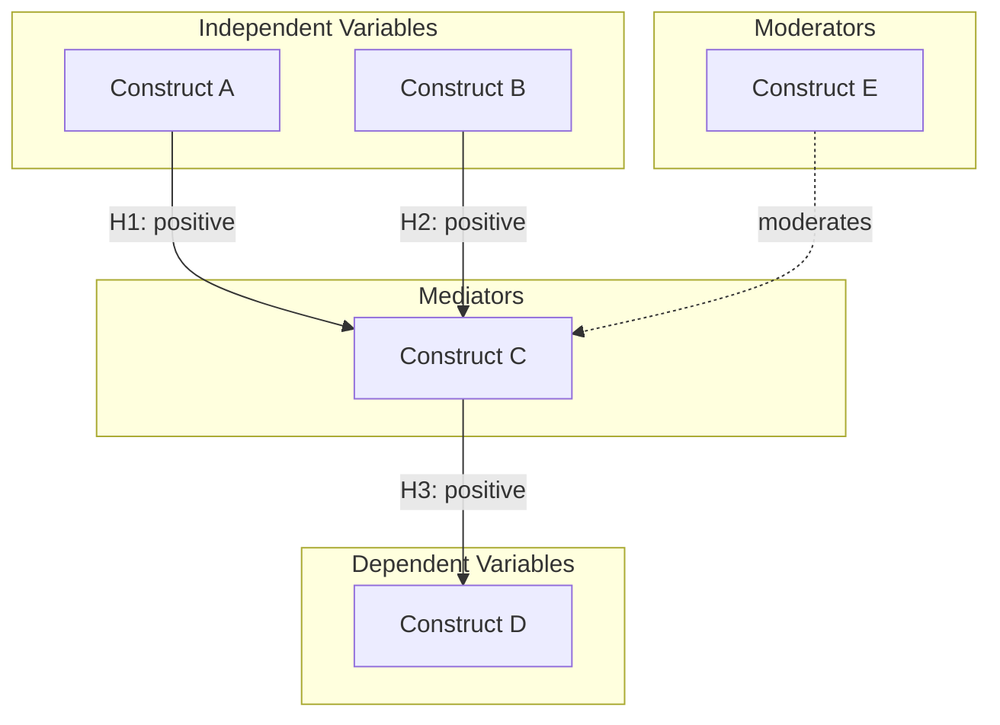

# Theoretical Framework Building

Build a theoretical framework for your research by mapping concepts, theories, and their relationships.

Canonical Task ID (from the globally installed `research-paper-workflow` skill):
- `A3` theoretical framing

## Topic

$ARGUMENTS

## Workflow

### Step 1: Topic Clarification

Use the **question-refiner** skill to:
1. Clarify the research domain
2. Identify the phenomenon of interest
3. Define the scope of theoretical exploration
4. Specify the disciplinary lens

### Step 2: Theory Identification

Use the **academic-searcher** skill to find:
1. Foundational theories in the domain
2. Key theoretical papers (highly cited)
3. Recent theoretical developments
4. Competing theoretical perspectives

### Step 3: Theory Analysis

Use the **theory-mapper** skill to analyze each relevant theory:

For each theory, extract:

#### Theory Profile
- **Name**: 
- **Origin**: (Author, Year, Seminal work)
- **Domain**: 
- **Core Proposition**: 
- **Key Constructs**: 

#### Construct Analysis
For each key construct:
- Definition
- Operationalization approaches
- Related constructs

#### Relationships
- Proposed relationships between constructs
- Causal mechanisms
- Boundary conditions
- Moderators/Mediators

### Step 4: Theoretical Comparison

Create comparison matrix:

| Aspect | Theory A | Theory B | Theory C |
|--------|----------|----------|----------|
| Core Focus | | | |
| Key Constructs | | | |
| Causal Logic | | | |
| Level of Analysis | | | |
| Assumptions | | | |
| Strengths | | | |
| Limitations | | | |
| Applicability | | | |

### Step 5: Conceptual Mapping

Generate Mermaid diagram showing:
1. Key concepts and their definitions
2. Relationships between concepts
3. Directional arrows for causal relationships
4. Groupings for related concepts

Example output format:



### Step 6: Framework Synthesis

Synthesize findings into a coherent framework:

1. **Theoretical Foundation**
   - Which theory/theories will anchor your research?
   - What adaptations or extensions are needed?

2. **Conceptual Model**
   - What are the core constructs?
   - How are they related?
   - What are the hypotheses/propositions?

3. **Assumptions**
   - What assumptions underlie the framework?
   - What scope conditions apply?

4. **Theoretical Contribution**
   - How does your framework extend existing theory?
   - What new relationships are proposed?

### Step 7: Generate Outputs

Create framework document:

```markdown
# Theoretical Framework: [Topic]

## Overview
[Brief description of the theoretical foundation]

## Foundational Theories

### [Theory 1 Name]
- **Origin**: 
- **Core Proposition**: 
- **Key Constructs**: 
- **Application to This Research**: 

### [Theory 2 Name]
...

## Theory Comparison
[Comparison table]

## Conceptual Framework

### Core Constructs
| Construct | Definition | Operationalization |
|-----------|------------|-------------------|

### Proposed Relationships
| Hypothesis | Relationship | Theoretical Basis |
|------------|--------------|-------------------|
| H1 | A → B (+) | Theory X suggests... |

### Conceptual Model
```mermaid
[Mermaid diagram]
```

### Assumptions and Boundary Conditions
- 

### Theoretical Contribution
- 

## References
```

Output: `RESEARCH/[topic]/theoretical_framework.md`

Begin theoretical framework building now.
