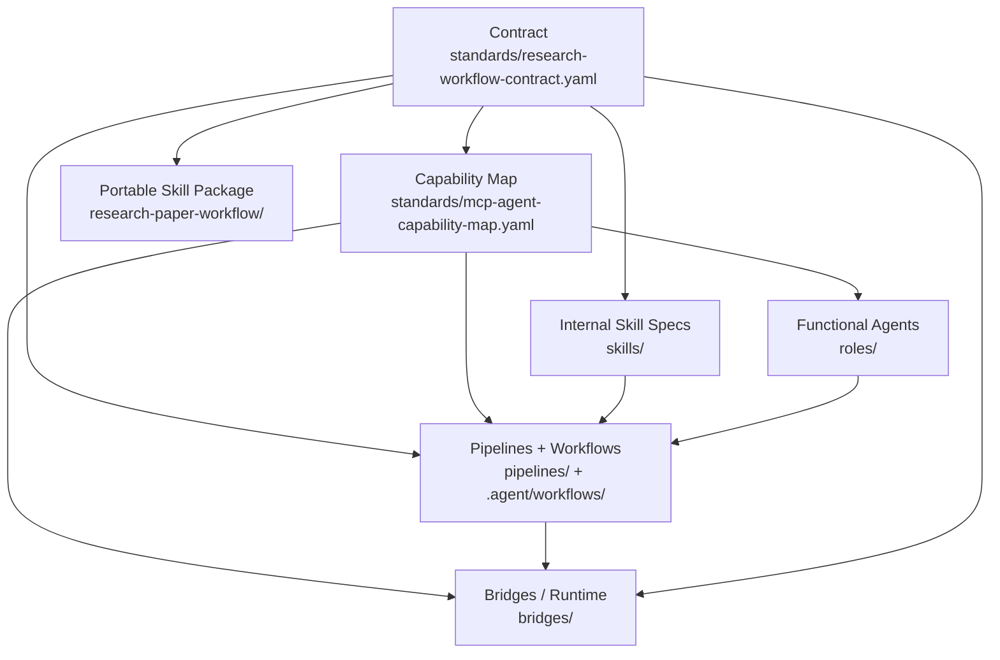

# Academic Deep Research Skills

A contract-driven academic workflow system for Codex, Claude Code, and Gemini, covering installation, task planning, literature work, manuscript production, and strict Stage-I research code execution under one canonical workflow contract.

<div align="center">
  <a href="#-quick-start-0--1-navigation">🚀 Quick Start</a> | 
  <a href="docs/reference/cli.md">💻 CLI Reference</a> | 
  <a href="docs/architecture.md">🏗 Architecture</a> | 
  <a href="docs/advanced/agent-skill-collaboration.md">🤝 Agent Collaboration</a> | 
  <a href="docs/advanced/extend-research-skills.md">🛠️ How to Extend / Contribute</a> | 
  <a href="TODO_ROADMAP.md">🗺️ Roadmap</a>
</div>

## Features

- 📚 **Systematic Literature Review** - PRISMA 2020 compliant methodology
- 📖 **Deep Paper Reading** - Structured notes + BibTeX
- 🧪 **Evidence Synthesis & Meta-analysis** - Narrative / qualitative / quantitative pooling (PRISMA-aligned)
- 📝 **Full Manuscript Drafting** - Outline → draft → claim-evidence integrity → figures/tables
- 🧩 **Study Design → Publication** - Study design, ethics/IRB pack, submission prep, rebuttal workflow
- 🔍 **Research Gap Identification** - 5 types of academic gap analysis
- 🧠 **Theoretical Framework Building** - Concept relationship mapping
- ✍️ **Academic Writing Assistance** - Standard-compliant formatting
- 🧑‍⚖️ **Multi-Persona Peer Review** - Parallel, independent cross-reviews (Methodologist, Domain Expert, "Reviewer 2")
- 🔎 **AI De-fingerprinting & Proofread** - Multi-AI collaborative de-AI rewriting, similarity reduction, and final proofread
- 🚀 **Strict Stage-I Academic Code Flow** - `I5 -> I6 -> I7 -> I8` with structured spec/plan/execute/review artifacts and targeted follow-up
- 🎤 **Academic Presentation** - Story arc design → slide content spec → output to Slidev (scholarly theme), LaTeX Beamer, or PPTX
- 🛡️ **Iterative Critique Loop (Red Teaming)** - AI self-review and Socratic questioning to continuously narrow down and refine outputs
- 🤖 **Multi-Model Collaboration** - Codex + Claude + Gemini coordination across research stages
- ⚡ **Token Optimized** - Layered skills architecture (~90% reduction)

> [!WARNING]
> Full functionality requires a real Python runtime plus all three model CLIs in `PATH`:
> `python3`, `codex`, `claude`, and `gemini`.
> You also need the matching API credentials (`OPENAI_API_KEY`, `ANTHROPIC_API_KEY`, `GOOGLE_API_KEY`) for orchestrator-driven multi-model execution.
> Without them, you can still install assets and use shell `rsk check|upgrade|align`, but `doctor`, validators, tests, and the full orchestrator flow will be partial or unavailable.

## Design Lineage And Related Projects

This repository is not built in isolation. Two external projects are especially relevant to its design direction:

- [fengshao1227/ccg-workflow](https://github.com/fengshao1227/ccg-workflow)
  - We borrow the workflow idea of strict phase separation: spec -> plan -> execute -> review.
  - We also borrow the habit of constraining execution instead of letting a single prompt improvise end to end.
  - The difference is scope: CCG is primarily a software-engineering collaboration system, while this repository localizes those ideas into an academic workflow and turns them into canonical Stage-I tasks `I5 -> I6 -> I7 -> I8` plus contract-bound outputs under `RESEARCH/[topic]/`.
- [GuDaStudio/skills](https://github.com/GuDaStudio/skills)
  - This project is a useful reference for packaging Claude-oriented collaboration skills and for making Codex / Gemini cooperation installable as reusable skill assets.
  - The difference is packaging model and target domain: `GuDaStudio/skills` is a general collaboration skill collection, while `research-skills` uses one research contract, one artifact tree, and one task catalog for academic work.

---

## Quick Start (0 → 1 Navigation)

This is the shortest stable path from “nothing installed” to “running a canonical task.”

Start with the consolidated docs when you need detail:

- [Quick Start](docs/quickstart.md)
- [Install Guide](docs/guide/install.md)
- [CLI Reference](docs/reference/cli.md)
- [Architecture](docs/architecture.md)

### 0. Choose `partial` Or `full`

The bootstrap installer now handles the environment setup for you. You do not need to preinstall Python just to get started.

| Profile | What you get | Python needed before install | Result after install |
|---|---|---|---|
| `partial` | skills, workflows, project integration files | No | Assets are ready; orchestrator is not |
| `full` | `partial` + shell CLI + Python 3.12 when needed + `doctor` | No | Orchestrator runtime is ready |

Behavior in `full` mode:

- If `python3 >= 3.12` already exists, bootstrap reuses it.
- If Python is missing or too old, bootstrap installs `mise`, then installs `python@3.12`.
- On Windows, bootstrap runs directly in PowerShell and installs Git for Windows via `winget` only when shell CLI wrappers need Bash.

If you omit `--profile`, the bootstrap script explains both choices and prompts you to choose.

### 1. Run The One-Click Bootstrap

Linux / macOS:

```bash
curl -fsSL https://raw.githubusercontent.com/jxpeng98/research-skills/main/scripts/bootstrap_research_skill.sh | bash -s -- --project-dir "$PWD" --target all
```

Windows PowerShell 7+:

```powershell
winget install --id Microsoft.PowerShell --source winget
Invoke-WebRequest https://raw.githubusercontent.com/jxpeng98/research-skills/main/scripts/bootstrap_research_skill.ps1 -OutFile .\bootstrap_research_skill.ps1
pwsh -ExecutionPolicy Bypass -File .\bootstrap_research_skill.ps1 -ProjectDir "$PWD" -Target all
```

If you want to skip the prompt and force a profile:

```bash
# Linux / macOS
curl -fsSL https://raw.githubusercontent.com/jxpeng98/research-skills/main/scripts/bootstrap_research_skill.sh | bash -s -- --profile partial --project-dir "$PWD" --target all
curl -fsSL https://raw.githubusercontent.com/jxpeng98/research-skills/main/scripts/bootstrap_research_skill.sh | bash -s -- --profile full --project-dir "$PWD" --target all
```

```powershell
# Windows PowerShell 7+
# Partial profile
pwsh -ExecutionPolicy Bypass -File .\bootstrap_research_skill.ps1 -Profile partial -ProjectDir "$PWD" -Target all
# Full profile
pwsh -ExecutionPolicy Bypass -File .\bootstrap_research_skill.ps1 -Profile full -ProjectDir "$PWD" -Target all
# Beta profile (latest prerelease tag)
pwsh -ExecutionPolicy Bypass -File .\bootstrap_research_skill.ps1 -Beta -Profile full -ProjectDir "$PWD" -Target all
```

This installs:

- workflow assets for Codex / Claude Code / Gemini
- project integration files such as `.agent/workflows/`, `CLAUDE.md`, `.gemini/`
- shell CLI commands `research-skills`, `rsk`, `rsw` in `full` mode

### 2. Optional Manual Python Setup

You only need this if you want to prepare Python yourself instead of letting `full` bootstrap handle it.

Recommended path: use `mise`.

```bash
# Linux / macOS
curl https://mise.run | sh
```

```bash
# bash
echo 'eval "$(mise activate bash)"' >> ~/.bashrc
source ~/.bashrc
```

```bash
# zsh
echo 'eval "$(mise activate zsh)"' >> "${ZDOTDIR-$HOME}/.zshrc"
source "${ZDOTDIR-$HOME}/.zshrc"
```

```powershell
# Windows
scoop install mise
```

```powershell
# Windows alternative
winget install jdx.mise
```

```bash
mise install python@3.12
mise use -g python@3.12
python3 --version
```

### 3. Pick An Entry Mode

Use one of these stable entrypoints:

- Workflow commands in `.agent/workflows/*.md` such as `/paper`, `/lit-review`, `/paper-write`, `/code-build`
- Installer / updater CLI: `research-skills`, `rsk`, `rsw`
- Orchestrator CLI: `python3 -m bridges.orchestrator ...`

### 4. Optional Local Installers And Refresh Paths

If Python is already available, you can also use the local cross-platform installer:

```bash
python3 scripts/bootstrap_research_skill.py --profile partial --project-dir .
python3 scripts/bootstrap_research_skill.py --profile full --project-dir .
```

If Python is already available and you specifically want the Python-distributed updater CLI, that path still exists:

```bash
pipx install research-skills-installer
```

That `pip` / `pipx` path is now optional compatibility distribution for the updater CLI. It is not the recommended first-install path.

To refresh an existing install from inside a project:

```bash
rsk upgrade --target all --project-dir . --doctor
```

If you already used the shell bootstrap above, re-run it or `rsk upgrade` with `--overwrite` whenever you want to refresh installed assets.

*Python boundary: shell `rsk check|upgrade|align` do not require Python; `--doctor`, `python3 -m bridges.orchestrator ...`, validators, and tests still require `python3`.*

### 5. Validate Local Readiness

If Python is available, run the stable preflight checks before a larger workflow:

```bash
python3 -m bridges.orchestrator doctor --cwd .
python3 scripts/validate_research_standard.py --strict
```

Use `doctor` for runtime CLIs, API keys, and MCP wiring.
Use the validator for repo-level contract and schema consistency.

### 6. Plan Before You Run

Inspect prerequisites, output paths, and routing before execution:

```bash
python3 -m bridges.orchestrator task-plan \
  --task-id F3 \
  --paper-type empirical \
  --topic ai-in-education \
  --cwd .
```

`task-plan` shows:

- contract outputs
- prerequisite tasks
- functional owner and handoff trace
- runtime plan (`draft` / `review` / `fallback`)

### 7. Run a Canonical Research Task

```bash
python3 -m bridges.orchestrator task-run \
  --task-id F3 \
  --paper-type empirical \
  --topic ai-in-education \
  --cwd . \
  --triad
```

Common controls:

- `--focus-output` and `--output-budget`: reduce auxiliary artifact spread by shrinking the active output set
- `--research-depth deep` plus `--max-rounds`: enforce a narrower, more adversarial evidence-expansion and revision loop
- `--only-target <id>`: for structured Stage-I tasks `I4`-`I8`, reload the existing artifact and rerun only the selected actionable target

Example: rerun one planning step only

```bash
python3 -m bridges.orchestrator task-run \
  --task-id I6 \
  --paper-type methods \
  --topic llm-bias \
  --cwd . \
  --only-target S1
```

### 8. Run the Strict Academic Code Flow

Use `code-build` when code is a first-class research artifact rather than a generic engineering task:

```bash
python3 -m bridges.orchestrator code-build \
  --method "Staggered DID" \
  --topic policy-effects \
  --domain econ \
  --focus full \
  --cwd .
```

With `--topic`, `code-build` enters the strict Stage-I path:

- `I5` code specification
- `I6` zero-decision planning
- `I7` execution + performance packaging
- `I8` review

It also supports targeted follow-up:

```bash
python3 -m bridges.orchestrator code-build \
  --method "Transformer Fine-Tuning" \
  --topic llm-bias \
  --domain cs \
  --focus full \
  --only-target I5:decision-1 \
  --only-target I8:P1-01 \
  --cwd .
```

### 9. Use Workflow Commands When You Want Slash-Command UX

If your client is using the installed workflow entry markdowns, try these commands:

| Command | Purpose | Example |
|---------|---------|---------|
| `/paper` | Choose-your-path paper workflow | `/paper ai-in-education CHI` |
| `/lit-review` | Systematic literature review | `/lit-review transformer architecture 2020-2024` |
| `/paper-read` | Deep paper analysis | `/paper-read https://arxiv.org/abs/2303.08774` |
| `/find-gap` | Identify research gaps | `/find-gap LLM in education` |
| `/build-framework` | Build theoretical framework | `/build-framework technology acceptance` |
| `/academic-write` | Academic writing assistance | `/academic-write introduction AI ethics` |
| `/paper-write` | Full paper drafting | `/paper-write ai-in-education empirical CHI` |
| `/synthesize` | Evidence synthesis / meta-analysis | `/synthesize ai-in-education` |
| `/study-design` | Empirical study design | `/study-design ai-in-education` |
| `/ethics-check` | Ethics / IRB pack | `/ethics-check ai-in-education` |
| `/submission-prep` | Submission package | `/submission-prep ai-in-education CHI` |
| `/rebuttal` | Rebuttal / revision response | `/rebuttal ai-in-education` |
| `/code-build` | Strict Stage-I academic code flow | `/code-build "Staggered DID" --topic policy-effects --domain econ --focus full` |
| `/proofread` | AI de-fingerprinting & final proofread | `/proofread ai-in-education` |
| `/academic-present` | Academic presentation prep | `/academic-present ai-in-education --format slidev` |

---

## CLI Install And Args

This section covers the installer/updater CLI only. It does not document the research execution args of `bridges.orchestrator`.

### 1. Ways to install the CLI

#### Option A: Shell bootstrap CLI install (recommended)

Use this when:
- the machine does not have Python
- you want `research-skills` / `rsk` / `rsw` quickly
- you also want workflow assets installed at the same time

Command:

```bash
cd /path/to/your/project
curl -fsSL https://raw.githubusercontent.com/jxpeng98/research-skills/main/scripts/bootstrap_research_skill.sh | bash -s -- \
  --project-dir "$PWD" \
  --target all
```

What it installs:
- shell CLI: `research-skills`, `rsk`, `rsw`
- `research-paper-workflow` skill into client skill directories
- project integration files such as `.agent/workflows/`, `CLAUDE.md`, `.gemini/`

Default CLI directory:
- `${RESEARCH_SKILLS_BIN_DIR:-~/.local/bin}`

If the command is not found after install, add this directory to `PATH`:

```bash
export PATH="$HOME/.local/bin:$PATH"
```

#### Option B: Python CLI via `pipx`

Use this when:
- Python is already available
- you want to keep using the PyPI-distributed CLI

Command:

```bash
pipx install research-skills-installer
```

What it installs:
- Python CLI: `research-skills`, `rsk`, `rsw`
- It does not automatically write workflow assets into your project; you still run `rsk upgrade`

#### Option C: Install shell CLI from a local clone

Use this when:
- you already cloned this repository
- you want to control install location or use `link` mode

Command:

```bash
./scripts/install_research_skill.sh \
  --target all \
  --project-dir /path/to/project \
  --install-cli \
  --overwrite
```

### 2. Shell bootstrap args

Entry script:
- `scripts/bootstrap_research_skill.sh`

Common args:

| Arg | Purpose | Default / Notes |
|-----|---------|-----------------|
| `--repo <owner/repo|git-url>` | Choose the upstream GitHub repo | Defaults to `RESEARCH_SKILLS_REPO`, else `jxpeng98/research-skills` |
| `--ref <tag-or-branch>` | Install a specific release tag or branch | Defaults to latest release |
| `--ref-type <tag|branch>` | Tell the installer how to interpret `--ref` | Default `tag` |
| `--beta` | Install the latest beta / prerelease tag when `--ref` is omitted | Off by default; stable latest release remains the default |
| `--target <codex|claude|gemini|antigravity|all>` | Choose which client targets to write | Default `all` |
| `--project-dir <path>` | Choose where project integration files are written | Default current directory |
| `--install-cli` | Install shell CLI commands | Enabled by default |
| `--no-cli` | Skip shell CLI installation and install workflow assets only | Opposite of `--install-cli` |
| `--cli-dir <path>` | Choose where the shell CLI is installed | Default `${RESEARCH_SKILLS_BIN_DIR:-~/.local/bin}` |
| `--overwrite` | Replace existing skill / CLI / project files | Off by default |
| `--doctor` | Run environment preflight after install | Only runs when `python3` exists |
| `--dry-run` | Preview the actions only | Does not download or write files |

Examples:

```bash
# Install a specific tag
curl -fsSL https://raw.githubusercontent.com/jxpeng98/research-skills/main/scripts/bootstrap_research_skill.sh | bash -s -- \
  --repo jxpeng98/research-skills \
  --ref v0.1.0 \
  --ref-type tag \
  --project-dir "$PWD" \
  --target all \
  --overwrite

# Install the latest beta / prerelease
curl -fsSL https://raw.githubusercontent.com/jxpeng98/research-skills/main/scripts/bootstrap_research_skill.sh | bash -s -- \
  --profile full \
  --beta \
  --project-dir "$PWD" \
  --target all

# Install workflows only, skip CLI
curl -fsSL https://raw.githubusercontent.com/jxpeng98/research-skills/main/scripts/bootstrap_research_skill.sh | bash -s -- \
  --project-dir "$PWD" \
  --target claude \
  --no-cli

# Preview without writing files
curl -fsSL https://raw.githubusercontent.com/jxpeng98/research-skills/main/scripts/bootstrap_research_skill.sh | bash -s -- \
  --project-dir "$PWD" \
  --target codex \
  --dry-run
```

### 3. Local installer args

Entry script:
- `scripts/install_research_skill.sh`

Common args:

| Arg | Purpose | Default / Notes |
|-----|---------|-----------------|
| `--target <codex|claude|gemini|antigravity|all>` | Choose which client targets to write | Default `all` |
| `--mode <copy|link>` | Copy files or create symlinks | Default `copy` |
| `--project-dir <path>` | Choose where project integration files are written | Default current directory |
| `--install-cli` | Install shell CLI | Off by default |
| `--no-cli` | Skip shell CLI installation | This is the default behavior |
| `--cli-dir <path>` | Choose where the shell CLI is installed | Default `${RESEARCH_SKILLS_BIN_DIR:-~/.local/bin}` |
| `--overwrite` | Replace existing targets | Off by default |
| `--doctor` | Run `python3 -m bridges.orchestrator doctor` after install | Only runs when `python3` exists |
| `--dry-run` | Preview the actions only | Does not write files |

Notes:
- Use `--mode link` when maintaining a local clone long-term
- Use `--mode copy` for one-off installs
- `--mode link` is for local-repo installs, not remote bootstrap installs

### 4. `rsk` / `research-skills` subcommands

Both shell CLI and Python CLI use the same command names:
- `research-skills`
- `rsk`
- `rsw`

#### `rsk check`

Purpose:
- inspect installed local skill versions
- inspect latest upstream release
- decide whether an upgrade is available

Args:

| Arg | Purpose |
|-----|---------|
| `--repo <owner/repo|url>` | Override the upstream repo |
| `--json` | Emit JSON for scripts or CI |
| `--strict-network` | Fail if upstream lookup fails |

Examples:

```bash
rsk check
rsk check --repo jxpeng98/research-skills
rsk check --json
```

#### `rsk upgrade`

Purpose:
- download an upstream release/branch archive
- refresh skills, project integration files, and shell CLI

Common args:

| Arg | Purpose |
|-----|---------|
| `--repo <owner/repo|url>` | Override the upstream repo |
| `--ref <tag-or-branch>` | Choose a release tag or branch |
| `--ref-type <tag|branch>` | Tell the installer how to interpret `--ref` |
| `--target <codex|claude|gemini|antigravity|all>` | Choose install target |
| `--project-dir <path>` | Choose project path |
| `--no-cli` | Skip shell CLI refresh |
| `--cli-dir <path>` | Choose shell CLI directory |
| `--overwrite` | Replace existing targets |
| `--doctor` | Run doctor after upgrade |
| `--dry-run` | Preview upgrade actions |

Examples:

```bash
rsk upgrade --project-dir . --target all --overwrite
rsk upgrade --repo jxpeng98/research-skills --ref main --ref-type branch --project-dir . --target claude
rsk upgrade --project-dir . --target codex --dry-run
```

#### `rsk align`

Purpose:
- print a short explanation of what the CLI installed and which paths `upgrade` modifies

Args:

| Arg | Purpose |
|-----|---------|
| `--repo <owner/repo|url>` | Only changes the example repo shown in output |

Examples:

```bash
rsk align
rsk align --repo jxpeng98/research-skills
```

### 5. Useful environment variables

| Env Var | Purpose |
|---------|---------|
| `RESEARCH_SKILLS_REPO` | Default upstream repo, so you can omit `--repo` |
| `RESEARCH_SKILLS_BIN_DIR` | Default install directory for the shell CLI |
| `CODEX_HOME` | Root directory for Codex skill installation |
| `CLAUDE_CODE_HOME` | Root directory for Claude Code skill installation |
| `GEMINI_HOME` | Root directory for Gemini skill installation |
| `ANTIGRAVITY_HOME` | Root directory for Antigravity global skill installation |
| `GITHUB_TOKEN` / `GH_TOKEN` | Auth token for private repos or GitHub API limits |

### 6. What still needs Python

Does not need Python:
- shell bootstrap install
- shell CLI `check` / `upgrade` / `align`
- local installer `copy/link` asset install

Still needs Python:
- `--doctor`
- `python3 -m bridges.orchestrator ...`
- validators, orchestrator, and test commands in this repo

---

## Dynamic Discipline Domains

**Why aren't there separate installers for Economics, Biology, or Computer Science?**

By design, this framework strictly separates the "generic research workflow pipeline" from "discipline-specific knowledge."
When you install `rsk`, you only install the generic workflow skeleton (e.g., how to run a Literature Review or write an Outline).

Discipline-specific knowledge (like Economics libraries, DID methodology checks, or Biology IRB templates) is loaded dynamically at **Runtime** via the `--domain` parameter. 
For example, using `/code-build --domain econ` tells the system to load `skills/domain-profiles/economics.yaml` at runtime, apply Economics-specific diagnostics, and bypass unrelated profiles. This keeps the base installation lightweight and avoids prompt pollution.

---

## 🏗 Architecture & Standardization Layer

The system operates on a single canonical workflow contract ensuring that Codex, Claude, and Gemini produce outputs in identical formats and paths.

- **The Contract**: `standards/research-workflow-contract.yaml` (Task IDs, required outputs, quality gates)
- **The Routing**: `standards/mcp-agent-capability-map.yaml` (MCP tool mapping & primary/fallback agents)
- **Output Standard**: All generated content saves strictly to `RESEARCH/[topic]/`

### Layer Model

The core execution stack is organized into six layers:

| Layer | Current Location | Responsibility |
|---|---|---|
| **Contract** | `standards/research-workflow-contract.yaml` | Defines canonical Task IDs, artifact paths, and quality gates |
| **Functional Agents** | `roles/` + `pipelines/` | Research responsibility layer (literature, methods, writing, compliance, etc.) |
| **Runtime Agents** | `standards/mcp-agent-capability-map.yaml` + `bridges/` | Chooses which model runtime executes a step (`codex`, `claude`, `gemini`) |
| **Internal Skill Specs** | `skills/` | Reusable execution specs referenced by the capability map and pipelines |
| **Pipelines / Workflows** | `pipelines/` + `.agent/workflows/` | DAGs and user entrypoints that sequence skills for a paper type or command |
| **Bridges** | `bridges/` | Runtime adapters, orchestration, and MCP integration |

One additional distribution surface sits beside the execution stack:

- **Portable Skill Package**: `research-paper-workflow/` is the installable cross-client entry skill for Codex/Claude/Gemini.
- **Important**: `research-paper-workflow/` is not the authoritative source for every internal capability spec; `skills/` and `standards/` remain the internal source-of-truth layers.

### Terminology

- **Portable skill** means an end-user installable skill package such as `research-paper-workflow/`.
- **Internal skill spec** means a repo-internal markdown spec under `skills/` used by the capability map, pipelines, and validators.
- **Functional agent** means the research responsibility layer (today represented primarily by `roles/` and pipeline ownership patterns).
- **Runtime agent** means the actual model executor (`codex`, `claude`, `gemini`).

### Dependency Direction

Maintain these dependencies in one direction only:



Operational rules:

- `Contract` defines canonical outputs and quality gates. Downstream layers may reference them but should not silently redefine them.
- `Capability Map` defines routing and required capabilities. Downstream layers may compose that routing but should not invent a second routing truth.
- `Functional Agents` define responsibility and ownership. They do not replace runtime selection.
- `Internal Skill Specs` define reusable execution behavior. They do not replace the contract or the capability map.
- `Pipelines / Workflows` sequence existing pieces. They should not become a second source of artifact or ownership truth.
- `Bridges` execute the plan. They should not encode contract logic that diverges from `standards/`.

### Maintainer Mapping

Use this table as a fast "where does this task live?" reference. Skills listed are representative, not exhaustive.

| Task ID | Functional owner | Representative skill specs | Runtime plan | Contract artifacts |
|---|---|---|---|---|
| `A1` | `research-orchestrator` | `question-refiner`, `metadata-enricher` | draft `claude` / review `gemini` / fallback `codex` | `framing/research_question.md` |
| `B1` | `literature-agent` | `academic-searcher`, `paper-screener`, `fulltext-fetcher`, `paper-extractor` | draft `claude` / review `codex` / fallback `gemini` | `protocol.md`, `search_strategy.md`, `search_log.md`, `search_results.csv`, `screening/` |
| `C4` | `data-agent` | `dataset-finder` | draft `claude` / review `gemini` / fallback `codex` | `data_management_plan.md`, `design/dataset_plan.md` |
| `F3` | `writing-agent` | `manuscript-architect`, `analysis-interpreter`, `effect-size-interpreter` | draft `claude` / review `codex` / fallback `gemini` | `manuscript/manuscript.md`, `manuscript/results_interpretation.md`, `manuscript/effect_interpretation.md` |
| `H1` | `publication-agent` | `submission-packager`, `reporting-checker`, `citation-formatter` | draft `claude` / review `gemini` / fallback `codex` | `submission/cover_letter.md`, `submission/submission_checklist.md`, `submission/title_page.md`, `submission/highlights.md`, `submission/*` |
| `I3` | `data-agent` | `data-cleaning-planner`, `data-merge-planner`, `code-builder` | draft `codex` / review `gemini` / fallback `claude` | `analysis/`, `data/cleaning_plan.md`, `data/merge_plan.md` |

### Skills + Agents Flow (ASCII)

```text
User Goal / Prompt
        |
        v
Task / Workflow Router (Task ID + paper_type)
        |
        v
Canonical Contract Load
        |
        v
Capability Map Load
        |
        +-------------------------------+
        |                               |
        v                               v
Functional Routing                 Runtime Routing
(role / responsibility)           (codex / claude / gemini)
        |                               |
        +---------------+---------------+
                        v
                MCP Evidence Collection
                        |
                        v
                 Draft Generation
                        |
                        v
                 Review / Critique
                        |
            +-----------+-----------+
            |                       |
            v                       v
      Triad Audit (optional)   Dual/Single Fallback
                        \       /
                         v     v
               Synthesis (summarizer)
                        |
                        v
        Quality Gates + Artifact Output Write
            -> RESEARCH/[topic]/...
```

See [docs/advanced/agent-skill-collaboration.md](docs/advanced/agent-skill-collaboration.md) for the current guide. The legacy mirror remains at [guides/advanced/agent-skill-collaboration.md](guides/advanced/agent-skill-collaboration.md).

---

## Multi-Model Collaboration (`orchestrator`)

You can coordinate Codex, Claude, and Gemini concurrently for cross-stage research tasks.
*(Requires API Keys exposed: `OPENAI_API_KEY`, `ANTHROPIC_API_KEY`, `GOOGLE_API_KEY`)*

```bash
# Inspect task prerequisites and routing before execution
python3 -m bridges.orchestrator task-plan --task-id F3 --paper-type empirical --topic my-topic --cwd .

# Parallel analysis - triad concurrent analysis + synthesis
python3 -m bridges.orchestrator parallel --prompt "Analyze code safety" --cwd . --summarizer claude

# Task-run - execute canonical Task ID with capability-map agent routing
python3 -m bridges.orchestrator task-run --task-id F3 --paper-type empirical --topic my-topic --cwd .

# Team-run - research fanout/fanin parallel execution (MVP: B1, H3)
python3 -m bridges.orchestrator team-run --task-id B1 --paper-type systematic-review --topic my-topic --cwd .
python3 -m bridges.orchestrator team-run --task-id H3 --paper-type empirical --topic my-topic --cwd .

# Strict Stage-I academic code flow
python3 -m bridges.orchestrator code-build --method "Staggered DID" --topic my-topic --domain econ --focus full --cwd .

# Interactive Step-by-Step Mode (pauses for Y/n confirmation before agent execution)
python3 -m bridges.orchestrator task-run --task-id F3 --paper-type empirical --topic my-topic --cwd . -i

# Enforce strict capabilities
python3 -m bridges.orchestrator task-run --task-id B1 --paper-type systematic-review --topic my-topic --cwd . --mcp-strict

# Reduce artifact sprawl and push for deeper evidence/review
python3 -m bridges.orchestrator task-run --task-id F3 --paper-type empirical --topic my-topic --cwd . \
  --focus-output manuscript/manuscript.md \
  --research-depth deep \
  --draft-profile deep-research \
  --review-profile strict-review \
  --triad-profile deep-research \
  --triad \
  --max-rounds 4

# Reopen only selected Stage-I targets
python3 -m bridges.orchestrator code-build --method "Transformer Fine-Tuning" --topic llm-bias --domain cs --focus full \
  --only-target I5:decision-1 \
  --only-target I8:P1-01 \
  --cwd .
```

Useful knobs for `task-run`:

- `--focus-output <path>`: repeatable; restrict this run to specific contract output paths.
- `--output-budget <n>`: cap how many contract outputs are active in this run.
- `--research-depth deep`: adds explicit evidence-expansion, contradiction-check, and narrow-claim pressure.
- `--max-rounds <n>`: increases revision depth after review blocks.
- `--only-target <id>`: for Stage-I structured artifacts, reload the existing artifact and rerun only the selected actionable target(s).
- Built-in profiles: `focused-delivery`, `deep-research`, `strict-review`, `rapid-draft`, `default`.

**Execution Modes**

| Mode | Purpose | Unit of work |
|------|---------|--------------|
| `parallel` | Same prompt → multiple agents analyze → synthesis | Open-ended prompt |
| `task-run` | Single Task ID → serial draft → review → triad | One research task |
| `team-run` | Single Task ID → fanout workers → merge → review | Multiple work units (MVP: `B1`, `H3`) |
*(See [docs/reference/cli.md](docs/reference/cli.md) for the full command reference.)*

---

## Evidence Quality Rating (A-E)

| Grade | Evidence Type |
|-------|--------------|
| **A** | Systematic reviews, Meta-analyses, Large RCTs |
| **B** | Cohort studies, High-IF journal papers |
| **C** | Case studies, Expert opinion, Conference papers |
| **D** | Preprints, Working papers |
| **E** | Anecdotal, Theoretical speculation |

---

## Supported APIs & Databases

| Source | Purpose | Coverage |
|--------|---------|----------|
| Semantic Scholar | Primary search | 200M+ papers |
| arXiv | CS/AI/Physics preprints | Full coverage |
| OpenAlex | Bibliometrics | 250M+ works |
| Crossref | Metadata verification | 140M+ DOIs |

---

## Development & Contributing

### CI Pipeline & Local Consistency
All changes to contracts or skills must pass strict CI format validation.

```bash
# Validate core YAML schemas and contract mappings locally
python3 scripts/validate_research_standard.py --strict
python3 -m unittest tests.test_orchestrator_workflows -v

# Validate user-generated research artifacts inside a project
python3 scripts/validate_project_artifacts.py --cwd ./project  --topic <topic> --task-id H1 --strict
```

If you wish to test the legacy installation method, the script is located at: `scripts/install_research_skill.sh`


### Release Automation
```bash
# Full end-to-end publish
./scripts/release_automation.sh publish --version 0.1.0 --from-tag v0.1.0-beta.6

# Manual split phases when needed
./scripts/release_automation.sh pre --tag v0.1.0 --from-tag v0.1.0-beta.6
./scripts/release_automation.sh post --tag v0.1.0 --create-release
```

---

## Project Structure

```
research-skills/
├── standards/                # Canonical workflow contract + capability map
├── research-paper-workflow/  # Portable cross-client skill package (distribution surface)
├── .agent/workflows/         # Installed workflow entry markdowns / slash-command surface
├── pipelines/                # Abstract DAGs for paper-type workflows and handoffs
├── roles/                    # Functional-agent role configs (research responsibility layer)
├── bridges/                  # Runtime orchestration and model adapters
├── skills/                   # Internal skill specs referenced by the capability map
│   ├── [...]                 # Stages A through K
│   └── domain-profiles/      # Domain-specific configs (economics, cs-ai, etc.)
├── schemas/                  # JSON schemas + artifact type vocab
├── eval/                     # Golden test cases
├── guides/                   # Basic and Advanced tutorials
├── scripts/                  # CI, installers, validators
└── tests/                    # Unit tests
```

License: MIT
