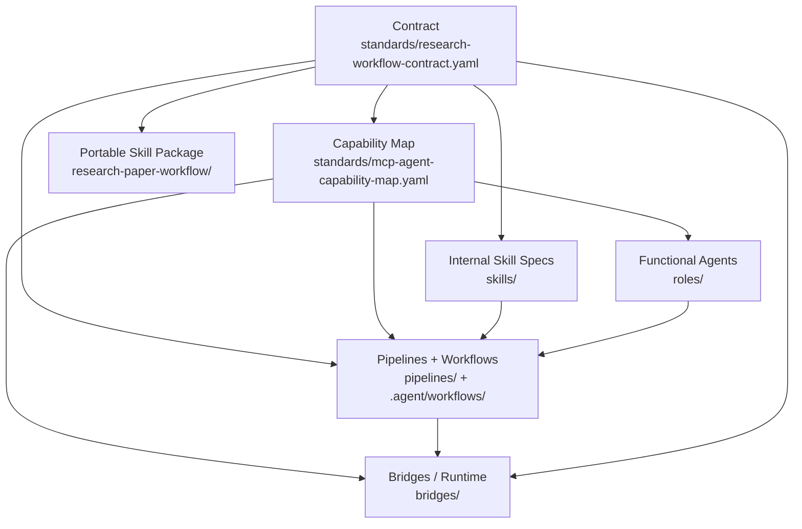

# Academic Deep Research Skills

A systematic research workflow system for Codex, Claude Code, and Gemini, covering literature review, paper analysis, gap identification, empirical design, writing, and submission packaging.

<div align="center">
  <a href="#-quick-start-0--1-navigation">🚀 Quick Start</a> | 
  <a href="guides/advanced/cli-reference.md">💻 CLI Commands</a> | 
  <a href="guides/advanced/agent-skill-collaboration.md">🤝 Agent Collaboration</a> | 
  <a href="guides/advanced/extend-research-skills.md">🛠️ How to Extend / Contribute</a> | 
  <a href="TODO_ROADMAP.md">🗺️ Roadmap</a>
</div>

## Features

- 📚 **Systematic Literature Review** - PRISMA 2020 compliant methodology
- 📖 **Deep Paper Reading** - Structured notes + BibTeX
- 🧪 **Evidence Synthesis & Meta-analysis** - Narrative / qualitative / quantitative pooling (PRISMA-aligned)
- 📝 **Full Manuscript Drafting** - Outline → draft → claim-evidence integrity → figures/tables
- 🧩 **Study Design → Publication** - Study design, ethics/IRB pack, submission prep, rebuttal workflow
- 🔍 **Research Gap Identification** - 5 types of academic gap analysis
- 🧠 **Theoretical Framework Building** - Concept relationship mapping
- ✍️ **Academic Writing Assistance** - Standard-compliant formatting
- 🧑‍⚖️ **Multi-Persona Peer Review** - Parallel, independent cross-reviews (Methodologist, Domain Expert, "Reviewer 2")
- 🔎 **AI De-fingerprinting & Proofread** - Multi-AI collaborative de-AI rewriting, similarity reduction, and final proofread
- 🚀 **CCG Code Execution** - Strict Spec -> Plan -> Execute -> Review isolation for code reliability
- 🛡️ **Iterative Critique Loop (Red Teaming)** - AI self-review and Socratic questioning to continuously narrow down and refine outputs
- 🤖 **Multi-Model Collaboration** - Codex + Claude + Gemini coordination across research stages
- ⚡ **Token Optimized** - Layered skills architecture (~90% reduction)

---

## Quick Start (0 → 1 Navigation)

This is the fastest way to understand and run the system. 

### 1. Install CLI (Recommended)

Using `pipx` is the recommended way to install the Research Skills Orchestrator:

```bash
pipx install research-skills-installer
```

This installs the CLI tool (`research-skills`, alias `rsk` or `rsw`).

### 2. Initialize your Project Environment
Run the upgrade command to copy the latest skills and project workflows into your `~/.claude` (or codex/gemini) directories and into your local project:

```bash
cd /path/to/your/project
rsk upgrade --target all --project-dir . --doctor
```

*Note: You can check for CLI updates at any point using `rsk check`.*

### 3. Run a Workflow
In your active project directory, Claude Code will now automatically recognize the `RESEARCH/` commands.

If you are using **Claude Code**, try any of these commands:

| Command | Purpose | Example |
|---------|---------|---------|
| `/paper` | Choose-your-path paper workflow | `/paper ai-in-education CHI` |
| `/lit-review` | Systematic literature review | `/lit-review transformer architecture 2020-2024` |
| `/paper-read` | Deep paper analysis | `/paper-read https://arxiv.org/abs/2303.08774` |
| `/find-gap` | Identify research gaps | `/find-gap LLM in education` |
| `/build-framework` | Build theoretical framework | `/build-framework technology acceptance` |
| `/academic-write` | Academic writing assistance | `/academic-write introduction AI ethics` |
| `/paper-write` | Full paper drafting | `/paper-write ai-in-education empirical CHI` |
| `/synthesize` | Evidence synthesis / meta-analysis | `/synthesize ai-in-education` |
| `/study-design` | Empirical study design | `/study-design ai-in-education` |
| `/ethics-check` | Ethics / IRB pack | `/ethics-check ai-in-education` |
| `/submission-prep` | Submission package | `/submission-prep ai-in-education CHI` |
| `/rebuttal` | Rebuttal / revision response | `/rebuttal ai-in-education` |
| `/code-build` | CCG-driven Research code execution | `/code-build "Staggered DID" --domain econ` |
| `/proofread` | AI de-fingerprinting & final proofread | `/proofread ai-in-education` |

If you are using the **CLI directly**, orchestrate a specific Task ID:
```bash
python3 -m bridges.orchestrator task-run --task-id F3 --paper-type empirical --topic <topic> --cwd . --triad
```

---

## Dynamic Discipline Domains

**Why aren't there separate installers for Economics, Biology, or Computer Science?**

By design, this framework strictly separates the "generic research workflow pipeline" from "discipline-specific knowledge."
When you install `rsk`, you only install the generic workflow skeleton (e.g., how to run a Literature Review or write an Outline).

Discipline-specific knowledge (like Economics libraries, DID methodology checks, or Biology IRB templates) is loaded dynamically at **Runtime** via the `--domain` parameter. 
For example, using `/code-build --domain economics` tells the system to only read from `skills/domain-profiles/economics.yaml`, applying Economics-specific diagnostics and entirely bypassing unrelated profiles. This keeps the base installation incredibly lightweight and prevents prompt pollution.

---

## 🏗 Architecture & Standardization Layer

The system operates on a single canonical workflow contract ensuring that Codex, Claude, and Gemini produce outputs in identical formats and paths.

- **The Contract**: `standards/research-workflow-contract.yaml` (Task IDs, required outputs, quality gates)
- **The Routing**: `standards/mcp-agent-capability-map.yaml` (MCP tool mapping & primary/fallback agents)
- **Output Standard**: All generated content saves strictly to `RESEARCH/[topic]/`

### Layer Model

The core execution stack is organized into six layers:

| Layer | Current Location | Responsibility |
|---|---|---|
| **Contract** | `standards/research-workflow-contract.yaml` | Defines canonical Task IDs, artifact paths, and quality gates |
| **Functional Agents** | `roles/` + `pipelines/` | Research responsibility layer (literature, methods, writing, compliance, etc.) |
| **Runtime Agents** | `standards/mcp-agent-capability-map.yaml` + `bridges/` | Chooses which model runtime executes a step (`codex`, `claude`, `gemini`) |
| **Internal Skill Specs** | `skills/` | Reusable execution specs referenced by the capability map and pipelines |
| **Pipelines / Workflows** | `pipelines/` + `.agent/workflows/` | DAGs and user entrypoints that sequence skills for a paper type or command |
| **Bridges** | `bridges/` | Runtime adapters, orchestration, and MCP integration |

One additional distribution surface sits beside the execution stack:

- **Portable Skill Package**: `research-paper-workflow/` is the installable cross-client entry skill for Codex/Claude/Gemini.
- **Important**: `research-paper-workflow/` is not the authoritative source for every internal capability spec; `skills/` and `standards/` remain the internal source-of-truth layers.

### Terminology

- **Portable skill** means an end-user installable skill package such as `research-paper-workflow/`.
- **Internal skill spec** means a repo-internal markdown spec under `skills/` used by the capability map, pipelines, and validators.
- **Functional agent** means the research responsibility layer (today represented primarily by `roles/` and pipeline ownership patterns).
- **Runtime agent** means the actual model executor (`codex`, `claude`, `gemini`).

### Dependency Direction

Maintain these dependencies in one direction only:



Operational rules:

- `Contract` defines canonical outputs and quality gates. Downstream layers may reference them but should not silently redefine them.
- `Capability Map` defines routing and required capabilities. Downstream layers may compose that routing but should not invent a second routing truth.
- `Functional Agents` define responsibility and ownership. They do not replace runtime selection.
- `Internal Skill Specs` define reusable execution behavior. They do not replace the contract or the capability map.
- `Pipelines / Workflows` sequence existing pieces. They should not become a second source of artifact or ownership truth.
- `Bridges` execute the plan. They should not encode contract logic that diverges from `standards/`.

### Maintainer Mapping

Use this table as a fast "where does this task live?" reference. Skills listed are representative, not exhaustive.

| Task ID | Functional owner | Representative skill specs | Runtime plan | Contract artifacts |
|---|---|---|---|---|
| `A1` | `research-orchestrator` | `question-refiner`, `metadata-enricher` | draft `claude` / review `gemini` / fallback `codex` | `framing/research_question.md` |
| `B1` | `literature-agent` | `academic-searcher`, `paper-screener`, `fulltext-fetcher`, `paper-extractor` | draft `claude` / review `codex` / fallback `gemini` | `protocol.md`, `search_strategy.md`, `search_log.md`, `search_results.csv`, `screening/` |
| `C4` | `data-agent` | `dataset-finder` | draft `claude` / review `gemini` / fallback `codex` | `data_management_plan.md`, `design/dataset_plan.md` |
| `F3` | `writing-agent` | `manuscript-architect`, `analysis-interpreter`, `effect-size-interpreter` | draft `claude` / review `codex` / fallback `gemini` | `manuscript/manuscript.md`, `manuscript/results_interpretation.md`, `manuscript/effect_interpretation.md` |
| `H1` | `publication-agent` | `submission-packager`, `reporting-checker`, `citation-formatter` | draft `claude` / review `gemini` / fallback `codex` | `submission/cover_letter.md`, `submission/submission_checklist.md`, `submission/title_page.md`, `submission/highlights.md`, `submission/*` |
| `I3` | `data-agent` | `data-cleaning-planner`, `data-merge-planner`, `code-builder` | draft `codex` / review `gemini` / fallback `claude` | `analysis/`, `data/cleaning_plan.md`, `data/merge_plan.md` |

### Skills + Agents Flow (ASCII)

```text
User Goal / Prompt
        |
        v
Task / Workflow Router (Task ID + paper_type)
        |
        v
Canonical Contract Load
        |
        v
Capability Map Load
        |
        +-------------------------------+
        |                               |
        v                               v
Functional Routing                 Runtime Routing
(role / responsibility)           (codex / claude / gemini)
        |                               |
        +---------------+---------------+
                        v
                MCP Evidence Collection
                        |
                        v
                 Draft Generation
                        |
                        v
                 Review / Critique
                        |
            +-----------+-----------+
            |                       |
            v                       v
      Triad Audit (optional)   Dual/Single Fallback
                        \       /
                         v     v
               Synthesis (summarizer)
                        |
                        v
        Quality Gates + Artifact Output Write
            -> RESEARCH/[topic]/...
```

See [guides/advanced/agent-skill-collaboration.md](guides/advanced/agent-skill-collaboration.md) for more details.

---

## Multi-Model Collaboration (`orchestrator`)

You can coordinate Codex, Claude, and Gemini concurrently for cross-stage research tasks.
*(Requires API Keys exposed: `OPENAI_API_KEY`, `ANTHROPIC_API_KEY`, `GOOGLE_API_KEY`)*

```bash
# Parallel analysis - triad concurrent analysis + synthesis
python -m bridges.orchestrator parallel --prompt "Analyze code safety" --cwd . --summarizer claude

# Task-run - execute canonical Task ID with capability-map agent routing
python -m bridges.orchestrator task-run --task-id F3 --paper-type empirical --topic my-topic --cwd .

# Interactive Step-by-Step Mode (pauses for Y/n confirmation before agent execution)
python -m bridges.orchestrator task-run --task-id F3 --paper-type empirical --topic my-topic --cwd . -i

# Enforce strict capabilities
python -m bridges.orchestrator task-run --task-id B1 --paper-type systematic-review --topic my-topic --cwd . --mcp-strict
```
*(Check out `guides/advanced/cli-reference.md` for a comprehensive list of commands).*

---

## Evidence Quality Rating (A-E)

| Grade | Evidence Type |
|-------|--------------|
| **A** | Systematic reviews, Meta-analyses, Large RCTs |
| **B** | Cohort studies, High-IF journal papers |
| **C** | Case studies, Expert opinion, Conference papers |
| **D** | Preprints, Working papers |
| **E** | Anecdotal, Theoretical speculation |

---

## Supported APIs & Databases

| Source | Purpose | Coverage |
|--------|---------|----------|
| Semantic Scholar | Primary search | 200M+ papers |
| arXiv | CS/AI/Physics preprints | Full coverage |
| OpenAlex | Bibliometrics | 250M+ works |
| Crossref | Metadata verification | 140M+ DOIs |

---

## Development & Contributing

### CI Pipeline & Local Consistency
All changes to contracts or skills must pass strict CI format validation.

```bash
# Validate core YAML schemas and contract mappings locally
python3 scripts/validate_research_standard.py --strict
python3 -m unittest tests.test_orchestrator_workflows -v

# Validate user-generated research artifacts inside a project
python3 scripts/validate_project_artifacts.py --cwd ./project  --topic <topic> --task-id H1 --strict
```

If you wish to test the legacy installation method, the script is located at: `scripts/install_research_skill.sh`


### Release Automation
```bash
# Auto-generate release docs and append validation smoke checks
./scripts/release_automation.sh pre --tag v0.1.0-beta.2
./scripts/release_automation.sh post --tag v0.1.0-beta.2
```

---

## Project Structure

```
research-skills/
├── standards/                # Canonical workflow contract + capability map
├── research-paper-workflow/  # Portable cross-client skill package (distribution surface)
├── .agent/workflows/         # Claude Code slash-commands
├── pipelines/                # Abstract DAGs for paper-type workflows and handoffs
├── roles/                    # Functional-agent role configs (research responsibility layer)
├── bridges/                  # Runtime orchestration and model adapters
├── skills/                   # Internal skill specs referenced by the capability map
│   ├── [...]                 # Stages A through J
│   └── domain-profiles/      # Domain-specific configs (economics, cs-ai, etc.)
├── schemas/                  # JSON schemas + artifact type vocab
├── eval/                     # Golden test cases
├── guides/                   # Basic and Advanced tutorials
├── scripts/                  # CI, installers, validators
└── tests/                    # Unit tests
```

License: MIT
