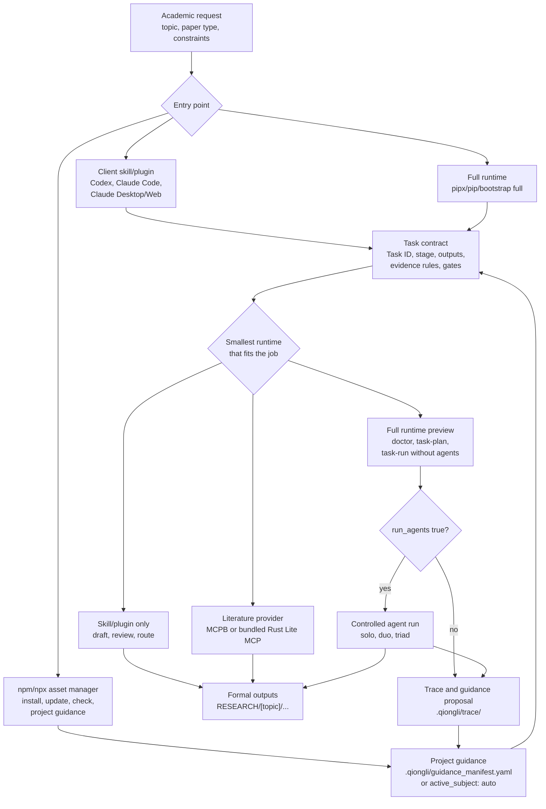

<div align="center">
  <h1>Qiongli (穷理)</h1>
  <p><strong>Use AI agents for academic research without losing the evidence trail.</strong></p>
  <p>Qiongli turns a research goal into a paper route, task IDs, literature and citation evidence, quality gates, agent handoffs, and stable files under <code>RESEARCH/[topic]/</code>.</p>
  <p>
    <a href="https://www.npmjs.com/package/qiongli"></a>
    <a href="https://www.npmjs.com/package/qiongli?activeTab=versions"></a>
    <a href="https://pypi.org/project/qiongli/"></a>
  </p>
  <p>
    <a href="README_CN.md">中文 README</a> ·
    <a href="docs/index.md">Docs</a> ·
    <a href="docs/zh/index.md">中文文档</a> ·
    <a href="docs/quickstart.md">Quickstart</a> ·
    <a href="docs/guide/install.md">Install</a> ·
    <a href="docs/reference/cli.md">CLI</a>
  </p>
</div>

## What It Is

Qiongli is an academic workflow system for researchers who use Codex, Claude Code, Claude Desktop, Antigravity, Hermes, or similar AI agents. Use it when a research task is too important for a one-off prompt and needs visible evidence, repeatable steps, and reviewable outputs.

You can use Qiongli to:

- choose a paper route for empirical, qualitative, systematic review, RCT, theory, and code-first methods projects;
- structure literature search, citation checking, study design, writing, code, review, submission, and rebuttal work;
- keep claims, sources, methods decisions, review notes, and generated artifacts in predictable project paths;
- run lightweight skill/plugin workflows first, then add the full local orchestrator only when you need controlled solo, duo, or triad agent execution.

The name comes from `穷理`: keep asking what principle, evidence, and limit sits underneath a claim.

## Start Here

For native Qiongli 2, use the [CLI installation and command guide](docs/guide/cli-2x.md).
Alpha.7 is available through GitHub, npm `next` and PyPI; Cargo is being added.
No App is required. The stable installation instructions below describe 1.x.

| Need | Best entry |
|---|---|
| Install the native 2.x CLI | [CLI installation and command guide](docs/guide/cli-2x.md) |
| Browse the full documentation | [VitePress Docs](docs/index.md), or run `npm run docs:dev` |
| Read in Chinese | [中文 README](README_CN.md) or [中文文档](docs/zh/index.md) |
| Install Qiongli in one client | [Install Guide](docs/guide/install.md) |
| Get from zero to a first workspace | [Quickstart](docs/quickstart.md) |
| Decide which paper workflow to use | [Task Recipes](docs/guide/task-recipes.md) |
| Use CLI commands, aliases, JSON checks, or automation | [CLI Reference](docs/reference/cli.md) |
| Understand the runtime and package model | [Architecture](docs/architecture.md) |

## Latest Stable Downloads

Current stable release: [v1.17.0](https://github.com/jxpeng98/qiongli/releases/tag/v1.17.0). These direct links cover the common install paths; use the download guide for subject-specific Desktop ZIPs and maintainer artifacts.

| Need | Link or command |
|---|---|
| npm CLI | [`qiongli@1.17.0`](https://www.npmjs.com/package/qiongli/v/1.17.0): `npm install -g qiongli@latest` |
| PyPI CLI | [`qiongli 1.17.0`](https://pypi.org/project/qiongli/1.17.0/): `pipx install qiongli` |
| Claude Desktop recommended plugin | [`qiongli-claude-desktop-plugin-v1.17.0.zip`](https://github.com/jxpeng98/qiongli/releases/download/v1.17.0/qiongli-claude-desktop-plugin-v1.17.0.zip) |
| Claude Desktop/Web fallback skill ZIP | [`qiongli-claude-desktop-skill-core-v1.17.0.zip`](https://github.com/jxpeng98/qiongli/releases/download/v1.17.0/qiongli-claude-desktop-skill-core-v1.17.0.zip) |
| Claude Desktop literature MCPB | [`qiongli-literature-provider-0.1.5.mcpb`](https://github.com/jxpeng98/qiongli/releases/download/v1.17.0/qiongli-literature-provider-0.1.5.mcpb) |
| Zotero Desktop companion | [`qiongli-zotero-companion-0.2.2.xpi`](https://github.com/jxpeng98/qiongli/releases/download/v1.17.0/qiongli-zotero-companion-0.2.2.xpi) |
| All release assets | [Download guide](https://github.com/jxpeng98/qiongli/releases/download/v1.17.0/qiongli-downloads-v1.17.0.md) and [GitHub Release](https://github.com/jxpeng98/qiongli/releases/tag/v1.17.0) |

## Install Fast

The npm CLI is a Python-free asset manager. It installs the skills surface by default:

```bash
npm install -g qiongli
qiongli install --target auto --surface skills
qiongli check
```

For scripted installs, keep the project directory explicit:

```bash
qiongli install --target all --project-dir "$PWD"
```

`--target all` writes every supported platform path explicitly. Use `--target auto` to detect supported client CLIs on `PATH` and install only those client surfaces.

Use project-local subject guidance instead of reinstalling packages for every topic:

```bash
qiongli project init --project-dir "$PWD"
qiongli project set-subject finance --project-dir "$PWD"
qiongli project status --project-dir "$PWD"
```

For plugin-lite or full runtime paths, use the install guide. It covers Codex and Claude Code marketplace plugins, Claude Desktop direct plugin and fallback Skill ZIPs, the literature MCPB, bootstrap partial/full, npm/npx, pipx, and pip. npm plugin-lite output is opt-in with `--surface plugin` or `--surface both` where bundled and supported.

## Install Entry Comparison

| Entry | Positioning | Includes | Use it for | Boundary |
|---|---|---|---|---|
| Marketplace plugin / extension | Client-native, lowest setup | Qiongli skill/plugin package, workflows, prompts, templates; Codex/Claude Code also bundle the Rust Lite literature MCP | Work inside one client without managing a CLI or Node/Python runtime | No full orchestrator or Python runtime unless you install the full runtime separately |
| Claude Desktop direct plugin | Recommended Desktop path | `qiongli` plugin with skill package, workflow wrappers, and bundled lightweight literature MCP runtime | A unified Qiongli entry in Claude Desktop without managing a CLI | No full Python orchestrator unless you install the full runtime separately |
| Claude Desktop fallback Skill ZIP + Literature MCPB | Desktop/Web manual path | Uploaded `qiongli` Skill ZIP plus optional `qiongli-literature-provider.mcpb` | Manual skill upload or provider-only Desktop literature tools | Skill ZIP is skill-only; MCPB is provider-only; neither runs the Python orchestrator |
| npm / npx | Python-free asset manager | npm CLI, pre-materialized skills by default, optional plugin-lite assets with `--surface plugin|both`, Node project commands | Scripted installs, dotfiles, CI, current-package asset refresh, project subject guidance | Does not self-update packages or run `doctor`, `mcp serve`, provider setup, or task orchestration |
| pipx / pip full runtime | Python CLI and managed full local runtime | Python CLI, setup wizard, full plugin install, unified MCP server, provider setup, doctor checks, task/orchestrator commands | Local validation, provider configuration, MCP/orchestrator tools, package self-update | Requires Python 3.12+ and the relevant local CLIs for agent execution |
| Bootstrap partial/full | Release-script install path | `partial`: global skills/discovery; `full`: partial plus shell CLI/MCP/doctor support | Machines that should install from release scripts instead of package managers | `full` still requires Python 3.12+ already available |

## Runtime Flow


```mermaid
flowchart TB
    Request["Academic request<br/>topic, paper type, constraints"]
    Entry{"Entry point"}
    Client["Client skill/plugin<br/>Codex, Claude Code,<br/>Claude Desktop/Web"]
    Npm["npm/npx asset manager<br/>install, update, check,<br/>project guidance"]
    Full["Full runtime<br/>pipx/pip/bootstrap full"]
    Project["Project guidance<br/>.qiongli/guidance_manifest.yaml<br/>or active_subject: auto"]
    Contract["Task contract<br/>Task ID, stage, outputs,<br/>evidence rules, gates"]
    Runtime{"Smallest runtime<br/>that fits the job"}
    SkillOnly["Skill/plugin only<br/>draft, review, route"]
    Provider["Literature provider<br/>MCPB or bundled Rust Lite MCP"]
    Preview["Full runtime preview<br/>doctor, task-plan,<br/>task-run without agents"]
    Execute{"run_agents true?"}
    Agents["Controlled agent run<br/>solo, duo, triad"]
    Outputs["Formal outputs<br/>RESEARCH/[topic]/..."]
    Trace["Trace and guidance proposal<br/>.qiongli/trace/"]

    Request --> Entry
    Entry --> Client
    Entry --> Npm
    Entry --> Full
    Npm --> Project
    Client --> Contract
    Full --> Contract
    Project --> Contract
    Contract --> Runtime
    Runtime --> SkillOnly
    Runtime --> Provider
    Runtime --> Preview
    SkillOnly --> Outputs
    Provider --> Outputs
    Preview --> Execute
    Execute -->|no| Trace
    Execute -->|yes| Agents
    Agents --> Outputs
    Agents --> Trace
    Trace --> Project
```

The npm path stops at asset management and project guidance. Full runtime commands are explicit, preview-first, and start real agent execution only after `run_agents: true` plus passing runtime checks.

## Recommended CLI Setup Wizard

Use the full runtime wizard when you want the CLI to help choose an install and upgrade path:

```bash
pipx install qiongli
qiongli setup
qiongli setup --dry-run
qiongli setup --project-dir "$PWD" --no-doctor
```

The full runtime wizard covers runtime surface, subject, coverage, `--mode copy|link`, shell CLI / CLI directory choices, `--overwrite` / `--no-overwrite`, optional provider config, and doctor verification. On npm/npx, `qiongli setup` is the Python-free asset manager shortcut for client assets; full runtime commands such as `doctor`, `mcp serve`, `provider setup`, or `customize` require `pipx install qiongli`. If you only need scriptable asset installation, run `qiongli install ...` directly.

## Update Or Refresh

On npm/npx, `qiongli update` and `qiongli refresh` stay on the Python-free asset path:

```bash
qiongli update
qiongli refresh
```

On npm/npx, `qiongli upgrade` is an alias for an overwrite asset refresh from the currently installed npm package; it does not update the npm package or the full Python CLI. Selected release archives, package self-update, and `qiongli self-update` belong to the full Python runtime: `pipx install qiongli`.

```bash
qiongli upgrade --target all
```

## Runtime Boundary

Installing Qiongli assets is intentionally lighter than running full orchestration.

| Surface | Use it for | Needs Python/model CLIs? |
|---|---|---|
| skill-only or plugin package | prompts, task routes, templates, standards, subject overlays | No |
| Bundled native literature MCP | provider status/search, evidence export, Zotero search, approval-bound sync, import files | No Python or Node |
| Full local plugin or CLI MCP | full runtime commands: `doctor`, provider config, `task-plan`, `task-run`, `mcp serve` | Yes |
| Shell/Python CLI | validators, release checks, local orchestration, package maintenance | Yes |

Actual agent execution starts only when the runtime is configured and an execution command explicitly enables it. Previews and checks are designed to be inspectable before side effects.

## Research Boundaries

Qiongli includes the Academic Idea Funnel and Academic Grill Loop as an academic adaptation of Matt Pocock's `grill-me` idea-discovery pattern. It is tuned for academic idea-discovery, so it asks about evidence, rival explanations, feasibility, venue fit, and boundary review before drafting.

Provider credentials stay in provider config, not generated skill bundles. Use `qiongli provider setup` for OpenAlex, Semantic Scholar, Crossref, PubMed, and arXiv-supported literature workflows, then `qiongli provider doctor` to verify. The `qiongli-literature-provider` `.mcpb` exposes `qiongli_literature_status`, `qiongli_search_plan`, `qiongli_literature_search`, `qiongli_literature_export_evidence`, `qiongli_config_status`, `qiongli_configure_provider`, and `qiongli_save_provider_config` for Codex/Desktop flows; statuses include `provider_connected`, `native_only`, and `strategy_only` depending on provider and platform search availability. `qiongli_collect_evidence` is an external evidence adapter path and must not be used as the OpenAlex provider-config check. Skill-only installs can still use strategy fallback, and runtime checks keep a 180-second ceiling for external provider probes.

The Rust Lite provider performs bounded basic provider search, normalization,
deduplication, limits, and truthful partial-failure diagnostics. Its setup tool
returns a tokenized loopback URL for the caller to open. With Zotero Desktop and
the compatible Qiongli Companion, Lite also supports explicit local-library
search and receipt-bound dry-run/apply sync. Domain deep search, citation
expansion, project writes, and agent execution remain Full-runtime capabilities.

## Documentation Map

- [Guide](docs/guide/index.md): install, usage, upgrade, troubleshooting, and runtime choices.
- [Quickstart](docs/quickstart.md): smallest install surface and first research route.
- [Using Agent Skills](docs/guide/using-agent-skills.md): what to type in Codex, Claude Code, Antigravity, Hermes, and shell.
- [Task Recipes](docs/guide/task-recipes.md): scenario-based paper routes.
- [Reference](docs/reference/index.md): CLI behavior and skill catalog.
- [Advanced](docs/advanced/index.md): MCP providers, Zotero, subject packaging, and plugin-first distribution.
- [Maintainer](docs/maintainer/index.md): release policy, naming policy, and contributor guidance.

## Development

Common checks:

```bash
python3 -m unittest tests.test_self_update tests.test_cli tests.test_cli_setup_docs
python3 -m unittest tests.test_materialize_distribution_payloads tests.test_npm_package_contract
npm --prefix packages/npm-qiongli test
npm run docs:build
git diff --check
```

Maintainer contract anchors:

- The canonical contract lives with the workflow standards; packaged installs expose `standards/research-workflow-contract.yaml` and `standards/mcp-agent-capability-map.yaml`.
- Run `python3 scripts/validate_research_standard.py --strict` before release-facing changes.
- Subject package changes must pass staged materialization and npm package contract tests, including `tests.test_materialize_distribution_payloads` and `tests.test_npm_package_contract`.
- Agent routing details live in [Agent-Skill Collaboration](docs/advanced/agent-skill-collaboration.md).
- The legacy shell installer remains at `scripts/install_qiongli.sh`; most users should prefer the install guide or `qiongli install`.

Routine releases go through:

```bash
./scripts/release_automation.sh publish --version <version> --from-tag <previous-tag>
```

## Credit

Qiongli adapts useful workflow ideas from strict agent planning/review systems, Claude skill packaging, and academic review practices. Thanks to the [linux.do](https://linux.do/) community for practical AI tooling discussion and feedback.
