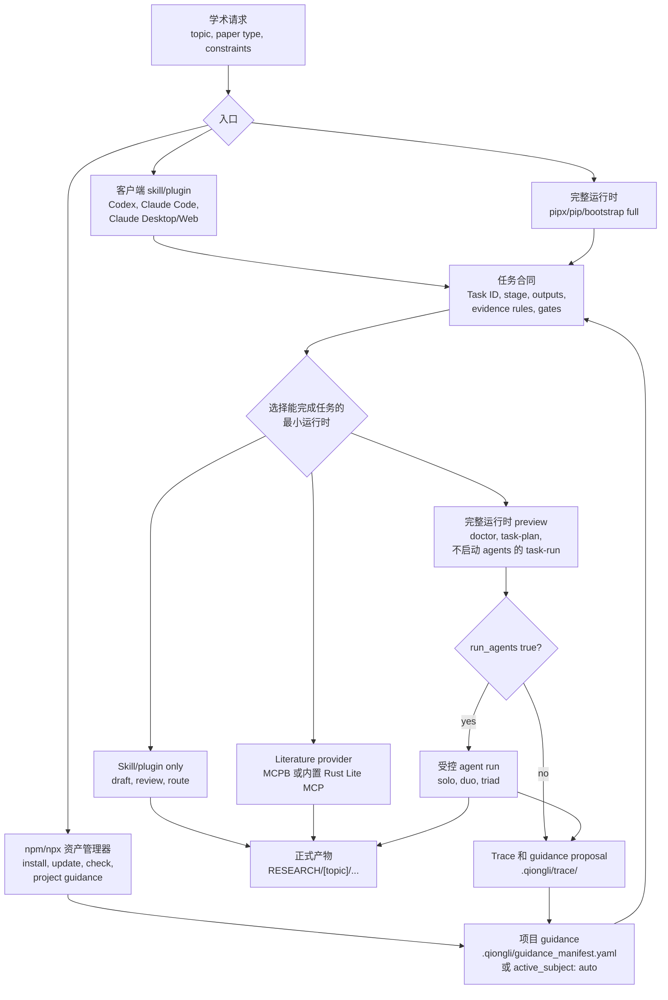

<div align="center">
  <h1>穷理（Qiongli）</h1>
  <p><strong>用 AI agent 做学术研究，同时保留可复查证据链。</strong></p>
  <p>穷理把一个研究目标拆成论文路线、Task ID、文献和引用证据、质量门、agent 交接，以及 <code>RESEARCH/[topic]/</code> 下的稳定文件。</p>
  <p>
    <a href="https://www.npmjs.com/package/qiongli"></a>
    <a href="https://www.npmjs.com/package/qiongli?activeTab=versions"></a>
    <a href="https://pypi.org/project/qiongli/"></a>
  </p>
  <p>
    <a href="README.md">English README</a> ·
    <a href="docs/zh/index.md">中文文档</a> ·
    <a href="docs/index.md">Docs</a> ·
    <a href="docs/zh/quickstart.md">快速开始</a> ·
    <a href="docs/zh/guide/install.md">安装</a> ·
    <a href="docs/zh/reference/cli.md">CLI</a>
  </p>
</div>

## 它是什么

穷理是面向学术研究的 AI agent 工作流系统，适合正在使用 Codex、Claude Code、Claude Desktop、Antigravity、Hermes 或类似工具的研究者。它适合那些不能只靠一次 prompt 完成、后续还需要复查证据、步骤和产物的研究任务。

你可以用它来：

- 为 empirical、qualitative、systematic review、RCT、theory、code-first methods 等项目选择论文路线；
- 组织 literature search、citation checking、study design、writing、code、review、submission 和 rebuttal；
- 把 claim、source、method decision、review note 和生成产物放到稳定项目路径里；
- 先用轻量 skill/plugin 工作流，需要受控 solo、duo、triad agent execution 时再接入完整本地 orchestrator。

“穷理”表示持续追问一个 claim 背后的 principle、evidence 和 limit。

## 从哪里开始

原生 Qiongli 2 使用 [CLI 安装与命令指南](docs/zh/guide/cli-2x.md)。
Beta.1 新增 Cargo 渠道，同时提供 GitHub 二进制下载、npm `next` 和 PyPI；不需要 App。
下方稳定版安装说明仍属于 1.x，不能直接用于 2.x。

| 目标 | 推荐入口 |
|---|---|
| 安装原生 2.x CLI | [CLI 安装与命令指南](docs/zh/guide/cli-2x.md) |
| 浏览完整文档站 | [中文文档](docs/zh/index.md)，或本地运行 `npm run docs:dev` |
| 阅读英文说明 | [English README](README.md) 或 [Docs](docs/index.md) |
| 先在一个客户端里安装 | [安装指南](docs/zh/guide/install.md) |
| 从零跑到第一个 workspace | [快速开始](docs/zh/quickstart.md) |
| 选择论文 workflow | [任务场景](docs/zh/guide/task-recipes.md) |
| 使用 CLI、别名、JSON check 或自动化 | [CLI 参考](docs/zh/reference/cli.md) |
| 理解运行时和 package 模型 | [系统架构](docs/zh/architecture.md) |

## Qiongli 2.x 独立二进制下载

**下载、解压、运行。不用先安装 Python、Node.js、Rust 或包管理器。**

在 [GitHub Release v2.0.0-beta.1](https://github.com/jxpeng98/qiongli/releases/tag/v2.0.0-beta.1)
中选择对应平台的完整 CLI，解压后运行 `./qiongli --help`（Windows PowerShell 使用 `.\qiongli.exe --help`）。
研究 Skills、模板和 Lite/Full MCP 资源都在程序里，不需要额外安装。
你可以直接在解压目录使用，安装 App 或配置 PATH 都不是前提。

| 平台 | 二进制压缩包 |
|---|---|
| macOS Apple Silicon（ARM64） | [下载 `.tar.gz`](https://github.com/jxpeng98/qiongli/releases/download/v2.0.0-beta.1/qiongli-2.0.0-beta.1-aarch64-apple-darwin.tar.gz) |
| Windows x64 | [下载 `.zip`](https://github.com/jxpeng98/qiongli/releases/download/v2.0.0-beta.1/qiongli-2.0.0-beta.1-x86_64-pc-windows-msvc.zip) |
| Linux x64（glibc 2.35+） | [下载 `.tar.gz`](https://github.com/jxpeng98/qiongli/releases/download/v2.0.0-beta.1/qiongli-2.0.0-beta.1-x86_64-unknown-linux-gnu.tar.gz) |

Windows Beta.1 已将 C 运行库编入程序，无需另外安装 Visual C++ 运行库。
Linux 使用系统自带库，要求 glibc 2.35+。

运行前使用同一 Release 的 [SHA256SUMS](https://github.com/jxpeng98/qiongli/releases/download/v2.0.0-beta.1/SHA256SUMS)
核对文件；[完整指南](docs/zh/guide/cli-2x.md)说明解压、PATH 和 MCP 接入步骤。
请在 **Assets** 中选择上述平台包，GitHub 自动生成的 **Source code** 是源码。
模型 Host 和在线文献服务仍需单独配置。

已有 Rust 1.97+ 和本机链接器的用户，也可以通过 Cargo 从源码安装。

Cargo 尚待完成发布，上传 crates.io 后才能使用以下命令。
目前可直接使用独立二进制、npm 或 PyPI。

```sh
cargo install qiongli --version 2.0.0-beta.1 --locked
```

Cargo 提供 `qiongli` 和 `ql`。如果不想编译，直接下载上方二进制包即可。

## 最新稳定版下载

当前稳定版是 [v1.17.0](https://github.com/jxpeng98/qiongli/releases/tag/v1.17.0)。下面这些直达链接覆盖常见安装路径；需要 subject 专精 Desktop ZIP 或维护者 artifacts 时，再打开下载指南。

| 需求 | 链接或命令 |
|---|---|
| npm CLI | [`qiongli@1.17.0`](https://www.npmjs.com/package/qiongli/v/1.17.0)：`npm install -g qiongli@latest` |
| PyPI CLI | [`qiongli 1.17.0`](https://pypi.org/project/qiongli/1.17.0/)：`pipx install qiongli` |
| Claude Desktop 推荐插件 | [`qiongli-claude-desktop-plugin-v1.17.0.zip`](https://github.com/jxpeng98/qiongli/releases/download/v1.17.0/qiongli-claude-desktop-plugin-v1.17.0.zip) |
| Claude Desktop/Web fallback skill ZIP | [`qiongli-claude-desktop-skill-core-v1.17.0.zip`](https://github.com/jxpeng98/qiongli/releases/download/v1.17.0/qiongli-claude-desktop-skill-core-v1.17.0.zip) |
| Claude Desktop literature MCPB | [`qiongli-literature-provider-0.1.5.mcpb`](https://github.com/jxpeng98/qiongli/releases/download/v1.17.0/qiongli-literature-provider-0.1.5.mcpb) |
| Zotero Desktop companion | [`qiongli-zotero-companion-0.2.2.xpi`](https://github.com/jxpeng98/qiongli/releases/download/v1.17.0/qiongli-zotero-companion-0.2.2.xpi) |
| 全部 release assets | [下载指南](https://github.com/jxpeng98/qiongli/releases/download/v1.17.0/qiongli-downloads-v1.17.0.md) 和 [GitHub Release](https://github.com/jxpeng98/qiongli/releases/tag/v1.17.0) |

## 快速安装

npm CLI 是免 Python 资产管理器，默认安装 skills surface：

```bash
npm install -g qiongli
qiongli install --target auto --surface skills
qiongli check
```

脚本化安装时建议显式传入项目目录：

```bash
qiongli install --target all --project-dir "$PWD"
```

`--target all` 会显式写入全部支持的平台路径。需要检测 `PATH` 上已安装的受支持客户端 CLI 并只安装这些客户端对应的 surface 时，使用 `--target auto`。

日常切换项目领域时，不需要反复重装 package；用项目级 subject guidance：

```bash
qiongli project init --project-dir "$PWD"
qiongli project set-subject finance --project-dir "$PWD"
qiongli project status --project-dir "$PWD"
```

如果需要 plugin-lite 或完整运行时路径，请看安装指南。里面分别说明 Codex / Claude Code marketplace plugin、Claude Desktop direct plugin 和 fallback Skill ZIP、literature MCPB、bootstrap partial/full、npm/npx、pipx 和 pip。npm 的 plugin-lite 输出只在 bundled/supported 的位置通过 `--surface plugin` 或 `--surface both` 显式启用。

## 安装入口对比

| 入口 | 定位 | 包含内容 | 适合做什么 | 边界 |
|---|---|---|---|---|
| Marketplace plugin / extension | 客户端原生、最少配置 | Qiongli skill/plugin package、workflows、prompts、templates；Codex / Claude Code 还内置 Rust Lite literature MCP | 不想管理 CLI，也不想安装 Node/Python runtime，只在一个客户端里使用 Qiongli | 不包含完整 orchestrator 或 Python runtime；需要时单独安装完整运行时 |
| Claude Desktop direct plugin | 推荐的 Desktop 路径 | 带 `qiongli` skill package、workflow wrappers 和轻量 bundled literature MCP runtime 的 plugin | 在 Claude Desktop 里获得统一的 Qiongli 入口，不需要管理 CLI | 不包含完整 Python orchestrator；需要时单独安装完整运行时 |
| Claude Desktop fallback Skill ZIP + Literature MCPB | Desktop/Web 手动路径 | 上传式 `qiongli` Skill ZIP，加可选 `qiongli-literature-provider.mcpb` | 手动 skill 上传或 Desktop literature provider 工具 | Skill ZIP 是 skill-only；MCPB 是 provider-only；二者都不运行 Python orchestrator |
| npm / npx | 免 Python 资产管理器 | npm CLI、默认预生成 skills；通过 `--surface plugin|both` 可显式安装 plugin-lite assets；Node project commands | 脚本化安装、dotfiles、CI、当前 package asset refresh、项目 subject guidance | 不升级 package，不运行 `doctor`、`mcp serve`、provider setup 或 task orchestration |
| pipx / pip 完整运行时 | Python CLI 和受管理 full local runtime | Python CLI、setup wizard、完整 plugin install、统一 MCP server、provider setup、doctor、task/orchestrator commands | 本地验证、provider 配置、MCP/orchestrator 工具、package self-update | 需要 Python 3.12+；真实 agent execution 还需要对应本地模型 CLI |
| Bootstrap partial/full | release script 安装路径 | `partial`：全局 skills/discovery；`full`：partial 加 shell CLI/MCP/doctor 支持 | 不走 package manager、直接从 release script 安装的机器 | `full` 仍要求机器已有 Python 3.12+ |

## 运行架构流程



npm 路径只负责资产管理和项目 guidance。完整运行时命令是显式、preview-first 的；只有 `run_agents: true` 且运行时检查通过后，才会启动真实 agent execution。

## 推荐的 CLI Setup Wizard

当你希望 CLI 帮你选择安装和升级路径时，使用完整运行时的 setup wizard：

```bash
pipx install qiongli
qiongli setup
qiongli setup --dry-run
qiongli setup --project-dir "$PWD" --no-doctor
```

完整运行时 wizard 会覆盖 runtime surface、subject、coverage、`--mode copy|link`、shell CLI / CLI 目录、`--overwrite` / `--no-overwrite`、可选 provider config，以及 doctor 验证。在 npm/npx 下，`qiongli setup` 是面向客户端资产的免 Python 资产管理器快捷入口；`doctor`、`mcp serve`、`provider setup` 或 `customize` 这类完整运行时命令需要 `pipx install qiongli`。如果只需要脚本化安装 assets，直接运行 `qiongli install ...` 即可。

## 更新还是刷新

在 npm/npx 下，`qiongli update` 和 `qiongli refresh` 都属于免 Python 资产路径：

```bash
qiongli update
qiongli refresh
```

在 npm/npx 下，`qiongli upgrade` 是覆盖式 asset refresh 的别名，只会从当前已安装 npm package 重新应用 assets；它不会升级 npm package，也不会升级完整 Python CLI。指定 release archive、package self-update 和 `qiongli self-update` 属于 Python 完整运行时：`pipx install qiongli`。

```bash
qiongli upgrade --target all
```

## 运行时边界

安装 Qiongli assets 比运行完整 orchestrator 轻得多。

| Surface | 用途 | 是否需要 Python / 模型 CLI |
|---|---|---|
| Skill 或 plugin package | prompts、task routes、templates、standards、subject overlays | 否 |
| Literature MCPB / bundled literature MCP | provider status、本地检索、evidence export、Zotero import files | 不需要 Python 或 Node |
| Full local plugin 或 CLI MCP | 完整运行时命令：`doctor`、provider config、`task-plan`、`task-run`、`mcp serve` | 需要 |
| Shell/Python CLI | validators、release checks、本地编排、package 维护 | 需要 |

只有在运行时配置完成并且执行命令明确启用时，才会启动真实 agent execution。Preview 和 check 设计上都应先可检查，再产生副作用。

## 研究边界

Qiongli 包含 Academic Idea Funnel 和 Academic Grill Loop；这是对 Matt Pocock 的 `grill-me` idea-discovery pattern 的 academic adaptation，并面向 academic idea-discovery 调整。它会在起草前追问证据强度、替代解释、可行性、venue fit 和 boundary review。

Provider 凭据保存在 provider config，不写进生成的 skill bundle。使用 `qiongli provider setup` 配置 OpenAlex、Semantic Scholar、Crossref、PubMed 和 arXiv 支持的文献 workflow，再用 `qiongli provider doctor` 验证。`qiongli-literature-provider` `.mcpb` 为 Codex/Desktop 流程暴露 `qiongli_literature_status`、`qiongli_search_plan`、`qiongli_literature_search`、`qiongli_literature_export_evidence`、`qiongli_config_status`、`qiongli_configure_provider` 和 `qiongli_save_provider_config`；状态会根据 provider 和平台原生搜索可用性区分 `provider_connected`、`native_only` 和 `strategy_only`。`qiongli_collect_evidence` 是 external evidence adapter 路径，不能作为 OpenAlex provider config 检查。skill-only 安装仍可使用 strategy fallback，外部 provider probe 保持 180 秒上限。

Rust Lite provider 只承诺有界的基础 provider 检索、规范化、去重、限额和
真实的部分失败诊断。配置工具返回由调用方打开的 tokenized loopback URL。
领域深搜、citation expansion、Zotero library 检索/写入、项目写入和 agent
execution 仍属于 Full runtime。

## 文档地图

- [入门](docs/zh/guide/index.md)：安装、使用、升级、故障排除和 runtime 选择。
- [快速开始](docs/zh/quickstart.md)：最小安装面和第一个研究路线。
- [使用 Agent Skills](docs/zh/guide/using-agent-skills.md)：Codex、Claude Code、Antigravity、Hermes 和 shell 里该输入什么。
- [任务场景](docs/zh/guide/task-recipes.md)：按真实研究目标选择 paper route。
- [参考](docs/zh/reference/index.md)：CLI 行为和 skill catalog。
- [高级](docs/zh/advanced/index.md)：MCP providers、Zotero、subject packaging、plugin-first distribution。
- [维护者](docs/zh/maintainer/index.md)：release policy、naming policy 和贡献者指南。

## 开发

常用检查：

```bash
python3 -m unittest tests.test_self_update tests.test_cli tests.test_cli_setup_docs
python3 -m unittest tests.test_materialize_distribution_payloads tests.test_npm_package_contract
npm --prefix packages/npm-qiongli test
npm run docs:build
git diff --check
```

维护者契约锚点：

- canonical contract 位于 workflow standards；打包安装中会暴露 `standards/research-workflow-contract.yaml` 和 `standards/mcp-agent-capability-map.yaml`。
- 面向发版的变更先运行 `python3 scripts/validate_research_standard.py --strict`。
- Subject package 变更需要通过 staged materialization 和 npm package contract tests，包括 `tests.test_materialize_distribution_payloads` 和 `tests.test_npm_package_contract`。
- Agent routing 细节见 [Agent-Skill Collaboration](docs/advanced/agent-skill-collaboration.md)。
- legacy shell installer 仍保留在 `scripts/install_qiongli.sh`；多数用户应优先使用安装指南或 `qiongli install`。

常规发版入口：

```bash
./scripts/release_automation.sh publish --version <version> --from-tag <previous-tag>
```

## 致谢

Qiongli 借鉴了严格 agent planning/review、Claude skill packaging 和学术审阅实践中的有效做法，并把它们收敛到可复查的研究产物链路里。感谢 [linux.do](https://linux.do/) 社区提供务实的中文 AI tooling 讨论和反馈。
