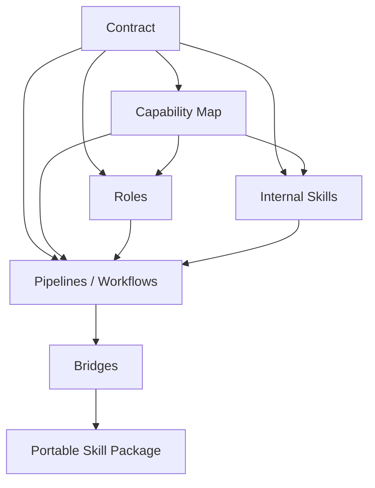

# Architecture

This page condenses the architecture sections scattered across `README.md` and maintainer guidance into one stable overview.

## Core Principle

Research Skills separates:

- canonical contract truth
- capability routing
- functional ownership
- reusable execution specs
- workflow sequencing
- runtime execution
- client-facing distribution

That separation is what keeps the system extensible without turning every workflow tweak into a hidden contract change.

## Layer Model

| Layer | Primary location | Responsibility |
|---|---|---|
| Contract | `standards/research-workflow-contract.yaml` | Task IDs, artifacts, quality gates |
| Capability Map | `standards/mcp-agent-capability-map.yaml` | Runtime routing, MCP and skill requirements |
| Functional Agents | `roles/` | Ownership, quality thresholds, tone |
| Internal Skill Specs | `skills/` | Reusable execution behavior |
| Pipelines / Workflows | `pipelines/`, `.agent/workflows/` | Step sequencing and entry UX |
| Bridges | `bridges/` | Runtime adapters and orchestration |
| Portable Skill Package | `research-paper-workflow/` | Cross-client distributable entry skill |

## Dependency Direction

## Stable User-Facing Entry Modes

| Entry mode | Best for | Entry |
|---|---|---|
| Claude Code workflows | Slash-command UX inside a project | `.agent/workflows/*.md` |
| Shell/Python installer CLI | Installing and upgrading assets | `research-skills`, `rsk`, `rsw` |
| Orchestrator CLI | Task planning, task execution, validation | `python3 -m bridges.orchestrator ...` |
| Portable skill package | Cross-client distribution surface | `research-paper-workflow/` |

## Dynamic Discipline Domains

The base system stays generic. Discipline specialization is injected at runtime through domain profiles such as `skills/domain-profiles/economics.yaml`.

This keeps the installed package small while still allowing:

- domain-specific libraries
- diagnostics and robustness checks
- reporting standards
- venue or methodology priors

## Multi-Model Runtime Collaboration

At execution time, the system can coordinate `codex`, `claude`, and `gemini` through the orchestrator.

Common modes:

- `parallel`: same prompt, multiple runtimes, one synthesis
- `task-run`: one canonical task with contract-driven review flow
- `team-run`: one task, multiple work units, then merge/review

## Design Lineage And Related Projects

Two external projects are especially relevant to how this repository evolved:

- [fengshao1227/ccg-workflow](https://github.com/fengshao1227/ccg-workflow)
  - Important influence: strict separation between spec, planning, execution, and review.
  - Important difference: CCG is a general software-engineering collaboration system, while `research-skills` localizes that discipline into academic research workflows and Stage-I tasks `I5 -> I6 -> I7 -> I8`.
- [GuDaStudio/skills](https://github.com/GuDaStudio/skills)
  - Important influence: packaging cross-model collaboration capabilities as installable Claude-oriented skills.
  - Important difference: `GuDaStudio/skills` is a general-purpose skill collection, while `research-skills` is organized around one canonical contract, one task catalog, and one `RESEARCH/[topic]/` artifact tree.

## Where To Go Next

- Need edit rules and placement guidance: [Conventions](/conventions)
- Need exact CLI commands: [CLI Reference](/reference/cli)
- Need to modify behavior: [Extend Research Skills](/advanced/extend-research-skills)
