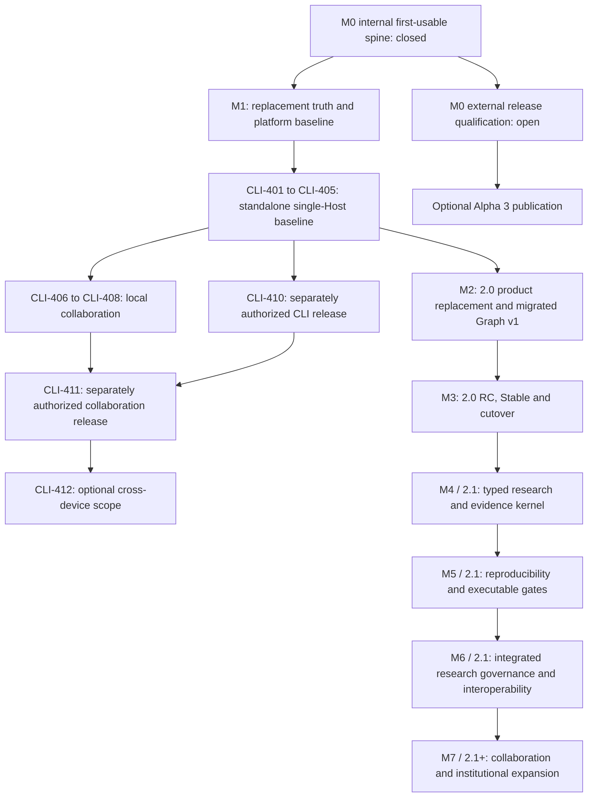

# Qiongli 2 CLI-First Replacement Master Roadmap

Status: authority for program direction, ordering, milestones, and the current
execution horizon. Live task state and exact evidence are owned by the
[program ledger](qiongli-program-ledger-v1.json) and rendered in the generated
[current program index](qiongli-current-program-index.md); remaining release
qualification stays independently evidence-gated

Decision date: August 2, 2026

Target branch: `2.x`

Live execution projection: generated from the program ledger

Planning horizon: reliable Qiongli 1.19 replacement in `v2.0.0`, followed by a
separate `2.1` research-harness expansion horizon

## 1. Purpose and authority

本路线图先把现有 Rust-native CLI、Plugin/Skills、Lite/Full MCP、Zotero 和
Academic Graph v1 收敛为不依赖本产品窗口的替代主线；Desktop 暂留维护，再进入
Typed Kernel、Evidence/Reproducibility 和机构级科研治理扩张。

它解决三个问题：

1. 旧主路线图已经混合了架构决策、迁移历史、当前状态和发布收据，无法继续作为
   清晰的未来执行队列；
2. Qiongli 的平台安全、事务和跨客户端连续性已经较成熟，但证据真实性、可复现性和
   科研质量评测仍明显落后；
3. 未来工作需要先证明用户可迁移、可使用、可回滚，再按依赖和可验证指标扩张，
   而不是继续按功能页面或 Agent 数量扩张。

权威关系如下：

- Archived implementation record
  `.trellis/tasks/archive/2026-08/08-10-close-alpha3-first-usable-spine/prd.md`
  记录已闭合的
  first-usable 范围与聚焦检查；后续工作复用当前执行计划，复杂的新目标才需要
  一份简短计划，不再要求 Trellis task，也不得复制本文件的 249 个长期 Task ID；
- [Alpha 3 completion plan](../plans/2026-08-01-qiongli-alpha3-completion-and-release.md)
  控制 M0 的 release state machine，但不再充当日常任务队列；
- [Alpha 3 acceptance ledger](../acceptance/2026-08-01-qiongli-alpha3-readiness.md)
  继续控制 Alpha 3 的证据与发布授权；
- 已接受 ADR 继续控制架构边界，尤其是 Tauri/Svelte presentation、
  CLI-first / External Host execution under ADR 0218、版本化状态和 1.x replacement
  migration；
- 本文件控制跨版本优先级、依赖、版本切片与 Stable 进入门；
- [Program ledger](qiongli-program-ledger-v1.json) controls the six live task
  states, dependencies and exact acceptance evidence; the generated
  [current index](qiongli-current-program-index.md) is the review surface, and
  checklist marks in this file are presentation only；
- 旧路线图和计划保留为历史设计与验收记录，不再通过追加“当前状态”来控制未来队列。

## Current execution horizon — September 10, 2026

The maintainer has selected **CLI-first delivery without a Qiongli App window**.
[ADR 0218](../../architecture/decisions/0218-cli-first-local-host-collaboration.md)
supersedes the App-owned ACP default. The September 5 local CLI notes are mapped
into this roadmap and the existing ledger; their static validation is not
product acceptance. CLI First is the product direction; CI remains verification.

September 10 maintainer decision: **Codex is the primary development and
verification Host**. Design new research interactions and measure quality in
Codex first; Claude Code and other Agents adapt the same CLI/Skill/MCP contracts
with focused compatibility checks. Preserve configured models, shared research
state, approval/CAS and macOS/Windows/Linux delivery. This prioritizes execution;
it does not supersede the External Host architecture or claim adapter acceptance.

Delivery closeout: `2.0.0-alpha.8` is published through GitHub, npm `next` and
PyPI `2.0.0a8`. Skillsplace's prerelease Plugin now uses the same native research
resources and an exact npm runtime pin. The
[distribution evidence](../../../tooling/release/acceptance/v2.0.0-alpha.8-distribution.json)
records qualified source, public bytes and marketplace parity. Continue with the
bounded semantic research observation below. Cargo's Windows staged-TOML failure
and missing registry credentials remain separate release gaps.

September 10 subsequent maintainer decision: deliver Marketplace Plugins with
bundled native executables and an explicit platform choice. ADR 0223 and the
current plan record local source implementation, 23 focused tests and macOS
empty-PATH checks. The six Codex/Claude target archives and generated platform
index reuse existing CLI release owners. External catalog adaptation, fresh
Windows/Linux Plugin observations and publication remain the next distribution
increment; published alpha.8 continues using its historical npm bridge. Research
quality work and Cargo qualification remain independently scoped.

September 10 research-quality increment: the maintainer requested local Graph
normalization and bilingual scholarly voice improvements. The current plan now
records multi-source evidence extraction, citekey-based cross-stage joins,
record-bound source navigation, and Host-assisted candidate-to-canonical guidance.
J2 reuses its existing Skill and adds English/Chinese voice guidance derived from
`jxpeng98/skills` humanizer. No graph store, new tool or independent model runtime
is added. Actual Codex semantic observation remains the next quality check;
source/pack checks do not establish universal extraction or live Host readiness.

September 10 stage-continuity increment: completed research can now be retained
in versioned, detailed stage documents with source coverage and an accumulating
history through the existing context-maintenance Skill. Optional retention
review is advisory and file-specific; selection and removal belong to the user,
and confirmation never enables assistant-operated cleanup. Local content/Plugin
checks and an isolated synthetic forward trial are recorded in the current plan.
They do not establish installed-Host acceptance or authorize real-project cleanup.

September 10 download-channel clarification: public alpha.8 already includes
standalone macOS ARM64, Windows x64 and Linux x64 archives. The current plan
records prominent bilingual download/setup documentation and a target-specific
README for future archives, reusing the existing release owner. Independent
public-byte verification and an empty-PATH macOS CLI/MCP observation passed;
published artifacts and the remaining release qualification gates are unchanged.

| Horizon | Ordered work |
|---|---|
| **CLOSEOUT** | App/ACP and authorized Trellis cleanup merged via #181; CLI build separation merged via #182. Retain the old plan/review as history. `PLT-404`—`PLT-408` remain deferred, not accepted. |
| **NOW** | Alpha.8 is published from `3d64767c` on GitHub, npm `next` (`2.0.0-alpha.8`) and PyPI (`2.0.0a8`). Native run `34490579219` passed builds and final-package installation on macOS ARM64, Windows x64 and Linux x64 (glibc 2.35+); public downloads match CI bytes. Skillsplace `973e1a04` aligns next with verified Codex/Claude distributions; stable remains 1.17.0. Public Plugin Lite MCP uses 14 tools; CLI Full retains 32. `CLI-405` bounded Codex/Claude Code handoff with configured DeepSeek remains verified at `dfebb17c`, revision 2. Program and managed/App lifecycle acceptance remain separate. |
| **NEXT** | Codex-first Skills quality: two bounded evidence-journey cases now check reading-to-manuscript and direct-source scopes through the existing V1 owner. Required outputs follow the task; prose/order/reuse stay flexible, while requested claims, active source links, evidence limits and source bytes remain constrained. Offline receipts pass 16/13 assertions, with missing/stale/mislinked evidence regressions. These are test observations, not full Markdown or semantic verification. Next bind actual Codex answers to these fixed synthetic inputs and review source fidelity, causal limits and unnecessary work alongside structural checks. Original resource-read score stays 4/6; no new model result is claimed. Other Agents adapt shared contracts; Host registration stays paused. Cargo separately needs staged manifest line-ending repair, three-platform source qualification and registry checks; acceptance stays separate. |
| **AFTER THE BASELINE** | `CLI-406` task/claim/candidate contract, `CLI-407` two real local Hosts, `CLI-408` conflict/crash/revocation checks. `CLI-409` qualifies additional Hosts separately. `CLI-410` can release the CLI baseline before collaboration; `CLI-411` qualifies collaboration separately. |
| **LATER** | `CLI-412` optional cross-device synchronization only after local collaboration, with new scope authority. M2/M3 replacement and M4+ research expansion retain their independent gates. |

The [current closeout and extraction plan](../plans/2026-09-06-cli-first-closeout-and-extraction.md)
records the actual branch, dependency/caller inventory, preserved source, checks
and the precise next increment. The former
[ACP implementation plan](https://github.com/jxpeng98/qiongli/blob/ab84081fd260cb2914ce86f6dc4b6c77c26c6a58/.trellis/tasks/09-04-app-acp-all-chat-realignment/implement.md)
and its embedded-Agent review are historical source evidence. Their unfinished
App stages are no longer the next execution queue.

September 10 research-Skills review: prioritize a research project that keeps
claims, sources, decisions and revisions traceable, with execution proportional
to the requested outcome. Skill count, multiple models and lifecycle coverage
alone do not establish differentiation. The current comparison found overlapping
capabilities in [Scientific Agent Skills](https://github.com/K-Dense-AI/scientific-agent-skills),
[Academic Research Skills](https://github.com/Imbad0202/academic-research-skills),
[Claude Academic Workflow](https://github.com/ericluo04/claude-academic-workflow)
and [PaperQA](https://github.com/Future-House/paper-qa); these are public-document
comparisons, not performance results. Keep the existing 82-card library and
CLI/Plugin/MCP owners while measuring outcome quality and avoidable operations.
Do not add a new routing service, graph store or model manager for this increment.

The new user outcome is: install a verified native package, use a chosen Host to
compare sources and propose a note, approve through existing project owners,
then recover or continue in another Host on the same device. Models/accounts and
native conversations stay with Hosts; research state and receipts stay with
Qiongli. Same-device collaboration shares local authority through existing
services, not chat copying or cross-device file synchronization.

### Academic relations and presentation under CLI First

September 8 maintainer decision: retain Graph v1 as a rebuildable relationship
query over canonical research records and receipts. Existing file/ID/source-anchor
authority, bounded CLI/MCP queries, rebuild and truthful missing/sparse diagnostics
remain supported. A model-proposed relation remains a candidate until reviewed;
structural containment never implies scholarly support. Do not introduce a second
canonical store, graph database or graph-editing write path for presentation.

Presentation follows the user's question rather than opening a whole network:

| Surface | Intended output | Delivery boundary |
|---|---|---|
| CLI | Brief summaries, tables and actionable evidence-gap lists, with source anchors | Reuse current query/doctor owners; preserve existing JSON contracts. Human-readable formatting is a bounded follow-up when needed, not a claim about current output. |
| External Host | Natural-language questions answered from bounded relation queries, citing artifacts and distinguishing proposed/reviewed/unverified relations | Reuse Full MCP; return actual missing data without inventing relations. |
| On-demand export | A local subset as Markdown or Mermaid; interactive local HTML only when a real research use case needs it | Optional read-only presentation work, not an App dependency or first-stage gate. |

The first stage requires preserved query/traceability behavior and truthful sparse
output, alongside the approved research write, restart and Host handoff. It does
not require every project to produce semantic nodes, a complete literature graph,
or a dedicated graph UI. The current REALM/RAG example's structural-only graph is
a disclosed capability limit, not a reason to manufacture scholarly records.
`PLT-322` retains useful source-bound semantics on a representative migrated
project in M2; its already-accepted historical task and evidence keep their original
scope, including visualization. This change does not reopen that task because the
current small fixture is sparse. Graph v2 stays in M4. Retained Desktop support and its existing
contracts remain intact. This decision refines roadmap ordering/presentation and
does not rewrite accepted ADRs or historical acceptance evidence.

All 46 accepted ledger records retain their original scope. `PLT-401`—`PLT-403`
capacity/bounds are already accepted. The retained App stage proves offline
source behavior only: reducer/ACP lifecycle, Tauri controls, private observations
and source-bound Capture integration. Live ACP isolation/authentication/resume,
packaged sidecars, App multi-Agent acceptance and the research-v2 consumer gate
remain unverified/deferred. A source-stage close or merge does not accept them.

`v2.0.0-alpha.5` remains an unpublished internal candidate at
`842f6bb7136fc03551b7a1acf3b612daa3dc6953`, with Native CI run `33525293258`
and candidate run `33527363262`. Its historical evidence does not qualify a
standalone CLI package. Public candidates require a fresh version and exact
source/package qualification under separate publication authority.

Keep Rust, content locks, CLI/MCP, ProjectStateService, Capture/Graph, task and
checkpoint owners, export/recovery, package trust and preview/approval/CAS.
The current mixed package and optional Tauri/Svelte desktop remain until the
CLI split is verified. Do not start React/Electron, embedded chat, direct provider
APIs, a general Agent daemon or a cross-repository common package. Old GUI
support and public package retirement require their own explicit decision.

Run affected Focused checks while editing, review and commit the local feature
branch, then merge it locally into `2.x`. No PR or remote CI wait is required. Missing live/package evidence blocks its own claim, not
independent offline work. The master and ledger own direction and state;
Trellis history is retained. The maintainer explicitly authorized integrating
the existing hook/task-engine cleanup. AGENTS.md and CONTRIBUTING.md own the
development flow; product approval/CAS and required integration checks remain.

September 7 maintainer correction: development and integration happen locally.
Create a feature branch from local `2.x`, edit, run affected checks, review and
commit, then merge locally and continue. This standing instruction covers scoped
local branch/commit/merge without repeated confirmation. No PR, remote CI wait,
post-merge suite or candidate acceptance is required for each increment. Push and
remote-rule changes remain separate. Optional CI retains headless/platform
checks; packages and live Hosts are qualified at named candidates. Acceptance
records gate claims, not independent implementation.

## 2. North Star

Qiongli 2 的目标产品定义是：

> A local-first, provenance-first research harness for auditable and
> reproducible scholarly workflows across model hosts.

对应的中文目标是：

> 一个本地优先、来源优先、可审计、可复现，并能跨模型 Host 保持科研语义连续性的
> 学术研究 Agent Harness。

`v2.0.0` 的成功不以“支持更多模型”“有更多 Agent”或“图谱更漂亮”为标准，而以
可靠替代 1.19 为标准：

- CLI、Plugin/Skills、Lite/Full MCP、Zotero 的关键用户旅程无需本产品 App；
- CLI、MCP、Host handoff 与保留的 Desktop 在同一 revision 上表达相同语义；
- Graph v1 在 M2 的代表性 1.19 迁移项目上产生来源绑定的学术语义、可用查询和
  可追溯的文字结果、确定性重建与真实空/稀疏状态；局部可视化按需提供；
- 安装、升级、迁移、修复、回滚和卸载不丢失用户项目或非托管状态；
- macOS、Windows 和 Linux 的公开声明都绑定同一 exact source、包和收据；
- 1.19 保持功能冻结，2.0 Stable 后按既有策略进入 90 天维护倒计时。

Typed Kernel、Graph v2、Evidence/Reproducibility v2、机构研究模式和远程协作
仍是目标产品方向，但不再阻塞 2.0 替代和 1.19 退役。

## 3. Verified baseline updated August 13, 2026

Sections 3.1 and 3.3 preserve the August 13 evidence and gap assessment; their
historical open labels do not override the program ledger. The September 6 horizon and ADR 0218 own the new direction; the maturity rows
below describe historical capabilities rather than new CLI acceptance.

### 3.1 Release state

- exact first-usable 产品 source 为
  `cced60826ac4d7dad596669103a7e15b61868e81`，包含已合并的 App first-use
  与 native Zotero vertical；Native CI run `31438158969` 已通过该 source。
- Community Alpha promotion run `31439930097` 已针对同一 source 完成 exact-head
  verification、三目标 fresh rebuild 与 non-publishing aggregation；其受保护发布
  审批于 2026-08-11 被明确拒绝，因此没有 tag、Release 或公开资产。
- 源码版本是 `2.0.0-alpha.3`，公开标签和 Release 仍只有
  `v2.0.0-alpha.1`。
- 当前 candidate 已达到自动化 `Internally usable`，但原生 CLI 比 28 MiB
  release budget 多 68,832 B；A6 target/manual claim、A7 real-Host/update、
  A8 trust/publication 与 A9 public observation 仍未完成。
- exact macOS package 的自动化 Zotero vertical 已通过；system-profile Codex
  完成了一个 revision-bound handoff transaction，但同时暴露出 Full MCP 的
  `qiongli_orchestrator_route` 错误返回 Marketplace Lite upgrade 指令。聚焦修复及
  `EVAL-401`—`EVAL-407` 由 PR #124 承载；目标分支证据仅在受保护合并且合并后 CI
  成功后成立，且不构成 exact-package 或发布证据。Claude live
  transaction 因外部传输权限未授权而保持 open。
- `cced6082` 的既有包和 Host 证据只属于该 source。当前 route 产品修复改变了
  product/package input；若恢复 Alpha 3 发布，必须冻结并重新资格化新的 exact
  candidate，不能沿用旧候选的 A5/A6 身份。

结论：Alpha 3 的第一个自包含可用主链已有同源三平台内部候选包，但仍是
`publication_allowed=false` 的内部版本，不是已经通过 release qualification
或可公开部署的版本。

### 3.2 Implemented product foundation

| Area | Verified state | Roadmap consequence |
|---|---|---|
| Native product | Rust workspace、Tauri 2、Svelte 5、native CLI 已建立 | 不再重启 Rust migration program |
| Agent boundary | External Hosts own normal execution under ADR 0218; retained App ACP code is deferred | 不恢复 direct-provider default；复用领域任务/候选/收据，聊天历史不作业务权威 |
| Project authority | CLI 与 Desktop 共用 `ProjectStateService` | 不建立第二套 Desktop project format |
| Write safety | revision CAS、file lock、atomic replace、rollback/recovery 已实现 | 并发工作的重点是 UX、时延和失效通知，而不是重写存储层 |
| Research Library | 项目注册、迁移、导入导出、Doctor、portable identity 已实现 | 作为后续 Kernel 的项目容器 |
| Research Capture | intake、delivery、assignment、resolution、lineage、restart recovery 已实现 | 扩展科研语义，不重新设计通用 Inbox |
| Academic Graph v1 | deterministic projection、query、portfolio、timeline、visualization 已实现 | Graph v2 必须由 Kernel 演进，不能从 UI 重做 |
| Frontend contract | versioned App API、Zod、Rust fixture 和 TypeScript tests 已较严格 | 继续收敛 CLI/MCP/public schema，而非否定现有 contract |
| Orchestration | revision-bound handoff、candidate、checkpoint、ToolHost evidence binding 已实现 | 把科研 Gate 接入现有 control plane |

### 3.3 Confirmed gaps

| Gap | Evidence | Severity |
|---|---|---:|
| Native Zotero tool/Skill drift (closed on Alpha 3 integration head) | native Lite/Full registry, dispatch, Companion search/upsert, receipt validation, Skill and import fallback now share one contract | Resolved |
| Full MCP route reported Marketplace Lite during authenticated Codex use | Full server reused Lite route dispatch even while host-orchestration tools were active; PR #124 overrides the shared Full dispatch and updates canonical Skill routing | P0 fixed in PR #124; target integration remains evidence-gated |
| App install stops before official Host activation | packaged control materializes/registers the Plugin, then reports `installed-host-action-required`; the user must still copy Host commands before a later probe can reach Ready | Immediate P0 |
| Evaluation Truth V1 target acceptance is evidence-gated | PR #124 carries executable `EVAL-401`—`EVAL-411`, including six adversarial fixture families, same-case evidence/count mutations and a direct `2.x` CI workflow; acceptance requires protected merge and successful post-merge CI | Integration prerequisite |
| Academic-quality eval (closed in PR #124) | the canonical V1 suite evaluates 12 captured finding cases and reports `12 passed, 0 failed`; target-branch acceptance uses the same integration gate | Resolved in PR; integration evidence-gated |
| Scholarly source verification is mostly syntactic | Capture validates locator shape; ledger extraction trusts declared status | P1 |
| No complete typed research kernel | Graph/Capture types exist, but Study, Dataset, Variable, Outcome, AnalysisRun, Result and protocol objects are incomplete | P1 |
| Reproducibility remains contract-level | Q4 checks structure and path presence, not environment reconstruction or result replay | P1 |
| Desktop external-change visibility | No filesystem watcher or native project-change event; manual refresh remains required | P1 |
| Synchronous IPC and coarse locks | `qiongli_snapshot` and `qiongli_execute` are synchronous; some work happens under global mutexes | P1, benchmark-gated |
| Full snapshot cost | Library snapshot is bounded but scans all registered projects and canonical artifacts | P1, scale-gated |
| Packaged real-IPC E2E coverage | Frontend uses jsdom/unit coverage; real packaged IPC/concurrency/fault journeys remain limited | P1 |

### 3.4 Maturity assessment

| Dimension | Current maturity | Stable target |
|---|---:|---:|
| Local transaction and migration safety | High | Production-qualified |
| CLI/Desktop project semantic parity | Medium-high | High, revision-coherent |
| External Host orchestration control | Medium-high; existing task and evidence owners | High, Gate-integrated |
| App-owned ACP and All Chat | Retained offline lifecycle, App/history and source-candidate integration | Deferred under ADR 0218; not a standalone CLI gate |
| Academic Graph and continuity | Medium-high | Kernel-derived and migration-safe |
| Desktop responsiveness and live invalidation | Medium | Measured, cancellable and coherent |
| Cross-language public schema governance | Medium | Generated and compatibility-gated |
| Scholarly source identity and status | Low-medium | Verified or explicitly unresolved |
| Claim-evidence support integrity | Low-medium | Auditable and blocker-aware |
| Reproducibility and replay | Low | Manifested, replayed and compared |
| Executable scientific evaluation | Medium; PR #124 carries V1 cases, adversarial fixtures, same-case mutation checks and direct CI ownership; target acceptance requires protected merge and successful post-merge CI, while release gates remain open | Release-gating |
| Restricted-data and ethics governance | Early | Policy-enforced local modes |
| Multi-user institutional collaboration | Not a 2.0 foundation | Post-Stable unless separately approved |

## 4. Reclassification of earlier recommendations

此前分析中的方向大体正确，但必须按当前实现重新分类：

| Earlier recommendation | Current finding | Decision |
|---|---|---|
| Make bundled App integrations effective | Existing App-mediated activation and CLI lifecycle are retained | Reuse fixed activation plans and fresh probes in the independent CLI lane |
| Improve bundled Plugin quality | PR #124 repairs the bounded Skill gaps and 12 academic-quality fixtures; canonical CI and mutation evidence are implemented | Integrate the Evaluation Truth slice through its existing evidence gate without broadening the evaluator |
| Fix eval false-green before expansion | Implemented and locally verified in PR #124; target acceptance requires protected merge and successful post-merge CI | Preserve as P1 prerequisite; do not rebuild a second evaluator |
| Build a Typed Research Kernel | Graph/Capture provide partial foundation, not a complete Kernel | Post-2.0 M4 |
| Build Evidence v2 | Locator syntax exists; identity, status and support verification remain incomplete | Post-2.0 M4 |
| Add RunManifest/replay | Orchestration hashes are not research run manifests | Post-2.0 M5 |
| Make Q1-Q4 executable | Contracts and auditors exist, but deterministic semantics are incomplete | Post-2.0 M5 after Evidence/Repro |
| Start R4C Academic Graph | Stale recommendation: Graph v1 and UI already exist | Preserve v1; derive Graph v2 from Kernel |
| Replace unsafe Desktop storage | Incorrect framing: shared service and CAS already exist | Retain storage; improve sync, jobs and E2E |
| Replace one global loading boolean | Active-operation counting and route-level states partly mitigate it | Fix only reproduced 2.0 instability; broader jobs remain post-2.0 M6 |
| Make every Tauri command async immediately | Risk is credible but not yet measured for every operation | Benchmark first; migrate long operations and lock scopes |
| Build real-time team collaboration | Large threat-model and scope expansion | Defer to 2.1 |
| Adopt external research standards internally | Direct adoption would over-constrain the Kernel | Keep internal model; add export adapters post-2.0 M6 |
| Add arbitrary agents/providers/domain packs | Does not close replacement gaps | Qualify selected External Hosts; defer App ACP and broader expansion |

## 5. Product boundary for v2.0.0

### 5.1 In scope for v2.0 replacement

- one local-first Research Library containing portable research projects;
- selected External Hosts through independently qualified native CLI,
  Plugin/Skills and Lite/Full MCP paths;
- source-bound tasks, candidates and receipts; same-device collaboration follows
  the single-Host baseline and does not gate its first independent CLI release;
- native CLI and Zotero Companion; retained App support stays in its own lane;
- the accepted Graph v1 semantic projection plus one representative migrated-
  project query and source-traceability journey in M2; visualization is optional;
- the existing deterministic Evaluation Truth checks and risk-triggered security,
  schema, data-loss and authorization checks;
- auditable export, migration, rollback and recovery for the replacement journey;
- production-qualified macOS, Windows and Linux targets according to the exact
  target claim matrix;
- the existing single-source Workflow/Skill and generated Plugin distribution path.

### 5.2 Explicitly out of scope for v2.0.0

- hosted multi-user synchronization or real-time editing;
- an authenticated remote Capture relay;
- a Qiongli-owned direct model-provider API client or silent transport fallback;
- new App/embedded-chat features, React/Electron migration and a general Agent daemon;
- automatic interpretation of arbitrary research-directory prose as verified facts;
- autonomous ethics, IRB, submission-readiness or causal-validity approval;
- an opaque database as the only authority for research meaning;
- majority vote between agents as proof of correctness;
- a single unexplained “Research Quality 87/100” score;
- unlimited domain-pack, provider or UI-feature expansion before trust gates close.
- Graph v2, a complete Typed Research Kernel, Evidence/Reproducibility v2,
  institutional research modes, submission freeze and external-standard adapters.

## 6. Target authority model

Qiongli must keep four authority layers distinct:

```text
Layer 1: Portable canonical research record
  Markdown / CSV / BibTeX / versioned JSON or JSONL
  + typed IDs, anchors, manifests and explicit human decisions

Layer 2: Immutable receipts and event history
  capture, delivery, resolution, run, gate, approval and migration receipts

Layer 3: Rebuildable projections
  Typed Kernel view, Academic Graph, Portfolio, Timeline, search index,
  Scientific Health and interoperability exports

Layer 4: Presentation caches
  Desktop route state, pagination cursors, layout and transient operation state
```

Rules:

1. Layer 3 and Layer 4 may always be deleted and rebuilt from Layer 1 and Layer 2.
2. Graph or UI state may never silently overwrite a canonical artifact.
3. Every typed object must expose its portable source and anchor.
4. A field must have one declared authority; duplicate representations require an
   explicit reconciliation rule.
5. Model output remains a candidate until schema, evidence, revision and approval
   checks accept it.

## 7. Program workstreams

| ID | Workstream | Outcome | Stable exit condition |
|---|---|---|---|
| `GOV` | Program and contract governance | One roadmap/status/schema authority | No live-state contradiction; accepted items have evidence |
| `REL` | Release and distribution | Exact-source, target-native, reversible releases | Every claim binds CI, package, receipt and trust bundle |
| `CLI` | Standalone native delivery and local collaboration | Window-free installation, research and same-device Host work | Independent package, approval and declared Host journeys have exact evidence |
| `EVAL` | Scientific evaluation | Executable, adversarial, calibrated evals | Zero false-pass blocker fixtures |
| `KRN` | Typed Research Kernel | Versioned scholarly objects and relationships | Every object is portable, anchored and migratable |
| `EVD` | Evidence integrity | Source identity, status, locator and support verification | Central claims are verified or explicit gaps |
| `RPR` | Reproducibility | Inputs-to-results manifest and replay | Reference analyses reproduce within declared tolerance |
| `GATE` | Executable Q1-Q4 | Deterministic, verifier and advisory Gate layers | PASS has complete machine evidence |
| `PLT` | App/CLI/MCP convergence | Coherent revisions, jobs, deltas and public contracts | No cross-surface semantic drift |
| `ORC` | Governed orchestration | Gate-driven candidate review and approved apply | High-risk changes cannot self-approve |
| `SEC` | Security and research-data governance | Untrusted-content isolation and research modes | Restricted/Offline policies fail closed |
| `UX` | Scientific research UX | Explainable health, evidence and recovery views | Every warning has cause, evidence and next action |
| `INT` | Interoperability | Auditable external export/import adapters | Round-trip or declared-loss reports pass |
| `PILOT` | Research validation | Representative projects and expert review | Independent researchers can reproduce the evidence path |

## 8. Dependency and release sequence



并行规则：

- `REL`、安全测试和文档治理贯穿所有阶段；
- M0 的 live Host、target-native、trust、update 和 publication 权限门可以继续
  open/deferred；它们不再阻塞不需要这些权限的 M1 代码工作，但也不能被 M1
  的测试或提交替代；
- 保持一个当前集成目标；接口稳定、文件责任清晰的工作可并行，不再用 Trellis
  task 生命周期串行阻塞。master roadmap 的 current horizon 决定 next 顺序，
  program ledger 与 current index 记录 live state、blocker 和 exact evidence；
- `EVAL-401`—`EVAL-411` 由 PR #124 进入受保护 `2.x`，其 target-branch acceptance
  只引用 program ledger 中的合并提交和合并后 CI，且不构成 release acceptance；
- `PLT` 替代链路和 Graph v1 真实项目验证先于 Kernel 实现；
- Evidence 和 Reproducibility 可在 Kernel schema 冻结后并行；
- Graph v2、Scientific Health 和 orchestration Gate integration 必须等待
  Kernel/Evidence/Gate 合约稳定；
- 远程协作、Relay 和大规模领域扩张不得占用 `v2.0.0` 关键路径。

### 8.1 GitHub program mapping

The public [Qiongli 2.x Research Harness Roadmap](https://github.com/users/jxpeng98/projects/1)
is the collaboration and visualization surface for this program. Repository
plans and pull requests are the local execution surface. Neither replaces this
document's long-term ordering or the acceptance ledger's evidence authority:

| GitHub object | Program meaning | Authority rule |
|---|---|---|
| Implementation plan | one current user outcome with bounded increments and checks | reuse existing notes; no mandatory task engine or duplicate backlog |
| Project | cross-release roadmap, forecasts, evidence and workstream views | derived from this roadmap and the program ledger |
| Milestone | one release/phase boundary from M0 through M7 | exit requires this document's Gate, not a due date |
| Epic Issue | bounded, independently reviewable group of task IDs | closing requires accepted evidence for every included task |
| Task ID | smallest program-ledger unit | identity, description and order come from this document; live state comes from the ledger |
| Pull Request | implementation and review evidence | merge alone does not imply Epic, Milestone or Gate acceptance |
| GitHub Release | an exact immutable published candidate | created only through the release authorization in Section 19 |

GitHub forecast dates are rolling planning windows rather than commitments or
publication authorization. M0 release qualification remains an open evidence
lane; this roadmap's current horizon owns the immediate code order, while the
generated current index reports its state and evidence. M2-M3 are the 2.0
replacement and cutover path; M4-M7 remain post-2.0 horizons until their entry
Gates are met.
Project status values mirror the program ledger:
`Proposed`, `Active`, `Accepted`, `Blocked`, `Deferred` and `Superseded`.

The initial GitHub issue population is intentionally limited to 32 Epic Issues.
Repository audit found that those Issues map 232 IDs and omit `REL-300`; remote
reconciliation remains separate work. All 249 repository task IDs, detailed state,
exact-head invalidation and acceptance receipts remain in the machine-readable
ledger and linked evidence rather than being inferred from Issue checkboxes.

## 9. Milestone M0 — v2.0.0-alpha.3 exact-head closure

Purpose: 先闭合 App、native CLI、Plugin/Skills、Lite/Full MCP 与 Zotero 的
first-usable 产品主链，再资格化已经冻结的 Alpha 3 公开发布面；不引入新的科研 Kernel。

Execution authority: completed Trellis tasks record the internal product spine,
App-managed official-Host-CLI activation, and executable Plugin-quality slices.
This roadmap's current horizon owns development order; the generated current
program index reports state and evidence. The existing Alpha 3 plan and
acceptance ledger continue to own release transitions and evidence; none of
these development tasks closes M0 qualification by itself.

Timebox guidance: one release-focused slice; any non-release feature moves to
Alpha 4.

### Entry state

- A0-A4 historical local/source gates are recorded as accepted;
- `cced6082` contains the merged first-use and native Zotero verticals;
- Native CI `31438158969` and promotion `31439930097` produced one exact,
  non-publishing three-target internal candidate;
- protected publication authorization was rejected, and the native CLI remains
  68,832 B over its release budget;
- exact-package Zotero automation passed and one authenticated Codex transaction
  produced local evidence; Claude live execution and all publication actions were
  skipped because their required authority was not granted;
- the Codex run exposed a Full/Lite route-profile mismatch, so `cced6082` cannot be
  promoted after the current product fix without a new exact-head candidate;
- public Alpha 3 tag and Release are absent.

### Checklist

- [x] `REL-300` Close the self-contained App/CLI/Plugin/Skills/MCP/Zotero
  first-usable spine under the completed Trellis task.
- [x] `REL-301` Freeze the exact current candidate commit after release-blocker fixes.
- [x] `REL-302` Re-run all local A5 source, frontend, release-policy and diff gates.
- [x] `REL-303` Require successful Native CI for the exact frozen commit.
- [x] `REL-304` Generate a new Community Alpha candidate from that exact commit.
- [ ] `REL-305` Complete exact-package R5D Zotero, R5E visual, R5F control-plane and R5G workspace acceptance.
  Exact-package R5D Zotero automation and product-control acceptance passed; the
  CLI budget plus R5E/R5F/R5G named manual observations remain open.
- [ ] `REL-306` Complete macOS, Windows and Linux target-native receipts for every claimed capability.
  Fresh packages exist for all three targets; capability-specific target claims
  remain open.
- [ ] `REL-307` Complete independent authenticated Codex and Claude Code revision-bound handoff receipts.
  A local authenticated Codex transaction exists for `cced6082`, but it required
  bypassing the incorrect Lite route result that this task fixes. Claude live
  execution was not authorized. REL-307 therefore remains open, and any future
  acceptance must bind both Hosts to the next exact product candidate.
- [ ] `REL-308` Complete the declared Alpha 1-to-Alpha 3 update/rollback journey or switch truthfully to manual replacement.
- [ ] `REL-309` Generate and independently verify checksums, SBOMs, provenance, detached signatures and update metadata.
- [ ] `REL-310` Publish only after A8 authorization binds source, packages, receipts and trust artifacts.
- [ ] `REL-311` Run public-download, startup, Host and rollback-trigger observation under A9.
- [ ] `REL-312` Record a redacted A8 publication-authorization receipt naming the approving role, exact commit, asset digests, channels, decision, constraints and expiry.
- [ ] `REL-313` Push release state in the declared order: immutable tag, signed assets, update/package metadata, independent public verification, then announcement.
- [ ] `REL-314` Never replace a published tag or asset in place; hold, withdraw or supersede a failed candidate with a new version and an explicit correction notice.
- [x] `GOV-301` Reconcile `CHANGELOG.md`, candidate notes and the acceptance ledger so only one publication state is expressed.

### Exit gate

- the tag, GitHub Release, source commit, CI run, candidate set, receipts,
  checksums, SBOM, provenance, signature and notes identify one immutable release;
- no target borrows evidence from another operating system;
- no receipt contains credentials, host paths, prompts, responses, conversations or
  research content;
- post-release smoke passes or the documented withdrawal/rollback path is activated.

### Non-goals

- no Eval engine redesign;
- no Kernel schema migration;
- no Desktop concurrency refactor;
- no new provider, Host, domain pack or major UI route.

### Code-forward boundary

M0 is no longer a blanket development freeze. Its remaining target-native,
manual, live-Host, update, trust and publication work may remain open when it
requires unavailable authority. Close the App CLI/Plugin activation task first;
only a fixed official Host CLI plan plus a fresh positive probe may report Ready.
PR #124 carries the `EVAL-409`—`EVAL-411` slices. Wider M1 work resumes only
after target integration is accepted or explicitly deferred. Do not mark M0
exited, publish Alpha 3, or reuse
`cced6082` receipts for any changed product source.

## 10. Milestone M1 — v2.0.0-alpha.4 Evaluation Truth and Platform Baseline

Purpose: eliminate false confidence, expose every unverified 1.19 replacement
surface, and establish one measurable platform baseline before product cutover.

Recommended planning size: two to three focused slices.

Entry rule: M0's external/manual release evidence may remain open. Before wider
M1 work resumes, close or explicitly defer the App CLI/Plugin activation gate.
PR #124 carries the Plugin-quality and `EVAL-409`—`EVAL-411` slices. Target
acceptance requires protected merge and successful post-merge CI. These commits
target Alpha 4 development and grant no Alpha 3 release or publication claim.

### 10.0 CLI-first delivery and same-device collaboration

The proposal's `LF-Q01`—`LF-Q12` aliases map one-to-one to the canonical rows
below. Only the program ledger records their state; there is no second tasks.json.
Independent CLI release (`CLI-410`) depends on the single-Host baseline, not on
collaboration or extra Hosts. Cross-device work (`CLI-412`) is last and deferred.
Existing backup/portable-project behavior remains supported during this sequence.

- [ ] `CLI-401` Audit the current branch, GUI dependencies and retained source; adopt the CLI-first direction and close the App development stage (LF-Q01).
- [ ] `CLI-402` Separate a pure native CLI/MCP target from graphical build, test and launch dependencies while preserving command and service behavior (LF-Q02).
- [ ] `CLI-403` Qualify independent resources, package identity, trust, installation, update and rollback without an App bundle (LF-Q03).
- [ ] `CLI-404` Provide window-free Host integration and a verified human approval path using existing preview/apply owners (LF-Q04).
- [ ] `CLI-405` Complete one real Host research journey and same-device handoff with source-bound candidates, approved writes and restart recovery (LF-Q05).
- [ ] `CLI-406` Extend existing task/checkpoint owners with atomic local claims, isolated candidates and exact-digest review contracts (LF-Q06).
- [ ] `CLI-407` Complete two actual local Host sessions performing bounded work and candidate review before human commit (LF-Q07).
- [ ] `CLI-408` Prove local claim conflict, stale sources/reviews, cancellation, duplicate commit, crash recovery and approval revocation cases (LF-Q08).
- [ ] `CLI-409` Qualify additional Hosts independently against the same native contracts and declared capabilities (LF-Q09).
- [ ] `CLI-410` Qualify and separately authorize the standalone CLI baseline release without waiting for local collaboration (LF-Q10).
- [ ] `CLI-411` Qualify and separately authorize the local collaboration release after real two-Host and fault evidence (LF-Q11).
- [ ] `CLI-412` Evaluate optional cross-device migration/synchronization only after local collaboration and a new scope decision (LF-Q12).

### 10.1 Evaluation truth

The checked `EVAL-401`—`EVAL-411` items below mean implemented and locally
verified in PR #124. They establish target-branch evidence only after protected
merge and successful post-merge CI; they do not establish exact-package or
release acceptance.

- [x] `EVAL-401` Mark every expected artifact as `required` or `optional`; missing required artifacts fail.
- [x] `EVAL-402` Replace free-form `validation` strings with versioned typed assertions.
- [x] `EVAL-403` Reject unknown assertion types instead of silently ignoring them.
- [x] `EVAL-404` Require `executed_assertions > 0` for a successful case.
- [x] `EVAL-405` Treat required `SKIP`, `BLOCKED`, parse error and unavailable validator as non-success.
- [x] `EVAL-406` Implement initial validators: schema, field constraint, count conservation, cross-artifact consistency, locator syntax, citation identity and file digest.
- [x] `EVAL-407` Emit deterministic JSON and JUnit receipts with case, assertion, evidence, status and reason code.
- [x] `EVAL-408` Add empty-project, missing-artifact, malformed, keyword-only, contradictory and stale-artifact fixtures.
- [x] `EVAL-409` Convert academic-quality fixtures from declared scores into executable inputs and expected findings.
- [x] `EVAL-410` Make one canonical eval command own CI; legacy Python entry points become tested compatibility shims or are removed.
- [x] `EVAL-411` Add mutation tests proving that deleting evidence or changing a count makes a previously passing case fail.

Mandatory success predicate:

```text
required_missing == 0
executed_assertions > 0
failed_assertions == 0
blocked_assertions == 0
unknown_validation_types == 0
```

### 10.2 Roadmap, ADR and schema governance

- [ ] `GOV-320` Publish the replacement matrix and three-tier verification
  policy; keep unverified user journeys open and preserve exact historical
  evidence for its original scope.
- [ ] `GOV-401` Create a machine-readable program ledger with `id`, `state`, `owner`, `dependencies`, `evidence`, `commit`, `run`, `updated_at` and `blocker`.
- [ ] `GOV-402` Restrict states to `proposed`, `active`, `accepted`, `blocked`, `deferred` and `superseded`.
- [ ] `GOV-403` Require evidence for `accepted`; unchecked boxes in historical plans have no status authority.
- [ ] `GOV-404` Generate the current roadmap index from the program ledger.
- [ ] `GOV-405` Correct the architecture overview to Tauri/Svelte, Rust native and host-driven execution.
- [ ] `GOV-406` repair the ADR registry, resolve the duplicate ADR 0208 identifier and update the machine-readable decision inventory.
- [ ] `GOV-407` Audit the 1.x parity ledger so “classified” is not reported as “implemented”.
- [ ] `GOV-408` Record one schema-authority ADR: Rust domain types generate versioned JSON Schema; TypeScript/Zod, MCP and public CLI schemas consume generated contracts and golden fixtures.
- [ ] `GOV-409` Add compatibility classification for every public schema change: additive, migratable-breaking or unsupported-breaking.
- [ ] `GOV-410` Publish one versioned authorization matrix covering research mutations, restricted-data movement, local repository writes, Git push/PR/merge and release publication.
- [ ] `GOV-411` Encode non-transitive authority: edit does not imply commit, commit does not imply push, push does not imply merge, and green CI does not imply release.
- [ ] `GOV-412` Define a redacted authorization-receipt schema bound to action, object scope, actor role, project/source revision, plan or artifact digest, decision, constraints, issue time and expiry.
- [ ] `GOV-413` Configure protected-branch and CODEOWNER/reviewer policy for security, schema, migration, release, research-Gate and authorization changes.
- [ ] `GOV-414` Add version-controlled pre-commit, pre-push, PR and release checklists with machine-verifiable evidence where possible.
- [ ] `GOV-415` Define exact-head evidence invalidation, feature-branch history-rewrite limits and an absolute no-force-push rule for protected branches, release branches and tags.
- [ ] `GOV-416` Keep merge authorization, release authorization and public-announcement authorization as separate decisions and receipts.
- [ ] `GOV-417` Define authorization denial, expiry, revocation, emergency hotfix and post-incident reconciliation paths.
- [ ] `GOV-418` Add policy-as-code negative tests proving that an Agent, CI job or successful check cannot approve its own privileged action or widen its granted scope.

### 10.3 Retained Desktop/ACP source and deferred follow-ups

- [ ] `PLT-401` Build deterministic small, medium and product-limit fixtures using the actual 512-project, 1,024-capture and graph/portfolio bounds.
- [ ] `PLT-402` Record startup, snapshot, project refresh, Capture load, Graph build/query, Portfolio rebuild, import/export, memory and IPC payload P50/P95.
- [ ] `PLT-403` Add one-over-limit rejection fixtures so bounds remain explicit and fail closed.
- [ ] `PLT-404` Complete the bounded ACP v1 lifecycle for pinned Codex and Claude: participant-scoped session identity, unknown-session rejection, capability/auth negotiation, repeated turns, interactive permission and wakeable cancellation, preserving External Host mode.
- [ ] `PLT-405` Deliver one recoverable single-Agent App research journey: private All Chat persistence, snapshot/control/stream contracts, Workflow/Skills and Full MCP context, source-linked candidates, approved project changes, stale-state rejection and resume.
- [ ] `PLT-406` Extend the deterministic single-Agent research journey to one coordinator and at most two bounded worker/reviewer sessions; project existing task/handoff/evidence transitions and prove child cancellation, adapter loss, crash and restart recovery.
- [ ] `PLT-407` Define latency, memory, UI-blocking and IPC budgets from measured results; do not invent absolute SLOs before this step.
- [ ] `PLT-408` Define the narrow ACP session/job ownership, lock order, permission-response, timeout and cancellation contract before long-running App commands; keep general job-system changes in M6.

### 10.4 External-content threat model

- [ ] `SEC-401` Mark PDF, web, repository, data documentation and imported notes as untrusted content.
- [ ] `SEC-402` Separate research content from control instructions at every Host/Tool boundary.
- [ ] `SEC-403` Prove external content cannot expand ToolHost permissions or satisfy approvals.
- [ ] `SEC-404` Add prompt-injection, embedded-object, oversized-document, archive and path-escape adversarial fixtures.
- [ ] `SEC-405` Add quarantine and safe-inspection states for suspicious or unsupported imported content.

`SEC-401` -> `SEC-402` -> `SEC-403` is the prerequisite chain for enabling
Host research tools and writes in `CLI-404`. Prove that external source text cannot change
instructions, widen adapter/tool permissions, or substitute for project approval.
The full import adversarial corpus and quarantine UX remain `SEC-404`—`SEC-405`;
they do not delay the bounded offline CLI build/entry separation.

### 10.5 1.19-to-2.0 replacement matrix

The 16-row parity ledger remains a bounded classification contract. This matrix
adds the user-visible cutover truth; code presence or historical fixture evidence
does not make a row ready.

| Surface | 1.19 oracle | Current 2.x evidence | 2.0 cutover requirement | Owner |
|---|---|---|---|---|
| CLI lifecycle | `v1.19.0-beta.1` install/setup/doctor/update/remove | Native focused and historical package receipts; current package still unverified | Clean install, upgrade, repair, rollback and uninstall on the frozen candidate | `PLT-320`, `REL-913` |
| Plugin and Skills | 1.19 Host-visible workflow and Skill behavior | Canonical content and generated bundles exist; isolated-client and historical receipts are narrower than migrated use | Same canonical content reaches supported Hosts, reports exact identity/version, and completes one critical workflow | `PLT-320` |
| Lite/Full MCP | 1.19 tool discovery and workflow execution | Native protocol suites exist; earlier authenticated Full route exposed a Lite-profile mismatch | Current supported Hosts discover and execute the declared Lite/Full tools without profile drift | `PLT-320` |
| Zotero | 1.19 discovery/search/write journey | Exact historical automated vertical exists | Frozen candidate proves supported discovery, read and approved write without losing library ownership | `PLT-320` |
| App | 1.19 CLI workflow remains the behavior oracle | App/API tests and historical package evidence exist; reported runtime flow remains unstable | App consumes the same native owners and completes setup, status, recovery and critical workflow without App-only logic | `PLT-321` |
| Research Graph v1 | 1.19 project artifacts plus accepted portable graph contracts | Deterministic fixtures and focused Graph v1 continuity repair exist | In M2, one representative migrated project produces source-bound scholarly nodes/relations, useful query and readable source traces, deterministic rebuild and truthful empty/sparse diagnostics; visualization is optional | `PLT-322` |

Rows remain open until their named candidate evidence exists. Graph v2 and the
Typed Research Kernel cannot be substituted for Graph v1 cutover evidence.

Canonical Workflow/Skill content remains under `content/`; Plugin trees,
installed Skills, embedded packs and release payloads remain generated outputs.
A compatible content improvement is materialized from that source for every
supported line. If a behavior needs a 2.x-only native contract, 1.19 receives an
explicit fallback/non-claim rather than a manually maintained content fork.

### Exit gate

- empty and keyword-only projects cannot pass;
- every required check executes or blocks the run;
- current architecture and roadmap status have one non-contradictory authority;
- performance and concurrency work has a repeatable baseline and frozen budgets;
- real IPC/concurrent-write tests show no silent overwrite;
- external content cannot control tools, approvals or policy.

## 11. Milestone M2 — v2.0.0-beta replacement and migrated-project dogfood

Purpose: close the shared 1.19 replacement path before treating App presentation
or a new research abstraction as product readiness.

Recommended planning size: three independently reviewable business slices.

### Checklist

- [ ] `PLT-320` Prove the shared native CLI -> Plugin/Skills -> Lite/Full MCP ->
  Zotero replacement vertical against current supported Hosts without duplicate
  canonical content or App-owned product logic.
- [ ] `PLT-321` Stabilize App setup, status, recovery and critical workflow as a
  client of the same native contracts, with explicit stale/error states.
- [ ] `PLT-322` Accept Graph v1 on one representative migrated 1.19 project with
  source-bound scholarly semantics, useful query and visualization, deterministic
  rebuild, and truthful empty/sparse diagnostics.

`PLT-322` above preserves its accepted historical scope. September 8's CLI-first
presentation decision governs future qualification: source-traceable query results
remain required, while new visualization is optional and separately qualified.

### Exit gate

- every replacement-matrix row has current Slice evidence or an explicit blocker;
- CLI, Plugin/Skills, MCP and Zotero succeed before App-only evidence is considered;
- Graph v1 semantic acceptance proves source-bound scholarly nodes/relations and
  deterministic rebuild independently of presentation;
- Graph v1 query acceptance proves useful, source-traceable results and truthful
  empty/sparse diagnostics on that same migrated project; any offered visualization
  is qualified separately and is not a CLI baseline or M2 exit prerequisite;
- no open P0/P1 remains in the replacement flow;
- Graph v2 expansion and the Typed Research Kernel remain separate M4 scope and
  cannot satisfy either Graph v1 gate.

## 12. Milestone M3 — v2.0.0 RC, Stable and 1.19 cutover

Purpose: freeze one exact replacement candidate, prove migration and recovery,
ship 2.0, and start the existing 90-day 1.x maintenance countdown.

Stable is evidence-driven and has no fixed calendar date. Ordinary Slice CI does
not authorize this milestone; it requires an explicit Acceptance run.

### 12.1 Contract and migration freeze

- [ ] `REL-901` Freeze public schema IDs, semantic meanings and compatibility window.
- [ ] `REL-902` Prove N-2 supported project and global-state migration with rollback.
- [ ] `REL-903` Prove forward-version files fail closed and remain unmodified.
- [ ] `REL-904` Run disaster recovery for interrupted migration, missing index, corrupted derived state, lost registration and partial update.
- [ ] `REL-905` Publish data ownership, backup, export, uninstall and end-of-support policy, including the existing 90-day post-Stable 1.x support window.
- [ ] `REL-906` Retire legacy 1.x source paths only after packaged replacement, representative migration and rollback acceptance prove no recovery dependency remains; retain the immutable 1.19 oracle.

### 12.2 Security, reliability and performance

- [ ] `SEC-901` Complete threat-model review for Host, MCP, imported content, ToolHost, update, project and classified-data boundaries used by the 2.0 claim.
- [ ] `SEC-902` Run property, fuzz and fault-injection suites for changed schemas, IDs, paths, locks, transactions, archives and network inputs.
- [ ] `SEC-903` Run the bounded release-candidate soak required by the declared 2.0 limits.
- [ ] `PLT-901` Meet frozen P50/P95 latency, memory, payload, cancellation and UI-blocking budgets on supported targets.
- [ ] `PLT-902` Complete packaged real-IPC, crash/restart, concurrent CLI/Desktop and external-file-change matrices for claimed workflows.
- [ ] `UX-901` Complete automated and human WCAG 2.2 AA-oriented acceptance for supported Desktop surfaces.
- [ ] `SEC-904` Confirm zero secret, path, prompt, response, conversation and restricted-content leakage in release artifacts and receipts.

### 12.3 Production distribution

- [ ] `REL-910` Produce reproducible or fully provenance-bound macOS, Windows and Linux artifacts from one accepted source.
- [ ] `REL-911` Complete macOS Developer ID/notarization and Windows Authenticode/timestamping for production claims.
- [ ] `REL-912` Publish Homebrew arm64/Intel, Scoop and WinGet projections from the same immutable asset digests.
- [ ] `REL-913` Prove clean install, upgrade, repair, rollback and uninstall without deleting user projects or unmanaged state.
- [ ] `REL-914` Verify checksums, SBOM, provenance, signatures and public downloads independently.
- [ ] `REL-915` Publish a bounded revocation, withdrawal and replacement process.

### 12.4 Replacement acceptance

- [ ] `PILOT-901` Complete blinded expert review across the five core research types claimed by 2.0.
- [ ] `PILOT-902` Measure expert agreement, unsupported-claim escape rate, correction effort and reproduction success for claimed behavior.
- [ ] `PILOT-903` Complete a representative migrated real-project pilot without storing Host conversations.
- [ ] `PILOT-904` Resolve every critical methodological or evidence disagreement in the 2.0 claim, or document an explicit non-claim.
- [ ] `PILOT-905` Publish a model/Host capability matrix based on observed receipts, not marketing equivalence.

### Stable exit gate

Stable requires a green replacement matrix, one exact packaged three-target
candidate, current supported-Host evidence, representative project migration,
Graph v1 acceptance, rollback/recovery, accessibility, trust artifacts and no
open P0/P1 in the advertised workflows. Release authorization remains separate
from green CI. After Stable, the branch policy starts the 90-day 1.x maintenance
countdown; `REL-906` closes only after that window and its retirement gate pass.

## 13. Milestone M4 — Post-2.0 Typed Research and Evidence Kernel

Purpose: create the minimum typed scientific object model required for evidence
verification, reproducibility and executable quality gates without replacing
portable artifacts with an opaque database.

Recommended planning size: four to six focused slices.

### 13.1 Kernel contract

- [ ] `KRN-501` Publish a Kernel ADR defining authority, migration, projection and extension rules.
- [ ] `KRN-502` Define stable semantic IDs separately from capture, timeline and revision event IDs.
- [ ] `KRN-503` Define versioned objects for `ResearchQuestion`, `Hypothesis`, `Claim`, `Source`, `EvidenceAssertion`, `Locator`, `Decision`, `Method`, `Dataset`, `Variable`, `Outcome`, `AnalysisRun`, `Result`, `Artifact`, `GateResult`, `Approval` and `Waiver`.
- [ ] `KRN-504` Define typed relations including supports, weakens, contradicts, derived-from, uses-method, operationalizes, produced-by, supersedes and bounded-by.
- [ ] `KRN-505` Declare field-level authority when the same object appears in Markdown, CSV, BibTeX and JSONL.
- [ ] `KRN-506` Keep narrative prose portable; only machine-verifiable fields become mandatory typed records.
- [ ] `KRN-507` Provide adapters for all Alpha 3 canonical graph sources and explicit diagnostics for unsupported files.
- [ ] `KRN-508` Add deterministic canonical serialization, stable digest and rebuild tests.
- [ ] `KRN-509` Add forward migration, backup, rollback and read-only downgrade behavior.
- [ ] `KRN-510` Add round-trip tests proving no silent loss of decisions, limitations, citations, anchors or provenance.
- [ ] `KRN-511` Preserve domain extensions through namespaced fields; core validators reject unregistered changes to core semantics.

### 13.2 Evidence identity and verification

- [ ] `EVD-501` Normalize DOI, PMID, PMCID, arXiv, ISBN, Zotero key, URL, citation key and local artifact identities.
- [ ] `EVD-502` Store immutable metadata snapshots with provider, retrieval time, query or lookup identity, content digest and license/access state.
- [ ] `EVD-503` Separate source identity state from availability, version/status, locator validity and claim support.
- [ ] `EVD-504` Support `verified`, `unresolved`, `conflicting`, `corrected`, `retracted`, `unavailable` and `stale` source states.
- [ ] `EVD-505` Verify identifier-to-title/author/venue matching instead of treating a resolvable DOI as sufficient.
- [ ] `EVD-506` Model preprint, version-of-record, correction and retraction relations without overwriting history.
- [ ] `EVD-507` Verify page, section, paragraph, table, figure, dataset row or analysis-output anchors when access permits.
- [ ] `EVD-508` Store support direction, directness, claim-strength limit, independence and limitations for every EvidenceAssertion.
- [ ] `EVD-509` Distinguish citation presence, source authenticity, relevance and actual support.
- [ ] `EVD-510` Put unresolved identity, unavailable full text and unsupported claims into explicit queues; never upgrade them to verified automatically.
- [ ] `EVD-511` Add human adjudication receipts for support/contradiction disputes and waivers.
- [ ] `EVD-512` Propagate correction, retraction and source-version changes to affected claims, gates and submission freezes.

### 13.3 Graph v2 as a projection

- [ ] `KRN-520` Add Study, Dataset, Variable, Outcome, AnalysisRun and Result nodes only after Kernel identities are frozen.
- [ ] `KRN-521` Generate Graph v2 exclusively from Kernel/canonical records plus explicit semantic links.
- [ ] `KRN-522` Preserve asserted, inferred, disputed, superseded and rejected relation states.
- [ ] `KRN-523` Require source anchor and evidence limit for every non-structural scholarly edge.
- [ ] `KRN-524` Produce deterministic Graph v1-to-v2 migration and revision diff.
- [ ] `KRN-525` Prove Graph, Portfolio and Timeline can be deleted and rebuilt without changing canonical research records.

### Exit gate

- every Kernel object has a stable identity, portable authority and source anchor;
- the same inputs generate byte-stable canonical records and graph identities;
- source identity, availability, status, anchor and support are independently represented;
- unverifiable evidence remains non-green;
- migrations are reversible and preserve all accepted Alpha 3 research meaning;
- Graph remains a rebuildable projection, never the only fact store.

## 14. Milestone M5 — Post-2.0 Reproducibility and Executable Gates

Purpose: turn Q1-Q4 from document contracts into evidence-backed, executable
release gates and connect research results to reproducible runs.

Recommended planning size: four to six focused slices after the Kernel schema is
stable.

### 14.1 Reproducibility manifest

- [ ] `RPR-601` Define a native, versioned `ReproducibilityManifest` and immutable `RunReceipt`.
- [ ] `RPR-602` Record input identities, digests, provenance, license/access state and research-data classification.
- [ ] `RPR-603` Record code, notebook, script, configuration and dependency-lock digests.
- [ ] `RPR-604` Record OS, architecture, runtime/tool versions, locale, relevant environment identity and container/lockfile where used.
- [ ] `RPR-605` Record command, arguments, execution order, working-directory class, random seeds and deterministic/nondeterministic declaration.
- [ ] `RPR-606` Record expected and observed outputs, result identity, digest, comparison method and scientific tolerance.
- [ ] `RPR-607` Link every result used by a claim to its producing run and exact output anchor.
- [ ] `RPR-608` Record model Host, workflow/profile/task digests and approvals without storing prompts, responses or conversations.
- [ ] `RPR-609` Distinguish reproducible, partially reproducible, non-reproducible-by-design, blocked and not-attempted states.
- [ ] `RPR-610` Build a bounded replay runner with clean-environment, timeout, cancellation and output-comparison receipts.
- [ ] `RPR-611` Treat unavailable private data, proprietary software and nondeterminism as explicit limits, not automatic failure or invented success.
- [ ] `RPR-612` Add clean-room reference runs for at least one Python, R, Stata-compatible specification or native method path according to declared project support.

### 14.2 Executable Q1-Q4

Each Gate has three layers:

1. deterministic structural and invariant checks;
2. source, evidence or run verification;
3. provenance-bearing human or model advisory review.

Layer 3 may add findings, but it cannot independently convert a failing or
unverified deterministic Gate into PASS.

- [ ] `GATE-601` Define a versioned `GateEvidenceBundle` with checks, evidence refs, digests, findings, blockers, reviewer and waiver lineage.
- [ ] `GATE-602` Q1 verifies RQ/hypothesis -> design -> data -> measurement -> method -> outcome -> analysis mapping and claim-strength compatibility.
- [ ] `GATE-603` Q2 verifies every central claim -> EvidenceAssertion -> source/result -> locator -> limitation path.
- [ ] `GATE-604` Q3 loads a reporting profile by paper type, method, venue and applicable standard; missing required items block or require explicit waiver.
- [ ] `GATE-605` Q4 verifies manifest completeness, input/code/environment presence, result lineage, rerun state and declared limitations.
- [ ] `GATE-606` Recompute all evidence and artifact digests immediately before a PASS or submission freeze.
- [ ] `GATE-607` Reject a Gate bundle when a required verifier is unavailable, stale or based on a different project revision.
- [ ] `GATE-608` Make waivers scoped, expiring, reasoned and bound to a human role; a waiver never rewrites underlying evidence state.
- [ ] `GATE-609` Store Gate history so a later source correction or result change invalidates affected PASS states.
- [ ] `GATE-610` Add deterministic PRISMA conservation, inclusion/exclusion coverage, duplicate screening and retrieval-trace validators.
- [ ] `GATE-611` Add causal-claim/design fit, effect-direction, sample-overlap, missing-anchor, unsupported-page and citation-status adversarial validators.
- [ ] `GATE-612` Add paper-type profiles for systematic review, empirical/causal, qualitative, computational/methods and theory workflows.

### 14.3 Governed orchestration

- [ ] `ORC-601` Separate Proposer, Executor and Verifier responsibilities in handoff metadata and acceptance policy.
- [ ] `ORC-602` Prevent the same role from self-approving high-risk research changes unless an explicit, visible solo-mode policy permits only non-critical work.
- [ ] `ORC-603` Require human approval for research-question scope changes, locked-decision overrides, evidence deletion, inclusion-criteria changes, causal-strength upgrades, ethics claims and submission freeze.
- [ ] `ORC-604` Represent multi-Agent disagreement as factual, methodological, interpretive or scope disagreement with evidence for each position.
- [ ] `ORC-605` Resolve disagreement by evidence and method risk, never by simple majority vote.
- [ ] `ORC-606` Keep candidate creation, Gate review, artifact preview and artifact apply as distinct state transitions.
- [ ] `ORC-607` Bind every transition to run, task, role, generation, project revision, document digest and evidence bundle.
- [ ] `ORC-608` Propagate cancellation through Host handoff, ToolHost, replay runner, validators and owned operations.
- [ ] `ORC-609` Expose recoverable blocked state and next actions when Host, verifier, evidence or approval is missing.

### 14.4 Reference and adversarial projects

- [ ] `PILOT-601` Systematic-review fixture with executable search, screening, PRISMA and retraction cases.
- [ ] `PILOT-602` Causal/DiD fixture with parallel-trend failure, staggered-treatment and overclaim cases.
- [ ] `PILOT-603` Qualitative fixture with codebook, audit trail, reflexivity and contradictory theme cases.
- [ ] `PILOT-604` Computational/NLP fixture with data version, environment, seed, leakage and replay cases.
- [ ] `PILOT-605` Theory fixture with mechanism, boundary condition, citation support and unfalsifiable-claim cases.
- [ ] `PILOT-606` Long-running dissertation/revision fixture for cross-stage and cross-Host semantic continuity.
- [ ] `PILOT-607` Add false DOI, mismatched title, retracted source, preprint/version conflict, nonexistent page, duplicate sample and PDF prompt-injection cases.
- [ ] `PILOT-608` Store expert-judged expected findings and permissible uncertainty rather than one generated “gold answer”.

### Exit gate

- every Q1-Q4 PASS resolves to existing, digest-matching evidence;
- missing data, code, environment, command order or outputs block Q4;
- unsupported high-impact claims block Q2;
- at least one reference analysis replays in a clean declared environment and
  meets a predeclared tolerance;
- high-risk semantic changes cannot be self-approved;
- all adversarial blocker fixtures have zero false-pass results.

## 15. Milestone M6 — Post-2.0 Integrated Research Harness

Purpose: integrate the trust Kernel into the real Desktop/CLI/MCP/Host product,
close responsiveness and synchronization risks, and validate complete research
journeys.

Recommended planning size: four to six focused slices plus an observation period.

### 15.1 Revision-coherent Desktop and CLI

- [ ] `PLT-701` Add a project-change channel with revision, affected object classes and redacted reason.
- [ ] `PLT-702` Combine native change events with revision checks on window focus and reconnect; the revision remains final authority.
- [ ] `PLT-703` Invalidate or reload Capture, Evidence, Graph, Portfolio, Timeline, Gate and artifact views after an external change.
- [ ] `PLT-704` Show “changed outside this Desktop session” and the exact safe recovery action.
- [ ] `PLT-705` Invalidate every pending preview whose project, library, evidence or Gate base revision changed.
- [ ] `PLT-706` Add mixed-revision guards so a page never combines old Graph, new Evidence and stale Gate state.
- [ ] `PLT-707` Add App/CLI/MCP golden journeys for create, capture, consolidate, gate, replay, archive, migrate and export.

### 15.2 Jobs, cancellation and lock scopes

- [ ] `PLT-710` Split short queries/commits from long scan, hash, import/export, graph, portfolio, verification and replay work.
- [ ] `PLT-711` Introduce one bounded job protocol: start, inspect/poll, progress event, cancel, terminal receipt and recover/expire.
- [ ] `PLT-712` Move measured long blocking work outside process-global mutex critical sections.
- [ ] `PLT-713` Use project-scoped or domain-scoped queues where concurrency is safe; freeze and test lock ordering.
- [ ] `PLT-714` Revalidate revision, plan digest and approval at commit after background work completes.
- [ ] `PLT-715` Make cancellation idempotent and prove that cancelled work cannot publish a partial canonical result.
- [ ] `PLT-716` Replace one implicit pending slot with operation identities bound to project, base revision, expiry and state.
- [ ] `PLT-717` Use page/operation-scoped busy state; unrelated read-only work remains available.
- [ ] `PLT-718` Add timeout and status lookup for read/preview operations; never automatically retry apply without an operation receipt.

### 15.3 Snapshot and contract scalability

- [ ] `PLT-720` Cache revision-keyed project overview, health and semantic digest projections.
- [ ] `PLT-721` Use bootstrap snapshot plus revisioned deltas and paginated detail queries for large collections.
- [ ] `PLT-722` Fall back to a complete snapshot when a delta sequence is missing or incompatible.
- [ ] `PLT-723` Generate App API schemas and TypeScript/Zod from the accepted wire authority.
- [ ] `PLT-724` Publish versioned CLI JSON schema only for declared public output; internal debug output is not a compatibility promise.
- [ ] `PLT-725` Validate Full MCP, CLI and Desktop against shared golden fixtures and semantic invariants.
- [ ] `PLT-726` Fail CI on unclassified schema drift or incompatible fixture changes.

### 15.4 Scientific Health UX

- [ ] `UX-701` Separate Software Health from Scientific Health.
- [ ] `UX-702` Show claim-evidence coverage as counts, not one opaque quality score.
- [ ] `UX-703` Show unverified, conflicting, corrected, retracted, unavailable and stale sources separately.
- [ ] `UX-704` Show unsupported claims, claim-strength mismatch, unresolved contradictions and protocol deviations.
- [ ] `UX-705` Show reproducibility state, last replay, output comparison and declared limits.
- [ ] `UX-706` Show pending human decisions, waivers, source changes and submission-freeze validity.
- [ ] `UX-707` For every finding, show trigger, affected object, evidence, severity, next action and waiver/approval authority.
- [ ] `UX-708` Update Graph inspection to reveal Kernel object, source anchor, relation status, limitation and Gate impact.
- [ ] `UX-709` Preserve accessible keyboard, screen-reader, reduced-motion, contrast and narrow-layout behavior in packaged App tests.

### 15.5 Integrated pilots

- [ ] `PILOT-701` Run all six reference projects through App, CLI and Full MCP on the same revisions.
- [ ] `PILOT-702` Exercise qualified local External Hosts through integrated Kernel/Evidence/Gate research journeys, sharing source-bound tasks/candidates while retaining private conversations; build on CLI-411 collaboration acceptance.
- [ ] `PILOT-703` Test cross-Host capture, conflict, decision and evidence continuity over multiple weeks.
- [ ] `PILOT-704` Have domain researchers review claims, evidence paths, method findings and reproduction receipts blind to Host/model identity.
- [ ] `PILOT-705` Track correction rate, unsupported-claim escapes, time-to-understand and manual revision effort.

### Exit gate

- App, CLI and Full MCP return equivalent semantics for the same revision;
- an external CLI change becomes visible within the frozen SLO or the Desktop
  shows an explicit stale state—never silent old truth;
- all measured long tasks are cancellable, recoverable or terminate with a
  structured final failure;
- concurrency and fault injection produce zero unrecoverable canonical-data loss;
- contract drift is zero for declared public surfaces;
- reference projects complete independent human review with no open P0/P1.

### 15.6 Research Governance and Interoperability

Purpose: make the local-first product usable in restricted and institution-aware
research settings without pulling remote collaboration into the 2.0 critical path.

Recommended planning size: four to six focused slices.

#### 15.6.1 Research-data modes

- [ ] `SEC-801` Add portable data classification: `public`, `internal`, `confidential`, `restricted`, `regulated`.
- [ ] `SEC-802` Define Open Research, Restricted Research and Offline Research policy profiles.
- [ ] `SEC-803` Bind classification to allowed Hosts, model/network routes, tools, export, logs, backups and retention.
- [ ] `SEC-804` Require explicit de-identification or approval before classified data can cross a remote-model boundary.
- [ ] `SEC-805` Make Offline mode technically disable network/provider routes and prove it in target-native tests.
- [ ] `SEC-806` Add Restricted mode domain/provider allowlists and fail closed when policy cannot be proven.
- [ ] `SEC-807` Exclude restricted content from ordinary diagnostics, receipts, telemetry and crash bundles.
- [ ] `SEC-808` Add encrypted backup/restore, key-loss and secure-delete policy receipts appropriate to supported targets.

#### 15.6.2 Ethics and human authority

- [ ] `SEC-810` Define typed ethics/IRB identity, status, authority, effective date, expiry and document anchor.
- [ ] `SEC-811` Model consent scope, data-use agreement, permitted purpose, processing region and retention/deletion obligation.
- [ ] `SEC-812` Model de-identification method, residual risk, responsible person and approval evidence.
- [ ] `SEC-813` Prevent Qiongli or an Agent from declaring ethics approval without an explicit institution/human record.
- [ ] `SEC-814` Make expired, withdrawn or scope-incompatible approvals invalidate affected runs and submission freezes.
- [ ] `SEC-815` Add PI, Reviewer, Data Steward and Researcher approval roles locally without implying remote identity federation.
- [ ] `SEC-816` Separate actor identity, local role, capability, object scope, policy decision and human/institutional approval in the authorization model.
- [ ] `SEC-817` Bind every sensitive approval to the exact project revision, operation-plan digest, data classification, permitted destination, constraints and expiry.
- [ ] `SEC-818` Deny expired, revoked, scope-mismatched, revision-mismatched and digest-mismatched authorization; never silently downgrade the requested action.
- [ ] `SEC-819` Add a review surface showing what will change, why approval is required, what data crosses which boundary, rollback implications and the redacted receipt before confirm.
- [ ] `SEC-820` Add adversarial tests for role escalation, confused deputy, approval replay, stale approval, destination substitution and Agent/CI self-authorization.

#### 15.6.3 Submission freeze and audit export

- [ ] `GATE-801` Freeze project revision, Kernel schema, sources/status, Gate bundles, run receipts, artifacts and approvals for submission.
- [ ] `GATE-802` Invalidate the freeze when any bound source, result, decision, waiver or artifact changes.
- [ ] `GATE-803` Generate a human-readable readiness report and machine-verifiable freeze manifest.
- [ ] `GATE-804` Keep “ready for package assembly” distinct from journal acceptance, ethics approval or scientific correctness.
- [ ] `INT-801` Export a self-contained audit package with hashes, schema, migrations, limitations and verification instructions.

#### 15.6.4 External standards as adapters

- [ ] `INT-810` Map provenance to a PROV-compatible export without making external ontology the internal authority.
- [ ] `INT-811` Export a research-object package compatible with RO-Crate concepts and declared omissions.
- [ ] `INT-812` Map resource metadata to DataCite-compatible fields where known.
- [ ] `INT-813` Support CRediT contribution roles, ORCID and ROR identifiers as verified or unresolved identities.
- [ ] `INT-814` Preserve Zotero as reference-library authority while exporting/importing versioned evidence links.
- [ ] `INT-815` Produce a deterministic loss report whenever an external format cannot represent a Qiongli field.
- [ ] `INT-816` Add round-trip and independent-validator fixtures for every advertised adapter.

#### 15.6.5 Extension certification

- [ ] `GOV-801` Define a profile/validator extension contract with namespace, version, dependencies and security capabilities.
- [ ] `GOV-802` Require domain/method/reporting packs to ship positive, negative and near-miss fixtures.
- [ ] `GOV-803` Prevent an extension from weakening core evidence, Gate, safety or privacy rules.
- [ ] `GOV-804` Freeze broad domain-pack expansion until the certification harness is active.

### Exit gate

- Offline and Restricted modes are enforced, not merely labelled;
- no classified research material crosses an undeclared boundary in adversarial tests;
- ethics and submission claims require explicit human/institutional authority;
- audit exports can be verified without an installed Qiongli App;
- external adapters are deterministic and report information loss;
- extension packs cannot bypass core trust contracts.

## 16. Milestone M7 — Post-Stable 2.1+ horizon

These capabilities are valuable but must not block `v2.0.0`:

- [ ] `COL-1001` Signed multi-device events and project-level encryption.
- [ ] `COL-1002` RBAC with researcher, reviewer, PI, data-steward and administrator roles.
- [ ] `COL-1003` Revision-based merge and semantic conflict queue; never last-write-wins for research meaning.
- [ ] `COL-1004` Authenticated remote Capture relay with separate privacy, abuse, deletion and incident-recovery threat model.
- [ ] `COL-1005` Institution-managed identity, policy, keys, retention and audit integration.
- [ ] `COL-1006` Long-term source monitoring for corrections, retractions, version changes and broken links.
- [ ] `COL-1007` Public Plugin/Profile SDK with certification and compatibility tooling.
- [ ] `COL-1008` Additional Hosts, providers and subject packs only through the certified extension path.
- [ ] `COL-1009` Optional remote MCP/cloud execution as an independently secured product boundary.

## 17. Verification-tier matrix

| Evidence | Focused implementation | Frozen business Slice | Explicit Acceptance candidate |
|---|---:|---:|---:|
| Changed behavior and nearest negative cases | Required | Required | Required |
| Affected package and cross-contract checks | When needed to falsify change | Required | Required |
| Three-platform Rust source matrix | No | Required | Required |
| Portable frontend checks | Affected command only | Linux once | Required once |
| Lite runtime compatibility | Affected command only | Required | Required |
| Target-native product packages | No | No | Required |
| Packaged product / Lite candidate acceptance | No | No | Required |
| Live Hosts and representative migrated project | No | Named dogfood only | Required for claimed journeys |
| Migration, rollback, trust and publication evidence | Risk-triggered negative only | No | Required for candidate claims |

Security, authorization, schema compatibility and data-loss checks move left to
Focused whenever the change touches those boundaries. They are never deferred
merely to shorten a run.

## 18. Global metrics

### Scientific trust

- required-artifact missing false-pass rate: `0%`;
- blocker-fixture false-pass rate: `0%`;
- unknown or silently skipped required validators: `0`;
- PASS Gate with complete digest-valid evidence coverage: `100%`;
- fabricated/mismatched/retracted-source adversarial escape rate: `0`;
- reference-result lineage coverage: `100%`;
- reproducible reference runs meeting declared tolerance: `100%` of claimed runs;
- high-impact unsupported claims reaching submission freeze: `0`.

### Platform integrity

- App/CLI/MCP declared contract drift: `0`;
- unrecoverable canonical-data corruption in fault injection: `0`;
- mixed-revision UI acceptance: `0` tolerated cases;
- partial publication after cancellation: `0`;
- receipt leakage of credentials, absolute paths, Host content or restricted research data: `0`;
- deterministic schema, Kernel, Graph and Gate output for identical inputs: `100%`.

### Performance and usability

Absolute budgets are frozen from M1 measurements. Until then, use no invented
performance claim. After freezing:

- P50/P95 startup, snapshot, query, graph, replay and IPC payload stay within the
  accepted regression budget;
- external changes are reflected or marked stale inside the accepted visibility SLO;
- cancellation reaches a safe terminal state inside the accepted cancellation SLO;
- all supported routes pass keyboard, screen-reader, reduced-motion, contrast and
  narrow-layout acceptance;
- researcher time-to-locate evidence and time-to-understand a blocker trend downward
  across pilots.

## 19. Program governance rules

1. One phase may have one release plan; a design spec does not also track live status.
2. `accepted` requires a commit, CI run or acceptance receipt bound to exact inputs.
3. A later source change invalidates exact-head package and release receipts.
4. ADRs record decisions; roadmaps sequence work; plans define batches; ledgers store evidence.
5. Historical checkboxes are not imported as backlog without a current task ID and dependency.
6. Each task declares a primary owner, reviewer, write set, tests, migration and rollback.
7. No phase begins downstream implementation before its prerequisite schema/exit gate is accepted.
8. Parallel work is allowed only where the dependency graph permits it.
9. A blocked external receipt remains open; it is never inferred from local or another-target evidence.
10. Scope expansion requires a named trade-off: what leaves the current release or which gate moves.
11. Every release freezes claims and non-claims before candidate generation.
12. Every research-facing PASS is explainable through objects, evidence and reason codes.

### 19.1 Authorization vocabulary and planes

Authentication, authorization, approval and evidence are different concepts:

- authentication identifies an actor or automation principal;
- authorization permits a specific action on a specific scope under stated
  constraints;
- approval is a human or institutional decision required by policy;
- a receipt is evidence that the decision occurred; it is not a reusable bearer
  credential.

Qiongli maintains three related but independent authorization planes:

1. **Research plane:** canonical project mutations, evidence deletion, Gate waiver,
   submission freeze, ethics claims and classified-data movement.
2. **Repository plane:** local edit, stage, commit, branch push, PR review and merge.
3. **Publication plane:** tag creation, asset/package/update-channel publication,
   withdrawal and public announcement.

An authorization in one plane never grants authority in another. Product approval
does not authorize a Git push; repository merge does not authorize a public release;
and a public release does not certify scientific correctness, ethics approval or
journal acceptance.

### 19.2 Basic authorization principles

1. Default to least privilege and deny unknown, expired, revoked or mismatched scope.
2. Bind authorization to an action, object set, revision/digest, constraints and time
   window; broad conversational intent is not an authorization receipt.
3. Authorization is non-transitive:
   `inspect != edit != stage != commit != push != merge != tag != publish`.
4. On the research plane, `preview != apply`, `install != activate`, model advice is
   not human approval, and one Gate waiver does not waive later revisions or Gates.
5. Agents and CI may propose, execute already-authorized mechanical steps and produce
   evidence; they cannot approve their own output, expand scope or infer authority
   from a successful test.
6. A changed plan, source revision, artifact digest, destination, data classification
   or release asset invalidates the corresponding approval unless the receipt
   explicitly permits that change.
7. Use separation of duties proportionate to risk. A solo maintainer may hold several
   roles, but each decision records the role being exercised; automation never acts
   as the required independent human reviewer.
8. Credentials are managed by the OS, Git host or approved secret store. Tokens,
   private keys, raw credentials and recovery codes never enter commits, receipts,
   logs, roadmap files or research artifacts.

### 19.3 Minimum roles and authorization matrix

The role model is local-first and does not claim institution-wide identity federation.
One person may have multiple roles where policy permits.

| Role | Primary authority | Explicit limits |
|---|---|---|
| Requester / Task Owner | defines requested scope, claims, non-claims and acceptable side effects | cannot turn CI success into merge/release approval |
| Contributor / Agent Operator | edits and tests the authorized write set on a working branch | no implicit push, merge, release or research-ethics authority |
| Maintainer | accepts repository changes and manages protected-branch workflow | cannot self-certify restricted-data or institutional ethics decisions |
| CODEOWNER / Specialist Reviewer | reviews owned security, schema, migration, Gate or release boundaries | approval is limited to owned paths and exact reviewed revision |
| Researcher / Reviewer / PI | approves research scope, scholarly decisions, waivers and submission state as assigned | cannot manufacture institutional ethics authority |
| Data Steward / Ethics Authority | approves classified-data use, destination, consent/IRB compatibility and retention obligations | approval is bound to the recorded purpose and effective scope |
| Release Approver | authorizes exact tag, assets, channels, claims, rollback and announcement | merge or green CI alone is insufficient |
| Agent / CI Principal | runs scoped checks and emits reproducible evidence | cannot self-authorize, self-review or widen capabilities |

| Action | Default rule | Required authorization/evidence |
|---|---|---|
| Read-only inspection | allowed only inside the requester-provided project/repository scope | task scope; diagnostics remain redacted |
| Local edit and test | working branch and explicit write set | task owner scope plus preserved unrelated user changes |
| Stage and commit | explicit paths only; inspect staged diff | contributor/maintainer role and relevant green local checks |
| Push a feature/docs/fix branch | no direct protected-branch push | repository write permission, push intent, clean checkpoint and pre-push checklist |
| Open or update a PR | Draft first for incomplete evidence | exact head, scope/non-claims, tests, risks, migration and rollback notes |
| Merge to `2.x` | protected PR path only | required checks plus non-stale reviewer/CODEOWNER approval |
| Create tag or publish assets | separate from merge | named release approval bound to exact commit and asset digests |
| Apply canonical research mutation | preview before apply | authorized human decision bound to project revision and operation-plan digest |
| Delete evidence, migrate destructively or override a locked decision | deny by default | named owner, backup/rollback proof and specialist approval where policy requires |
| Export restricted/regulated data or call a remote Host | deny unless policy proves permission | Data Steward/ethics record, exact destination, purpose, classification and expiry |
| Waive a Gate | exception, never ordinary PASS | named human authority, reason, evidence, bounded scope, expiry and compensating controls |
| Announce a release/update | only after public verification | publication receipt, truthful claims/non-claims, upgrade/rollback and known-issue notice |

### 19.4 Authorization receipt contract

Every sensitive authorization produces a redacted, immutable receipt with at least:

```yaml
authorization_id: stable opaque identifier
action: exact permitted or denied action
scope: project, paths, objects, channels and destination
actor_role: role requesting or executing the action
authorizer_role: role making the decision
subject_or_object_id: affected project, PR, release or research object
project_or_source_revision: exact revision when applicable
plan_digest: preview or operation-plan digest when applicable
artifact_digests: exact release/research asset digests when applicable
data_classification: public, internal, confidential, restricted or regulated
decision: approved, denied, revoked or expired
constraints: bounded conditions and compensating controls
reason_code: machine-readable decision reason
issued_at: timestamp
expires_at: timestamp or explicit non-expiring policy basis
evidence_refs: redacted review, CI, Gate or institutional references
```

Receipts must not contain credentials, prompts/responses, conversations, raw restricted
research content or unnecessary absolute host paths. A receipt is checked against the
current revision and digest before use; replay against a different object, destination
or revision fails closed. Revocation and expiry remain append-only events so the audit
history is preserved.

### 19.5 Branch, commit and push workflow

While 2.0 is under development, `2.x` is the protected integration branch. Direct
pushes to `2.x`, release branches and tags are prohibited. Normal working branches use
one of the following forms:

```text
feat/<bounded-scope>
fix/<bounded-scope>
docs/<bounded-scope>
test/<bounded-scope>
release/<version>
hotfix/<bounded-scope>
```

The delivery sequence is:

1. Confirm task scope, authorized write set, target branch and whether push/PR work is
   included. Permission to edit locally does not imply permission to push.
2. Fetch and compare with the remote integration branch before branching. If the local
   branch is behind or divergent, reconcile that state as an explicit step; do not hide
   an unrelated pull, merge or rebase inside the task diff.
3. Create a bounded working branch from the accepted `origin/2.x` revision and record
   the base commit for high-risk or release work.
4. Implement one dependency-contiguous slice, preserve unrelated worktree changes and
   run focused tests before broader gates.
5. Stage only explicit paths, review the staged diff, check for whitespace/secrets and
   commit with the repository's Conventional Commit policy and task identifiers.
6. Complete the pre-push checklist, then push the working branch. The first push sets
   the upstream; later pushes target only that branch.
7. Open a Draft PR early when review or CI evidence is still accumulating. The PR owns
   scope, non-claims, tests, compatibility, migration, rollback, risk and evidence.
8. Every new push changes the reviewed head and invalidates stale exact-head CI,
   package, review and release receipts. Re-run the affected gates.
9. Merge only through the protected PR path after required checks and current-head
   approvals. Release receipts reference the resulting integration commit, not an
   earlier feature-branch commit.

Illustrative commands are shown for workflow clarity; this roadmap does **not** grant
permission to run them:

```bash
git status --short --branch
git fetch origin
git switch -c docs/research-harness-roadmap origin/2.x
git add <explicit-paths>
git diff --cached --check
git diff --cached
git commit -m "docs(roadmap): add authorization and delivery policy"
git push -u origin docs/research-harness-roadmap
gh pr create --draft --base 2.x --head docs/research-harness-roadmap
```

Never force-push `2.x`, release branches, tags or a head that owns accepted evidence.
A feature-branch rewrite is exceptional: it requires owner approval, occurs before or
with explicit reviewer notice, uses `--force-with-lease` rather than `--force`, and
invalidates every receipt for the replaced commits. Prefer an ordinary follow-up commit.

### 19.6 Pre-push and PR evidence checklist

Before any push, the operator or Agent records that:

- the current branch is the intended non-protected working branch and its base is known;
- the diff contains only the authorized write set and preserves unrelated user changes;
- staged and unstaged state have both been reviewed; no accidental generated output,
  credential, private path, prompt/response or restricted data is included;
- focused tests and all boundary-appropriate lint, schema, migration, security, docs and
  package checks are green at the commit being pushed;
- compatibility class, migration, rollback and data-loss behavior are stated wherever
  a public schema or persisted format changes;
- documentation, claims, non-claims, changelog and evidence are updated in proportion
  to the change;
- the commit message identifies the bounded change and no stale exact-head evidence is
  represented as current;
- an authorized upstream and PR target are explicit; success of this checklist does
  not itself authorize merge or release.

Each PR must state at minimum:

- problem and bounded outcome;
- in-scope paths and explicit non-goals;
- architecture/schema/security/research-boundary impact;
- tests and exact-head evidence links;
- migration, rollback and compatibility classification;
- known risks, residual limitations and required follow-ups;
- required CODEOWNER, specialist, research or release reviewers.

Changes to authorization policy, ToolHost capabilities, secret handling, persisted
schema, migrations, executable Gates, release automation or restricted-data routing
require the corresponding specialist reviewer. CI and generated review summaries are
evidence, not reviewer approval.

### 19.7 Merge, release publication and update push

For the standalone CLI Alpha GitHub download lane, ADR 0219 supersedes the
App/Community Alpha signing and promotion prerequisites below. Qualify a clean
local `2.x` source, publish its immutable tag and checked CLI assets, and verify
public downloads. Existing signed managed-product/update contracts remain intact;
registry publication and program acceptance are separate claims.

Merge authorization and publication authorization are separate. After merge, release
qualification starts again from the exact integration commit. The release sequence is:

1. freeze version, claims, non-claims, source commit and publication channels;
2. run source gates and target-native builds from the frozen commit;
3. generate immutable packages, checksums, SBOM, provenance, signatures and receipts;
4. obtain a named release decision bound to those exact digests;
5. create the immutable tag and publish signed assets/update metadata to the declared
   channels using protected publication credentials/environment;
6. independently download and verify every advertised target/channel;
7. only then push the public announcement and update notice.

The announcement includes version, supported targets, truthful capability claims and
non-claims, upgrade steps, rollback/replacement path, known issues and verification
links. It must not imply scientific correctness, ethics approval or journal acceptance.

Tags and published assets are immutable. A failed publication is held, withdrawn,
yanked where the channel supports it, or superseded by a new version; assets are never
silently replaced under an existing version. Emergency hotfixes use `hotfix/<scope>`,
retain the narrowest possible diff, repeat applicable review and exact-head release
gates, and publish a new version plus correction notice.

### 19.8 Revocation, emergency and audit behavior

- A denied request records the reason and safe next action without leaking policy or
  classified content.
- Expired or revoked authority immediately blocks future use; in-flight work reaches a
  safe cancelled/blocked state and cannot publish partial canonical state.
- Credential compromise revokes the credential separately from authorization receipts,
  rotates affected secrets and audits actions made during the exposure window.
- Emergency bypass, if repository policy permits one at all, requires a named human
  decision, minimum scope, expiry, full audit trail and immediate follow-up review. It
  never authorizes tag/asset rewriting or concealment of failed checks.
- Authorization decisions, push/PR heads, merge commits, publication channels and
  withdrawal/correction events are exportable as redacted audit evidence.

## 20. Risk register

| Risk | Early signal | Mitigation | Release impact |
|---|---|---|---|
| Roadmap status drift | Multiple files claim different current release/stage | machine-readable ledger and generated index | blocks M1 exit |
| Kernel becomes hidden second authority | edits differ between typed record and portable artifact | field authority registry, rebuild and round-trip tests | blocks post-2.0 M4 exit |
| DOI resolution mistaken for support | verified identifier but irrelevant evidence | separate identity, locator, relevance and support states | blocks Q2 PASS |
| LLM reviewer produces false green | advisory output changes Gate without machine evidence | layered Gate policy and human waiver | blocks post-2.0 M5 exit |
| Desktop deadlock/regression | growing P95 or lock-order failures | fix measured replacement blockers; broader job work stays M6 | blocks 2.0 only when reproduced in the replacement path |
| Snapshot scaling collapses | supported replacement project exceeds budget | freeze a 2.0 limit; broader delta/pagination stays M6 | blocks claimed 2.0 limit |
| Kernel migration loses nuance | limitations/decision rationale disappears | corpus round-trip and diff receipts | blocks post-2.0 M4 exit |
| Restricted data leaks through Host | policy mismatch or diagnostic exposure | exclude unsupported claims; institutional modes stay M6 | blocks any affected 2.0 claim |
| Graph presented as truth | inferred edge appears reviewed | Graph v1 source-bound semantic acceptance | blocks M2 exit |
| Domain expansion hides weak core | more packs but unchanged blocker accuracy | expansion freeze and certification | defer pack release |
| Alpha release loops indefinitely | non-blocker features enter candidate | Alpha 3 release-only freeze | move work to Alpha 4 |
| Institutional scope overwhelms 2.0 | relay/RBAC work enters critical path | defer collaboration to 2.1 | no 2.0 claim |

## 21. Historical 90-day sequence after Alpha 3

This earlier calendar sketch is superseded by the September 6 execution horizon;
it supplies neither current priorities nor promised dates.

The sequence is dependency-based; “day” ranges are planning windows rather than
calendar commitments.

### Days 1-15: freeze replacement truth

- keep 1.19 feature-frozen under the existing critical-fix-only policy;
- reproduce each CLI, Plugin/Skills, Lite/Full MCP, Zotero, App and Graph v1 row;
- record current evidence and blockers without turning code presence into parity;
- use Focused checks during investigation and one Slice when the matrix is frozen.

### Days 16-35: close the shared product vertical

- prove native CLI lifecycle, Host-visible Plugin/Skills, Lite/Full MCP and Zotero
  on current supported clients;
- keep canonical content single-source and generated payloads disposable;
- turn each reproduced gap into one bounded task; do not hide it in App work.

### Days 36-60: App stability and Graph v1 dogfood

- stabilize App setup, status, recovery and the critical workflow on native owners;
- migrate one representative 1.19 project and accept Graph v1 semantics, query,
  visualization, rebuild and empty/sparse diagnostics;
- run one Slice per completed business vertical, not release acceptance.

### Days 61-90: freeze the 2.0 candidate or stay on replacement work

- enter RC only if every replacement row is green and no advertised P0/P1 remains;
- run the explicit Acceptance workflow for exact packages, current Hosts,
  migration/rollback, trust and manual claims;
- otherwise remain in M2 and close replacement gaps; do not start Kernel or Graph v2
  to create the appearance of progress.

## 22. Mapping from existing plans

| Existing authority | New treatment |
|---|---|
| 2026-07-13 accelerated Rust migration roadmap | Frozen migration and acceptance history; post-Alpha-3 sequence superseded here |
| 2026-07-10 Rust-native platform roadmap | Architecture/task catalog reference; direct-provider and old Beta gates superseded by accepted ADRs |
| 2026-08-01 Alpha 3 completion plan | Remains M0 execution authority until A9 closure |
| Alpha 3 acceptance ledger | Remains M0 evidence authority |
| R5C continuity plans | Accepted foundation plus remaining exact-package/live Host receipts feed M0 and Beta E2E |
| R5D Zotero plan | Remaining packaged/manual replacement acceptance feeds M2/M3; evidence identity evolution moves to M4 |
| R5E Graph visualization plan | UI foundation is implemented; representative migrated Graph v1 acceptance feeds M2; Graph v2 belongs to M4 |
| R5F control-plane plan | Local convergence foundation is implemented; exact-package qualification feeds M0 |
| R5G project-centered workspace plan | Local product foundation is implemented; replacement package acceptance feeds M3 and broader Scientific Health work moves to M6 |
| shadcn-svelte migration roadmap | Completed design-system history; future scientific UX belongs to M6 |
| adaptive subject and domain-pack roadmaps | Preserve accepted assets; new expansion waits until after 2.0 and M6 certification |
| September 4–5 App/ACP and embedded-Agent plans | Completed source retained; unfinished App stages deferred under ADR 0218 |
| September 5 CLI-first local proposal | Mapped to CLI-401—CLI-412 here; current bounded execution lives in the September 6 closeout/extraction plan |

## 23. Definition of 2.0 replacement done

The 2.0 replacement phase is complete when:

- every replacement-matrix row is green for one exact candidate;
- the packaged macOS, Windows and Linux candidate passes its declared critical
  CLI, Plugin/Skills, MCP, Zotero and Graph v1 journeys; any still-advertised App
  capabilities retain their separate maintenance evidence;
- one representative 1.19 project migrates, rebuilds, remains usable and rolls
  back without silent loss;
- current supported Hosts, trust artifacts, accessibility and public claims have
  exact evidence and no advertised P0/P1 remains;
- `v2.0.0` passes the Stable exit gate and the existing 90-day 1.x maintenance
  countdown begins;
- `REL-906` retires active legacy maintenance only after that window and its
  recovery gate, while the immutable 1.19 oracle remains available.

The earlier standalone CLI baseline release is governed by `CLI-410`; it does
not claim completion of this full replacement/cutover gate or GUI retirement.

M4-M7 then continue as a separate post-2.0 program. Typed research objects,
Evidence/Reproducibility v2, executable research Gates, institutional modes and
collaboration may advance without reopening the accepted 2.0 replacement claim
unless they change its public contracts or package inputs.
