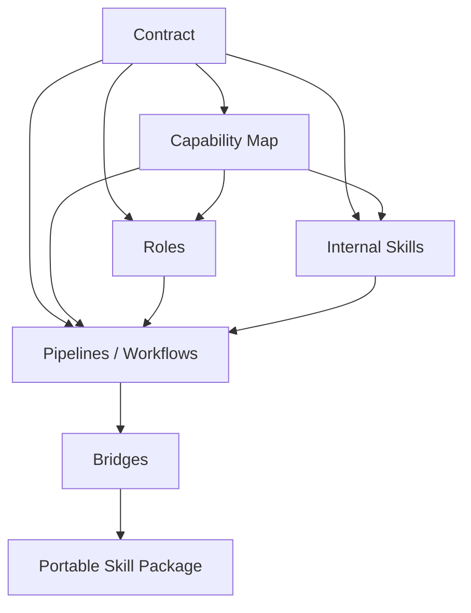

# 系统架构

这一页把 `README_CN.md`、`README.md` 与维护者说明中分散的架构信息收敛成一个稳定入口。

## 核心原则

Research Skills 把以下几层明确拆开：

- 契约真源
- 能力路由
- 功能责任
- 可复用执行规格
- 工作流编排
- 运行时执行
- 面向客户端的分发层

这样做的目的，是避免“改了一个 workflow 文案，却悄悄把 contract 改坏了”。

## 分层模型

| 层 | 主要位置 | 职责 |
|---|---|---|
| Contract | `standards/research-workflow-contract.yaml` | Task ID、产物路径、质量门 |
| Capability Map | `standards/mcp-agent-capability-map.yaml` | 运行时路由、MCP 与 skill 要求 |
| Functional Agents | `roles/` | 责任归属、质量阈值、语气与审稿风格 |
| Internal Skill Specs | `skills/` | 可复用执行行为 |
| Pipelines / Workflows | `pipelines/`、`.agent/workflows/` | 步骤编排与入口 UX |
| Bridges | `bridges/` | 运行时适配器与 orchestrator |
| Portable Skill Package | `research-paper-workflow/` | 面向客户端分发的安装技能包 |

## 依赖方向

## 稳定入口

| 入口方式 | 适用场景 | 入口 |
|---|---|---|
| Claude Code workflows | 你想用斜杠命令在项目里操作 | `.agent/workflows/*.md` |
| Shell / Python 安装 CLI | 你要安装或升级 assets | `research-skills`、`rsk`、`rsw` |
| Orchestrator CLI | 你要显式规划任务、执行任务、做校验 | `python3 -m bridges.orchestrator ...` |
| Portable skill package | 你要做跨客户端分发 | `research-paper-workflow/` |

## 动态领域挂载

基础系统保持通用。学科专精通过运行时注入的 domain profile 完成，例如 `skills/domain-profiles/economics.yaml`。

这样做的收益是：

- 安装包更轻
- 不相关学科不会污染默认 prompt
- 可以按领域注入专属库、诊断项、报告规范和方法学先验

## 多模型运行时协同

运行时可以通过 orchestrator 联动 `codex`、`claude`、`gemini`。

常见模式：

- `parallel`：同一个 prompt，多端分析，一个总结
- `task-run`：围绕单个 canonical task 的契约执行链
- `team-run`：单 task 拆多工作单元，再汇总与审查

## 下一步去哪里

- 要看修改规则和落点判断：去 [规范约定](/zh/conventions)
- 要看 CLI 精确参数：去 [CLI 参考](/zh/reference/cli)
- 要改系统行为：去 [扩展 Research Skills](/zh/advanced/extend-research-skills)
