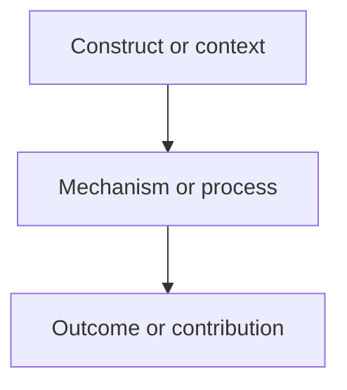

# Research Proposal Template

<!--
Usage: Draft a research proposal, prospectus, opening report, or 开题报告.
Save to: RESEARCH/[topic]/proposal/research_proposal.md
Canonical fields are in English; headings and body may be translated when the user requests Chinese or another language.
-->

# Research Proposal: [Working Title]

## 1) Project Information
- **Project title**:
- **Applicant / author**:
- **Supervisor / committee / funder / venue**:
- **Program / department / course**:
- **Target submission date**:
- **Proposal type**: research proposal / prospectus / opening report / 开题报告 / grant proposal
- **Current project stage**:

## 2) Background and Problem Statement
- **Research context**:
- **Practical or theoretical problem**:
- **Why the problem matters now**:
- **Scope boundary**:

## 3) Research Gap and Literature Positioning
| Gap ID | Literature stream | What is known | What remains unresolved | Evidence / citation keys |
|---|---|---|---|---|
| G1 | | | | |

## 4) Theoretical Framework
- **Anchor theory / framework**:
- **Core constructs or sensitizing concepts**:
- **Proposed relationships or mechanism**:
- **Boundary conditions**:

## 5) Research Questions, Objectives, and Hypotheses
### Research questions
1. 

### Objectives
1. 

### Hypotheses / propositions / working expectations
| ID | Statement | Type | Mechanism | Boundary condition |
|---|---|---|---|---|
| H1 / P1 / W1 | | confirmatory / exploratory / theoretical / qualitative | | |

## 6) Expected Contribution and Significance
- **Primary contribution**:
- **Secondary contributions**:
- **Theoretical significance**:
- **Methodological significance**:
- **Practical or policy significance**:

## 7) Study Design and Methods
- **Study type**:
- **Unit of analysis**:
- **Setting / population / case boundary**:
- **Sampling or case selection plan**:
- **Data sources and access status**:
- **Instruments / materials**:
- **Procedure**:
- **Design alternatives rejected**:

## 8) Analysis Plan
- **Primary analytic target / estimand / focal process**:
- **Primary model, coding strategy, or interpretive procedure**:
- **Variables, measures, or code families**:
- **Missing data or evidence-gap handling**:
- **Robustness, sensitivity, triangulation, or rival interpretation checks**:
- **Software / tools**:

## 9) Ethics, Data Management, and Reproducibility
- **Human participants or sensitive data**:
- **Ethics / IRB status**:
- **Consent and recruitment approach**:
- **Privacy and de-identification plan**:
- **Storage and access control**:
- **Retention and sharing plan**:
- **Reproducibility artifacts**:

## 10) Feasibility, Timeline, and Milestones
| Milestone | Deliverable | Target date | Dependency | Risk |
|---|---|---|---|---|
| Proposal approval | `proposal/research_proposal.md` | | | |
| Data access / collection | | | | |
| Analysis | | | | |
| Draft writing | | | | |

## 11) Risks, Limitations, and Fallback Plan
| Risk / limitation | Likelihood | Impact | Mitigation | Fallback |
|---|---|---|---|---|
| | low / medium / high | low / medium / high | | |

## 12) References and Unresolved Evidence Gaps
### References
- [citation key] Full reference or bibliography pointer

### Missing information / gap notes
- [ ] Missing citation for:
- [ ] Missing data-access confirmation:
- [ ] Missing institutional / funder / department requirement:
- [ ] Missing ethics requirement:
