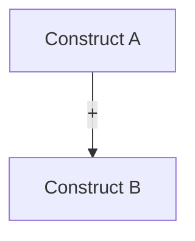

# Stage A — Framing & Positioning (A1–A5)

This stage turns a topic into a *defensible* research plan: what you will claim, why it matters, and what evidence would count.

## Inputs (minimum)

- `topic` (1 sentence)
- `paper_type` (`empirical` / `qualitative` / `systematic-review` / `methods` / `theory`)
- Constraints: time, data access, population/context, methods you can actually run
- Optional: target `venue` (or 2–3 candidate venues)

## Canonical outputs (contract paths)

- `A1` → `framing/research_question.md`
- `A1_5` → `framing/hypothesis.md`
- `A2` → `framing/contribution_statement.md`
- `A3` → `theoretical_framework.md`
- `A4` → `gap_analysis.md`
- `A5` → `framing/venue_analysis.md`

## Quality gate focus

- `Q1` (question-to-method alignment) applies to all A-tasks.
- `Q2` (claim-evidence traceability) starts in `A2` (contribution) and is enforced later in `F4/G3`.

---

## A1 — Research Question (RQ) Specification

**Definition of done**

- 1 **main RQ** + 2–5 **sub-RQs** (non-overlapping)
- Clear **unit of analysis** (individual/team/org/document/system)
- Defined **constructs** (what you mean by each key term) and plausible **operationalizations**
- Scope boundaries (what is *out of scope*, and why)
- For `systematic-review`: inclusion/exclusion criteria + keyword seed set
- For `qualitative`: expected evidence form (interviews / cases / fieldnotes / documents / observations) + setting boundary
- A short feasibility note (FINER-style) with the biggest risks

**Recommended structure: `framing/research_question.md`**

```markdown
# Research Question (RQ)

## Topic
[1–2 sentences]

## Main RQ
[One sentence]

## Sub-RQs
1. ...
2. ...

## Framing (choose one)
- PICO (intervention/exposure effect) OR PEO (non-intervention)
- If methods/theory paper: state the target capability or construct network
- If qualitative paper: state the focal process, practice, experience, or meaning to be understood

## Core constructs & definitions
| Construct | Working definition | Observable proxy (candidate) |
|---|---|---|

## Scope boundaries
- Included:
- Excluded:

## Evidence that would answer the RQ
- Primary outcomes / observations:
- Minimum viable dataset / corpus:

## Risks & feasibility (FINER short form)
- Feasible:
- Novel:
- Ethical:
- Relevant:

## Keywords (seed list)
- concept1: ...
- concept2: ...
```

---

## A1_5 — Hypothesis / Proposition Generation

Use when the paper needs *testable* or *arguable* statements (empirical / qualitative / theory / methods).

**Definition of done**

- Map each RQ to 1–3 hypotheses, propositions, or sensitizing concepts
- Each item has **mechanism intuition** and **boundary conditions**
- If confirmatory, include **direction**
- If qualitative and exploratory, articulate the focal process, meaning, or contrast to investigate
- Include at least 2 types of alternatives:
  - measurement/construct alternative (operationalization could flip result)
  - theory-based rival explanation or rival interpretation (addressed in `C1_5`)

**Recommended structure: `framing/hypothesis.md`**

```markdown
# Hypotheses / Propositions / Sensitizing Concepts

## Mapping to RQs
| RQ | Hypothesis/Proposition/Concept IDs |
|---|---|

## Hypotheses (empirical / methods validation)
### H1 (directional)
- Statement:
- Mechanism:
- Boundary conditions:
- Operationalization candidates (IV/DV):

## Propositions (theory paper)
### P1
- Statement:
- Intuition:
- Scope conditions:

## Sensitizing concepts / working propositions (qualitative)
### QP1
- Focal process / meaning:
- Why it may matter:
- Boundary conditions / contrast cases:
- Evidence form (cases / interviews / observations / documents):

## Rival explanations (seed list)
1. ...
2. ...
```

---

## A2 — Contribution & Novelty Statement

Write *what changes in the literature* if your paper is accepted.

**Definition of done**

- 3–5 contributions, each with:
  - **Prior state** (what was known/assumed)
  - **Your delta** (what changes)
  - **Evidence plan** (what will support it)
- Identify the main contribution type (one primary, others secondary):
  - theoretical / empirical / methodological / dataset / systems artifact / synthesis

**Recommended structure: `framing/contribution_statement.md`**

```markdown
# Contribution Statement

## One-sentence thesis
[What the paper shows/builds]

## Primary contribution
- Type:
- Claim:
- Who cares / why now:
- Evidence required:

## Secondary contributions (3–5 bullets)
1. ...

## Non-goals (to prevent scope creep)
- ...
```

---

## A3 — Theoretical Framework

Choose, justify, and operationalize the theory lens; do not just list citations.

**Definition of done**

- 1–3 anchor theories/frameworks with:
  - core constructs + relationships
  - mechanism narrative (why the relation holds)
  - boundary conditions
- A conceptual model diagram (Mermaid acceptable)
- A mapping from constructs → measures (if empirical) or → propositions (if theory)

**Recommended structure: `theoretical_framework.md`**

```markdown
# Theoretical Framework

## Anchor theory(ies)
| Theory | Core idea | Key constructs | Why it fits this RQ |
|---|---|---|---|

## Construct definitions
| Construct | Definition | Notes / contested definitions |
|---|---|---|

## Proposed relationships
| Link | Direction | Mechanism | Boundary conditions |
|---|---|---|---|

## Conceptual model


## Operationalization bridge (if empirical)
| Construct | Candidate measure | Data source |
|---|---|---|
```

---

## A4 — Gap Analysis

Gap ≠ “no one has studied this exact combination”. Gap must be *meaningful* and *supported* by the literature.

**Definition of done**

- 3–7 candidate gaps, each with:
  - category (theoretical / empirical / methodological / population / data)
  - supporting citations (2–6 each, mix of seminal + recent)
  - why existing work cannot answer your RQ
  - how your approach closes it
- Prioritize gaps by feasibility + impact (short rubric)

**Recommended structure: `gap_analysis.md`**

```markdown
# Gap Analysis

## Landscape summary (5–10 bullets)
- ...

## Candidate gaps
| Gap ID | Type | Description | Evidence (citations) | Why it matters | How we address |
|---|---|---|---|---|---|

## Prioritization
| Gap ID | Feasible | Impact | Novelty | Risk | Priority |
|---|---:|---:|---:|---:|---|
```

---

## A5 — Venue Analysis

Venue choice determines *what reviewers reward* (novelty vs rigor vs artifact quality).

**Definition of done**

- 2–5 candidate venues, with:
  - fit statement (topic + method + contribution)
  - formatting + length constraints
  - typical paper structure expectations
  - “desk reject” risk factors for your paper type

**Recommended structure: `framing/venue_analysis.md`**

```markdown
# Venue Analysis

| Venue | Fit | Key expectations | Word/page limits | Evidence expectations | Notes |
|---|---|---|---|---|---|

## Chosen target (current)
- Venue:
- Why:
- Must-not-fail items:
```
