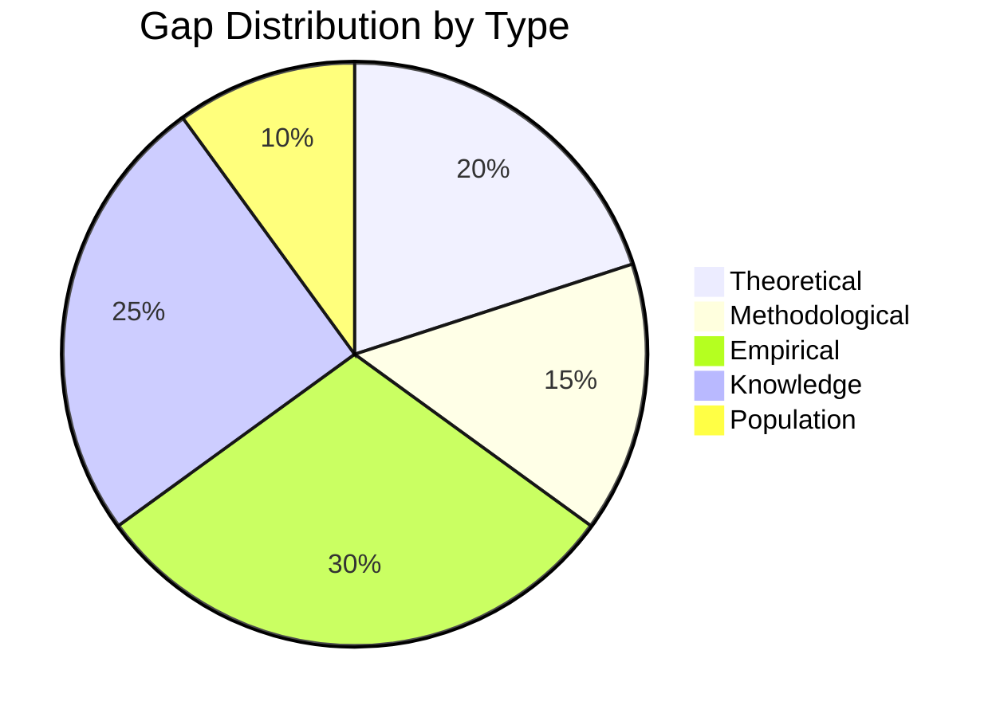

# Gap Analyzer Skill

Systematically identify and categorize research gaps from literature analysis.

## Purpose

Analyze a body of literature to identify:
- What has been studied
- What remains unknown
- Where opportunities exist for new research

## Gap Taxonomy

### 1. Theoretical Gaps

Gaps in theoretical understanding or framework development.

**Indicators:**
- Conflicting theoretical explanations
- Concepts lacking clear definition
- Missing theoretical integration
- Unexplained phenomena
- Boundary conditions unclear

**Questions to Ask:**
- What theories are used to explain [phenomenon]?
- Where do theories conflict or contradict?
- What phenomena lack theoretical explanation?
- What concepts need better definition?
- How could existing theories be extended?

**Output Format:**
```markdown
### Theoretical Gap: [Title]

**Description:** [What is missing theoretically]

**Evidence:**
- Paper A suggests X, but Paper B suggests Y
- "[Quote from paper]" (Author, Year)

**Implication:** [Why this matters]

**Potential Research Direction:** [How to address]
```

### 2. Methodological Gaps

Gaps in how research is conducted.

**Indicators:**
- Dominant methods with known limitations
- Underutilized appropriate methods
- Validity/reliability concerns
- Measurement issues
- Analysis limitations

**Questions to Ask:**
- What methods dominate the field?
- What methodological limitations are noted?
- What methods could provide new insights?
- Are there measurement problems?
- Are findings replicable?

**Output Format:**
```markdown
### Methodological Gap: [Title]

**Description:** [What is missing methodologically]

**Current Approaches:**
- Method 1: Used by X papers, limitation: [...]
- Method 2: Used by Y papers, limitation: [...]

**Suggested Approach:** [Alternative methodology]

**Expected Contribution:** [What new method would reveal]
```

### 3. Empirical Gaps

Gaps in the evidence base.

**Indicators:**
- Understudied contexts
- Geographic limitations
- Temporal gaps
- Sector/industry gaps
- Scale limitations

**Questions to Ask:**
- Where has research been conducted?
- What time periods are covered?
- What contexts are missing?
- What settings need investigation?
- How generalizable are findings?

**Output Format:**
```markdown
### Empirical Gap: [Title]

**Description:** [What context/setting is understudied]

**Current Evidence:**
- [Context A]: X studies
- [Context B]: Y studies
- [Context C]: 0 studies ← Gap

**Why This Matters:** [Importance of context]

**Research Opportunity:** [How to fill the gap]
```

### 4. Knowledge Gaps

Gaps in what is known about a topic.

**Indicators:**
- Unanswered questions
- Unexplored relationships
- Unknown mechanisms
- Missing variables
- Incomplete understanding

**Questions to Ask:**
- What questions remain unanswered?
- What relationships haven't been tested?
- What variables are overlooked?
- What mechanisms are unclear?
- What "future research" is suggested?

**Output Format:**
```markdown
### Knowledge Gap: [Title]

**Description:** [What is not yet known]

**Current State of Knowledge:**
- Known: [...]
- Unknown: [...]

**Questions to Answer:**
1. [Specific research question]
2. [Specific research question]

**Expected Impact:** [Significance of filling this gap]
```

### 5. Population/Stakeholder Gaps

Gaps in who has been studied.

**Indicators:**
- Underrepresented demographics
- Missing stakeholder perspectives
- Cultural/geographic bias
- Organizational types absent
- Sample homogeneity

**Questions to Ask:**
- Who has been studied?
- Who is missing?
- What demographics are underrepresented?
- Whose voices are not heard?
- What cultural contexts are absent?

**Output Format:**
```markdown
### Population Gap: [Title]

**Description:** [Who is understudied]

**Populations Studied:**
| Population | # Studies | % of Literature |
|------------|-----------|-----------------|
| [Group A] | X | Y% |
| [Group B] | X | Y% |
| [Group C - Missing] | 0 | 0% |

**Why This Matters:** [Importance of this population]

**Research Opportunity:** [How to include them]
```

## Gap Prioritization Matrix

Evaluate each gap using FINER criteria:

```markdown
| Gap | F | I | N | E | R | Score | Priority |
|-----|---|---|---|---|---|-------|----------|
| Gap 1 | ✓ | ✓ | ✓ | ✓ | ✓ | 5/5 | High |
| Gap 2 | ✓ | ✓ | ✗ | ✓ | ✓ | 4/5 | Medium |
| Gap 3 | ✗ | ✓ | ✓ | ✓ | ✓ | 4/5 | Low (not feasible) |

F = Feasible, I = Interesting, N = Novel, E = Ethical, R = Relevant
```

## Synthesis Output

```markdown
# Gap Analysis Summary: [Topic]

## High Priority Gaps

### 1. [Gap Title]
- **Type:** Theoretical/Methodological/Empirical/Knowledge/Population
- **Description:** 
- **FINER Score:** X/5
- **Recommended RQ:**

## Medium Priority Gaps
...

## Gap Visualization


```

## Usage

This skill is called by:
- `/find-gap` - Main gap analysis workflow
- `/lit-review` - In synthesis phase
