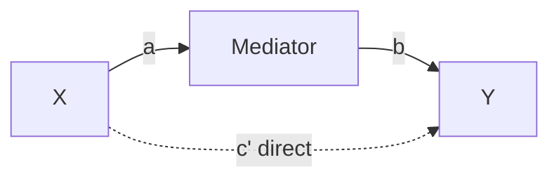
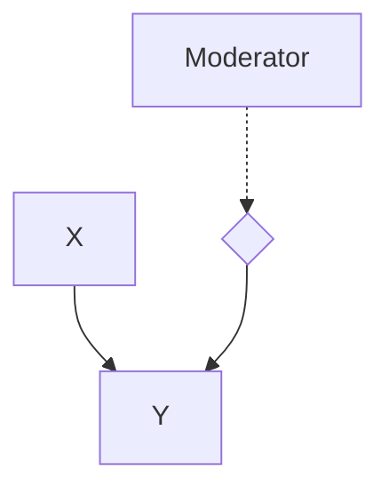
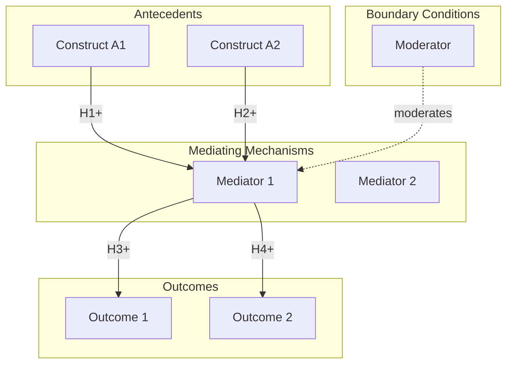

# Theory Mapper Skill

Map theoretical concepts, relationships, and frameworks for research foundation building.

## Purpose

Create visual and structured representations of:
- Existing theories in a domain
- Concept definitions and relationships
- Theoretical models and propositions
- Theory comparisons and integrations

## Process

### 1. Theory Identification

For each relevant theory, extract:

```markdown
## Theory Profile: [Theory Name]

### Basic Information
| Field | Value |
|-------|-------|
| Name | |
| Origin | Author(s), Year |
| Seminal Work | Title, Citation |
| Domain | |
| Type | Grand theory / Middle-range / Micro |

### Core Proposition
[The central claim or argument of the theory]

### Key Assumptions
1. 
2. 
3. 

### Scope Conditions
[When/where the theory applies]
```

### 2. Construct Mapping

For each key construct:

```markdown
## Construct: [Name]

### Definition
- **Conceptual Definition:** [Abstract meaning]
- **Operational Definition:** [How it's measured]

### Dimensions
| Dimension | Description |
|-----------|-------------|
| Dimension 1 | |
| Dimension 2 | |

### Related Constructs
| Construct | Relationship | Type |
|-----------|--------------|------|
| [Related 1] | [How related] | Antecedent/Outcome/Correlate |
| [Related 2] | [How related] | |

### Measurement Approaches
| Measure | Source | Items |
|---------|--------|-------|
| [Scale 1] | Author, Year | X items |
| [Scale 2] | Author, Year | Y items |
```

### 3. Relationship Mapping

Map relationships between constructs:

```markdown
## Relationship: [Construct A] → [Construct B]

### Nature of Relationship
- **Direction:** Positive / Negative / Curvilinear
- **Strength:** Strong / Moderate / Weak
- **Type:** Causal / Correlational / Mediating / Moderating

### Theoretical Justification
[Why this relationship exists according to theory]

### Empirical Evidence
| Study | Finding | Effect Size |
|-------|---------|-------------|
| Author (Year) | | r/β = |
```

### 4. Visual Representation

Generate Mermaid diagrams for theory visualization:

#### Simple Causal Model


#### Mediation Model


#### Moderation Model


#### Complex Theoretical Model


### 5. Theory Comparison Matrix

```markdown
## Theory Comparison

| Aspect | Theory A | Theory B | Theory C |
|--------|----------|----------|----------|
| **Core Focus** | | | |
| **Unit of Analysis** | | | |
| **Key Constructs** | | | |
| **Causal Logic** | | | |
| **Assumptions** | | | |
| **Strengths** | | | |
| **Limitations** | | | |
| **Best Applied To** | | | |
| **Complementary With** | | | |
```

### 6. Theoretical Synthesis

Create integrated framework:

```markdown
## Theoretical Integration: [Your Framework Name]

### Integration Approach
[How theories are combined: complementary, competing, extension]

### Core Propositions
1. **P1:** [Proposition 1]
2. **P2:** [Proposition 2]
3. **P3:** [Proposition 3]

### Conceptual Model

```mermaid
[Integrated model diagram]
```

### Hypotheses
| ID | Hypothesis | Theoretical Basis |
|----|------------|-------------------|
| H1 | [Statement] | Based on Theory X... |
| H2 | [Statement] | Extending Theory Y... |

### Boundary Conditions
- Condition 1: [When/where applies]
- Condition 2: [When/where applies]

### Theoretical Contribution
[How this advances existing theory]
```

## Output Templates

### Theory Summary Table
```markdown
| Theory | Core Idea | Key Constructs | Application |
|--------|-----------|----------------|-------------|
| | | | |
```

### Construct Definition Table
```markdown
| Construct | Definition | Dimensions | Source |
|-----------|------------|------------|--------|
| | | | |
```

### Hypothesis Table
```markdown
| # | Hypothesis | IV | DV | Expected Effect | Basis |
|---|------------|----|----|-----------------|-------|
| H1 | | | | +/- | Theory X |
```

## Usage

This skill is called by:
- `/build-framework` - Main framework building workflow
- `/lit-review` - For theoretical synthesis
