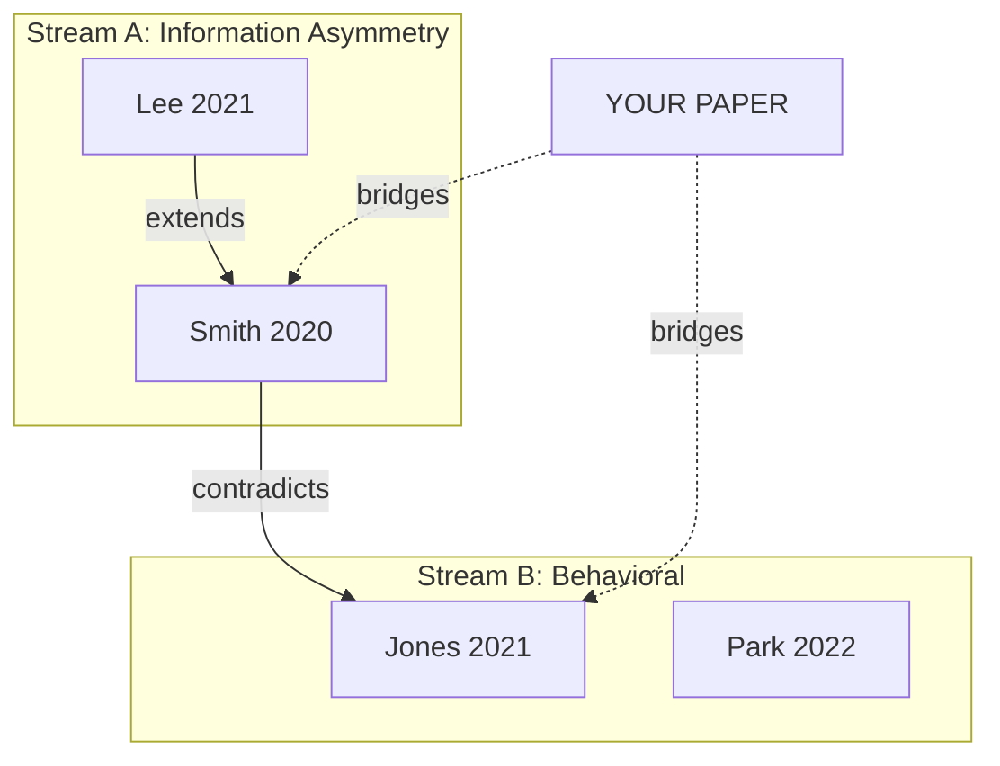

# Literature Mapper Skill

Build a structured taxonomy/map of the literature that reveals where your work fits and what gaps remain — the foundation for a strong related-work section.

## Related Task IDs

- `B6` (literature mapping)

## Output (contract path)

- `RESEARCH/[topic]/literature/literature_map.md`

## When to Use

- After paper extraction (B2) when you have ≥15 papers with structured notes
- Before writing related work (B4) — the map becomes the related-work skeleton
- When you need to demonstrate novelty at the field level, not just per-paper

## Process

### Step 1: Choose a Clustering Basis

Do NOT cluster chronologically ("early work → recent work") or by author ("Smith et al. stream"). Instead, use one of these approaches:

| Clustering Basis | When to Use | Example Labels |
|------------------|------------|----------------|
| **Mechanism / theory** | When papers explain the same DV via different causal stories | "Information asymmetry view" vs "Behavioral anchoring view" |
| **Method / approach** | When the methodological divide is the core structure | "Experimental" vs "Observational" vs "Computational" |
| **Context / application** | When the phenomenon manifests differently across settings | "Healthcare" vs "Education" vs "Financial services" |
| **Variable / construct focus** | When papers measure different facets of the same phenomenon | "Antecedents" vs "Outcomes" vs "Moderators" |
| **Level of analysis** | When some work is micro, meso, or macro | "Individual" vs "Team" vs "Organizational" |

> **Best practice**: Combine two bases (e.g., mechanism × method) if the field is large enough to warrant a 2D map.

### Step 2: Assign Papers to Clusters

For each paper in your extraction table:

| Paper (citekey) | Primary Cluster | Secondary Cluster | Key Contribution | Method | Key Finding |
|----------------|----------------|-------------------|-----------------|--------|-------------|
| smith2020 | Info asymmetry | Experimental | First experimental test | Lab RCT | Partial support |
| jones2021 | Behavioral | Survey | Cross-cultural comparison | SEM | Significant in US, not EU |

Rules:
- Each paper gets exactly one primary cluster
- Secondary cluster is optional (for papers spanning two streams)
- If a paper doesn't fit any cluster, it may signal a missing cluster or an outlier to exclude

### Step 3: Characterize Each Cluster

For each cluster, document:

```markdown
### Cluster: [Mechanism-based label]

**Core argument**: [1–2 sentence summary of the intellectual position]

**Representative papers**: [3–5 key papers with citekeys]

**Typical methods**: [What methods are dominant in this stream]

**Key findings**: [Where this stream converges]

**Internal contradictions**: [Where papers within this stream disagree]

**Open problems**:
1. [Unresolved question that future work could address]
2. [Methodological limitation shared across the stream]
3. [Boundary condition not yet tested]
```

### Step 4: Map Inter-Cluster Relationships

Document how clusters relate to each other:

| Cluster A | Relationship | Cluster B | Evidence |
|-----------|-------------|-----------|----------|
| Info asymmetry | Complementary | Behavioral | Both explain different variance components |
| Experimental | Methodological tension with | Survey-based | External vs internal validity tradeoff |
| Micro-level | Nested within | Macro-level | Aggregation assumptions untested |

Relationship types:
- **Complementary**: both contribute to understanding, non-competing
- **Competing**: mutually exclusive explanations for the same pattern
- **Nested**: findings at one level depend on assumptions at another
- **Parallel**: study the same phenomenon in different contexts without integration

### Step 5: Position Your Contribution

Using the map, articulate precisely:

```markdown
## Positioning

Our work bridges Cluster X and Cluster Y by [mechanism / method / context / level].

Specifically, we address open problems:
- [Open problem 1 from Cluster X]: we provide [specific contribution]
- [Open problem 2 from Cluster Y]: we provide [specific contribution]

No existing work in any cluster has [specific differentiator].
```

> **Anti-pattern**: "Our work is novel because no one has studied X" — this is necessary but insufficient. Show WHERE in the map the gap exists and WHY the existing streams cannot address it.

### Step 6: Generate Visual Map (Optional but Valuable)

Create a Mermaid diagram showing clusters and relationships:



## Quality Bar

The literature map is **ready** when:

- [ ] 3–6 clusters with mechanism-based or theory-based labels (not author-based)
- [ ] Every included paper assigned to a primary cluster
- [ ] Each cluster has: core argument, representative papers, open problems
- [ ] Inter-cluster relationships documented
- [ ] Your contribution is positioned against at least 2 open problems
- [ ] A reviewer in the field would recognize the cluster structure as fair

## Common Pitfalls

| Pitfall | Problem | Fix |
|---------|---------|-----|
| Chronological organization | Doesn't reveal intellectual structure | Re-organize by mechanism or method |
| Too many clusters (>8) | Map is unusable; some clusters have 1–2 papers | Merge related clusters |
| Missing a major stream | Reviewer rejects for incomplete coverage | Check with a second search or consult a domain expert |
| Clusters match search databases, not ideas | PubMed cluster vs SSRN cluster | Re-cluster by intellectual contribution |
| No open problems identified | Map is descriptive, not critical | Every cluster must have ≥1 unresolved question |

## Minimal Output Format

```markdown
# Literature Map

## Clustering basis: [mechanism / method / context / level]

## Cluster Overview

| Cluster | Label | Papers (k) | Core Argument | Key Open Problem |
|---------|-------|-----------|---------------|-----------------|

## Detailed Clusters

### Cluster 1: [Label]
- **Core argument**: ...
- **Representative papers**: ...
- **Typical methods**: ...
- **Key findings**: ...
- **Internal contradictions**: ...
- **Open problems**: ...

### Cluster 2: [Label]
...

## Inter-Cluster Relationships

| Cluster A | Relation | Cluster B | Evidence |
|-----------|----------|-----------|----------|

## Positioning
Our work bridges [Cluster X] and [Cluster Y] by ...
Open problems addressed: ...
```
