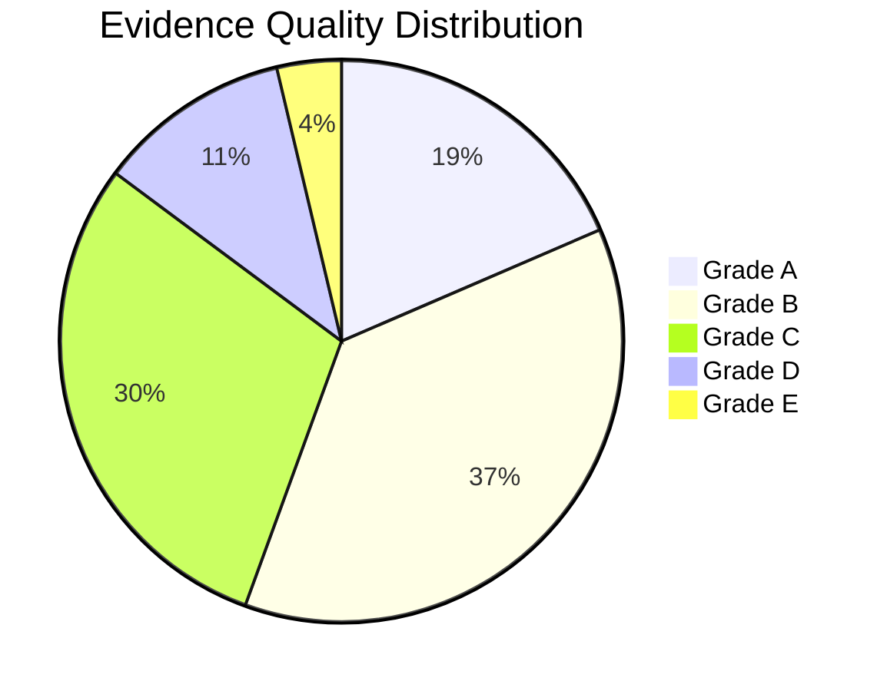

# Quality Assessor Skill

Assess the quality and strength of academic evidence using standardized criteria.

## Purpose

Evaluate research quality through:
- A-E evidence grading
- Risk of bias assessment
- Methodological rigor evaluation
- Source credibility assessment

## A-E Evidence Rating System

### Grade Definitions

| Grade | Evidence Type | Weight | Examples |
|-------|--------------|--------|----------|
| **A** | Highest quality | 5 | Systematic reviews, Meta-analyses, Large RCTs |
| **B** | High quality | 4 | Cohort studies, High-IF journal articles, Well-designed experiments |
| **C** | Moderate quality | 3 | Case studies, Expert opinion, Conference papers |
| **D** | Lower quality | 2 | Preprints, Working papers, Non-peer-reviewed |
| **E** | Lowest quality | 1 | Anecdotal, Blog posts, Theoretical speculation |

### Detailed Criteria

#### Grade A - Highest Quality

Must meet ALL:
- [ ] Peer-reviewed in high-impact journal (IF > field median)
- [ ] Rigorous methodology (RCT, systematic review, meta-analysis)
- [ ] Large sample size (N > 1000 or effect size adequate)
- [ ] Clear limitation acknowledgment
- [ ] Reproducible methods

Examples:
- Cochrane systematic reviews
- Meta-analyses in Nature/Science
- Large-scale RCTs
- Registered replications

#### Grade B - High Quality

Must meet MOST:
- [ ] Peer-reviewed publication
- [ ] Sound methodology (cohort, quasi-experimental)
- [ ] Adequate sample size
- [ ] Appropriate statistical analysis
- [ ] Limitations discussed

Examples:
- Longitudinal cohort studies
- Well-designed surveys (N > 300)
- Controlled experiments
- Top-tier conference papers (CHI, NeurIPS, ACL)

#### Grade C - Moderate Quality

Meets SOME:
- [ ] Peer-reviewed or authoritative source
- [ ] Reasonable methodology
- [ ] Sample size may be limited
- [ ] Some validity concerns possible

Examples:
- Case studies
- Expert commentaries
- Small-N qualitative studies
- Regular conference papers
- Book chapters

#### Grade D - Lower Quality

May have:
- [ ] Not peer-reviewed
- [ ] Preliminary findings
- [ ] Methodology unclear
- [ ] Limited generalizability

Examples:
- arXiv preprints
- Working papers
- Technical reports
- Dissertations/Theses

#### Grade E - Lowest Quality

Characteristics:
- [ ] No peer review
- [ ] Opinion or speculation
- [ ] No methodology
- [ ] No empirical basis

Examples:
- Blog posts
- News articles
- Opinion pieces
- Theoretical musings

## Quality Assessment Checklist

### For Quantitative Studies

```markdown
## Quantitative Study Quality Assessment

**Paper:** [Title]

### Research Design (0-5 points)
| Criterion | Score | Notes |
|-----------|-------|-------|
| Appropriate design for RQ | /1 | |
| Clear independent/dependent variables | /1 | |
| Control group or comparison | /1 | |
| Randomization (if applicable) | /1 | |
| Adequate sample size | /1 | |
| **Subtotal** | /5 | |

### Measurement (0-4 points)
| Criterion | Score | Notes |
|-----------|-------|-------|
| Valid measures | /1 | |
| Reliable measures | /1 | |
| Appropriate data collection | /1 | |
| Common method bias addressed | /1 | |
| **Subtotal** | /4 | |

### Analysis (0-4 points)
| Criterion | Score | Notes |
|-----------|-------|-------|
| Appropriate statistical tests | /1 | |
| Assumptions checked | /1 | |
| Effect sizes reported | /1 | |
| Missing data handled | /1 | |
| **Subtotal** | /4 | |

### Reporting (0-3 points)
| Criterion | Score | Notes |
|-----------|-------|-------|
| Limitations acknowledged | /1 | |
| Results clearly presented | /1 | |
| Conclusions supported by data | /1 | |
| **Subtotal** | /3 | |

### Total Score: /16
| Score Range | Grade |
|-------------|-------|
| 14-16 | A |
| 11-13 | B |
| 8-10 | C |
| 5-7 | D |
| 0-4 | E |

**Final Grade:** [ ]
```

### For Qualitative Studies

```markdown
## Qualitative Study Quality Assessment

**Paper:** [Title]

### Credibility (0-4 points)
| Criterion | Score | Notes |
|-----------|-------|-------|
| Prolonged engagement | /1 | |
| Triangulation | /1 | |
| Member checking | /1 | |
| Peer debriefing | /1 | |
| **Subtotal** | /4 | |

### Transferability (0-3 points)
| Criterion | Score | Notes |
|-----------|-------|-------|
| Thick description | /1 | |
| Context provided | /1 | |
| Purposive sampling | /1 | |
| **Subtotal** | /3 | |

### Dependability (0-3 points)
| Criterion | Score | Notes |
|-----------|-------|-------|
| Audit trail | /1 | |
| Clear procedures | /1 | |
| Reflexivity | /1 | |
| **Subtotal** | /3 | |

### Confirmability (0-3 points)
| Criterion | Score | Notes |
|-----------|-------|-------|
| Raw data available | /1 | |
| Analysis documented | /1 | |
| Researcher bias addressed | /1 | |
| **Subtotal** | /3 | |

### Total Score: /13
| Score Range | Grade |
|-------------|-------|
| 11-13 | A |
| 9-10 | B |
| 6-8 | C |
| 4-5 | D |
| 0-3 | E |

**Final Grade:** [ ]
```

## Quality Assessment Summary Table

For multiple papers:

```markdown
| ID | Citation | Design | Sample | Rigor | Limitations | Grade |
|----|----------|--------|--------|-------|-------------|-------|
| 1 | Smith (2024) | RCT | n=500 | High | Minor | A |
| 2 | Jones (2023) | Survey | n=200 | Moderate | Some | B |
| 3 | Lee (2022) | Case study | n=5 | Low | Significant | C |
```

## Evidence Synthesis by Grade

```markdown
## Evidence Summary by Quality Grade

### Grade A Evidence (n=X)
Key findings supported by highest-quality evidence:
1. Finding 1 (Smith, 2024; Jones, 2023)
2. Finding 2 (Lee, 2024)

### Grade B Evidence (n=X)
...

### Grade C Evidence (n=X)
...

### Evidence Quality Distribution


```

## Risk of Bias (RoB) Tool Selection

Choose the appropriate RoB tool based on study design:

| Study Design | Recommended Tool | Key Domains |
|--------------|------------------|-------------|
| Randomized trials | **RoB 2** | Randomization, deviations, missing data, measurement, selection |
| Non-randomized interventions | **ROBINS-I** | Confounding, selection, classification, deviations, missing data, measurement, selection of results |
| Diagnostic accuracy | **QUADAS-2** | Patient selection, index test, reference standard, flow and timing |
| Qualitative studies | **CASP Qualitative** | Aims, methodology, design, recruitment, data collection, reflexivity, ethics, analysis, findings, value |
| Systematic reviews | **AMSTAR 2** | Protocol, search, selection, extraction, RoB, meta-analysis, publication bias |
| Cross-sectional | **JBI Critical Appraisal** | Inclusion criteria, subjects, exposure, outcomes, confounders, strategies |

### RoB 2 Quick Assessment (for RCTs)

| Domain | Low Risk | Some Concerns | High Risk |
|--------|----------|---------------|-----------|
| Randomization process | | | |
| Deviations from interventions | | | |
| Missing outcome data | | | |
| Measurement of outcome | | | |
| Selection of reported result | | | |
| **Overall** | | | |

## GRADE Framework (Evidence Certainty)

For systematic reviews, apply GRADE to rate certainty of evidence:

| Factor | Upgrade/Downgrade | Assessment |
|--------|-------------------|------------|
| Risk of bias | ↓ | Serious / Very serious / None |
| Inconsistency | ↓ | Serious / Very serious / None |
| Indirectness | ↓ | Serious / Very serious / None |
| Imprecision | ↓ | Serious / Very serious / None |
| Publication bias | ↓ | Strongly suspected / None |
| Large effect | ↑ | Large / Very large / None |
| Dose-response | ↑ | Yes / No |
| Confounders | ↑ | Would reduce effect / None |

**GRADE Certainty Levels:**
- ⊕⊕⊕⊕ **High** - Very confident in the estimate
- ⊕⊕⊕○ **Moderate** - Moderately confident
- ⊕⊕○○ **Low** - Limited confidence
- ⊕○○○ **Very Low** - Very little confidence

## Usage

This skill is called by:
- `/lit-review` - Quality assessment phase
- `/paper-read` - Individual paper assessment
