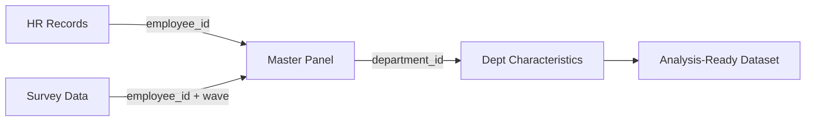

# Data Merge Planner Skill

Plan how multiple datasets become one analysis-ready file — specifying join keys, cardinality, validation, and provenance at every step.

## Related Task IDs

- `I3` (data pipeline)

## Output (contract path)

- `RESEARCH/[topic]/data/merge_plan.md`

## When to Use

- When analysis requires combining multiple data sources
- When enriching primary data with contextual/administrative records
- When linking survey waves or panel rounds
- When researcher asks "why did my N change after merging?"

## Process

### Step 1: Inventory Source Datasets

For each dataset entering the merge:

| Field | What to Document | Example |
|-------|-----------------|---------|
| **Dataset name** | Identifier | hr_records_2023 |
| **Source** | Where from | HR system export, Jan 2024 |
| **Unit of observation** | What is one row | employee-month |
| **N rows** | Raw row count | 58,420 |
| **N unique keys** | Distinct entities | 4,868 (employees) |
| **Time coverage** | Period covered | 2023-01 to 2023-12 |
| **Key variables** | Variables needed from this source | remote_days, total_days, department |
| **Key field** | Join key candidate(s) | employee_id |
| **Data state** | Is this raw or cleaned? | cleaned (from cleaning_plan step 3) |

### Step 2: Define Merge Topology

Map out the full merge sequence:



### Step 3: Specify Each Join

For each pairwise merge:

| Specification | What to Document | Why It Matters |
|--------------|-----------------|---------------|
| **Left dataset** | Name + unit | Determines base rows |
| **Right dataset** | Name + unit | What's being added |
| **Join key(s)** | Exact column names in both datasets | Mismatched names = failed join |
| **Join type** | Inner / left / right / full outer | Determines sample retention |
| **Expected cardinality** | 1:1 / 1:m / m:1 / m:m | m:m is almost always an error |
| **Expected match rate** | % of left keys expected to match | Low match rate = data quality issue |
| **Unmatched handling** | Keep unmatched? Drop? Flag? | Affects sample size and selection |
| **Duplicate key handling** | How to resolve if keys are non-unique | Pre-merge dedup or aggregation |

#### Join Type Decision Guide

| Scenario | Join Type | Consequence of Wrong Choice |
|----------|----------|----------------------------|
| "Keep only units in both files" | Inner join | Silent sample reduction |
| "Keep all primary records, add info where available" | Left join | NAs introduced for unmatched |
| "Keep everything from both" | Full outer join | Large dataset with many NAs |
| "Core sample + supplementary data" | Left join | Standard for enrichment |
| "Linking survey waves" | Left join on ID + time | Attrition visible as NAs |

#### Cardinality Expectations

| Expected | Meaning | Validation |
|----------|---------|-----------|
| **1:1** | One row left = one row right | Assert: no duplicate keys on either side |
| **1:m** | One left row matches multiple right rows | Assert: left keys are unique |
| **m:1** | Multiple left rows match one right row | Assert: right keys are unique; enrichment pattern |
| **m:m** | Multiple matches on both sides | Almost always a mistake — investigate |

### Step 4: Key Validation

Before executing any merge, validate join keys:

| Check | Method | Action on Failure |
|-------|--------|-------------------|
| **Key exists in both datasets** | Column name check | Fix naming mismatch |
| **Key type matches** | Character vs integer comparison | Cast to consistent type |
| **Key format consistent** | Padding, case, prefixes | Standardize (e.g., `emp_001` vs `1`) |
| **Key uniqueness (where expected)** | Count per key | Investigate duplicates; aggregate or dedup |
| **Key coverage** | % of each dataset's keys present in the other | Report match rate; investigate if < 90% |
| **Temporal alignment** | Are time keys comparable? | Align fiscal/calendar year; standardize dates |

### Step 5: Post-Merge Validation

After each merge step, verify:

| Validation | What to Check | Expected Result | If Violated |
|-----------|---------------|-----------------|-------------|
| **Row count** | N after merge | Matches expectation from cardinality | Investigate duplicates or unexpected m:m |
| **Key count** | Unique entities | ≥ unique entities in left dataset (for left join) | Sample attrition |
| **Match rate** | % of records that matched | ≥ expected match rate | Data quality issue |
| **NA introduction** | New NAs in merged columns | Only from unmatched rows | Merge logic error |
| **Duplicate check** | Unexpected new duplicates | None | Cardinality misspecified |
| **Variable collision** | Same column name from both sources | Suffixed (_x, _y) or resolved | Rename to preserve provenance |

### Step 6: Document Provenance

For every variable in the final analysis dataset:

| Variable | Original Source | Merge Step | Notes |
|----------|----------------|-----------|-------|
| `productivity_index` | HR quarterly | Step 1 (base) | — |
| `department_size` | Dept characteristics | Step 3 (enrichment) | NAs for 3% unmatched departments |
| `remote_ratio` | Derived | Post-merge | Computed from HR: `wfh_days / total_days` |

### Step 7: Sample Flow Report

Document the N at every stage (analogous to CONSORT flow):

```markdown
## Sample Flow

| Step | Action | N Before | N After | Records Lost | Reason |
|------|--------|----------|---------|-------------|--------|
| 0 | HR Records (base) | — | 58,420 | — | — |
| 1 | + Survey Data (left join) | 58,420 | 58,420 | 0 | Left join preserves all |
|   | Survey matched | — | — | — | 52,180 matched (89.3%) |
| 2 | + Dept Characteristics (left join) | 58,420 | 58,420 | 0 | — |
|   | Dept matched | — | — | — | 56,790 matched (97.2%) |
| 3 | Analysis sample restrictions | 58,420 | 48,500 | 9,920 | Tenure < 3mo, missing DV |
```

## Quality Bar

The merge plan is **ready** when:

- [ ] All source datasets inventoried with row counts and key fields
- [ ] Merge topology documented (order of joins)
- [ ] Each join specified: type, key, cardinality, match rate expectation
- [ ] Key validation checks defined (type, format, uniqueness, coverage)
- [ ] Post-merge validation checks defined (row count, NAs, duplicates)
- [ ] Unmatched record handling documented (keep, drop, flag)
- [ ] Variable provenance tracked (which source → which variable)
- [ ] Sample flow report shows N at every stage

## Common Pitfalls

| Pitfall | Problem | Fix |
|---------|---------|-----|
| m:m join without knowing it | Row explosion; duplicated observations | Always check key uniqueness before joining |
| Silent sample loss from inner join | N drops without documentation | Use left join; report match rate |
| Mismatched key types | String "001" ≠ integer 1 → no matches | Cast to same type before merge |
| Name collisions after merge | `score_x` and `score_y` without clarity | Rename with source prefix before merge |
| Not reporting sample flow | Reviewer can't assess selection | Report N at every step like CONSORT |
| Merge order affects results | Different selection depending on merge sequence | Document order; test sensitivity |

## Minimal Output Format

```markdown
# Merge Plan

## Source Inventory
| Dataset | Unit | N | Key | Variables Needed |
|---------|------|---|-----|-----------------|

## Merge Steps
| Step | Left | Right | Key | Type | Cardinality | Expected Match |
|------|------|-------|-----|------|-------------|---------------|

## Key Validation Checks
| Key | Check | Expected |
|-----|-------|----------|

## Post-Merge Validation
| Step | N Expected | Check |
|------|-----------|-------|

## Sample Flow
| Step | N Before | N After | Lost | Reason |
|------|----------|---------|------|--------|
```
