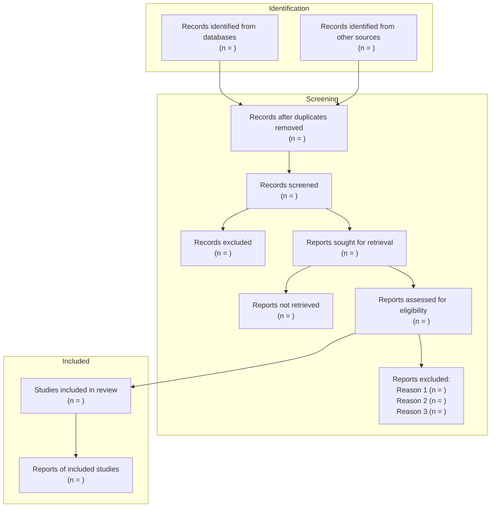

# PRISMA 2020 Flow Diagram Template

<!-- 
Usage: Fill in numbers from your systematic review screening process.
Based on: PRISMA 2020 Statement (Page et al., 2021)
-->

# PRISMA 2020 Flow Diagram

## Review Title: [Your Review Title]

## Date: [Date]

---

## Identification

### Records identified from databases

| Database | Records |
|----------|---------|
| Semantic Scholar | n = |
| arXiv | n = |
| Google Scholar | n = |
| PubMed | n = |
| Other: _______ | n = |
| **Total** | **n = ** |

### Records identified from other sources

| Source | Records |
|--------|---------|
| Reference lists | n = |
| Citation searching | n = |
| Expert recommendations | n = |
| Grey literature | n = |
| **Total** | **n = ** |

---

## Screening

### Duplicate removal

- Records before deduplication: n = 
- Duplicates removed: n = 
- **Records after deduplication: n = **

### Title/Abstract Screening

- Records screened: n = 
- Records excluded: n = 

### Full-text Retrieval

- Reports sought for retrieval: n = 
- Reports not retrieved: n = 
  - Reasons: 

### Full-text Screening

- Reports assessed for eligibility: n = 
- Reports excluded: n = 
  - Reason 1: [description] (n = )
  - Reason 2: [description] (n = )
  - Reason 3: [description] (n = )
  - Reason 4: [description] (n = )

---

## Included

- **Studies included in review: n = **
- **Reports of included studies: n = **

---

## Flow Diagram (Mermaid)

---

## Exclusion Reasons Summary

| Exclusion Reason | Count | % of Excluded |
|------------------|-------|---------------|
| Wrong population | | |
| Wrong intervention/exposure | | |
| Wrong outcome | | |
| Wrong study design | | |
| Wrong publication type | | |
| Duplicate data | | |
| Language | | |
| Full text unavailable | | |
| Other: _______ | | |
| **Total Excluded** | | **100%** |

---

## Search Date Range

- Start: [YYYY-MM-DD]
- End: [YYYY-MM-DD]

## Databases Last Searched

- [Database 1]: [Date]
- [Database 2]: [Date]

---

*Based on: Page MJ, McKenzie JE, Bossuyt PM, et al. The PRISMA 2020 statement: an updated guideline for reporting systematic reviews. BMJ 2021;372:n71. doi: 10.1136/bmj.n71*
