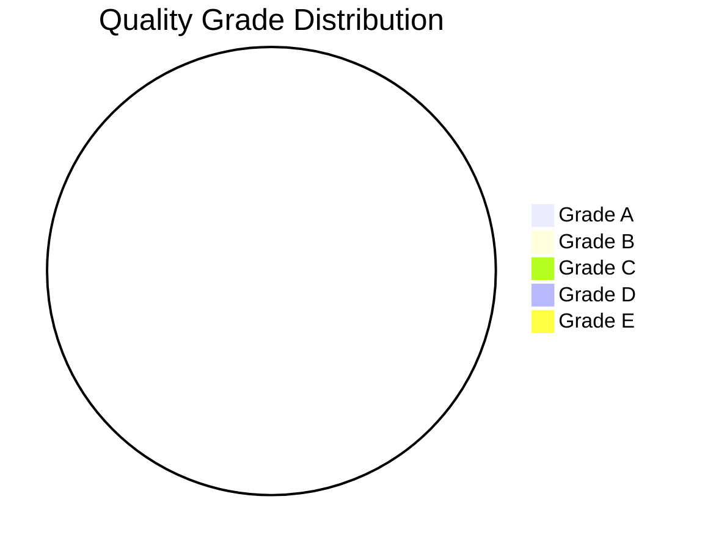

# Quality Assessment Table Template

<!-- 
Usage: Use this table to assess the quality of included studies.
Adjust criteria based on study types in your review.
-->

# Quality Assessment Table

## Review: [Your Review Title]

## Date: [Date]

---

## Quick Quality Assessment (A-E Rating)

| ID | Citation | Study Type | Peer Reviewed | Sample Size | Rigor | Limitations | Grade |
|----|----------|------------|---------------|-------------|-------|-------------|-------|
| 1 | | | ✓/✗ | | High/Med/Low | Minor/Mod/Major | A-E |
| 2 | | | ✓/✗ | | High/Med/Low | Minor/Mod/Major | A-E |
| 3 | | | ✓/✗ | | High/Med/Low | Minor/Mod/Major | A-E |
| 4 | | | ✓/✗ | | High/Med/Low | Minor/Mod/Major | A-E |
| 5 | | | ✓/✗ | | High/Med/Low | Minor/Mod/Major | A-E |

---

## A-E Grading Criteria Reference

| Grade | Description | Criteria |
|-------|-------------|----------|
| **A** | Highest | Peer-reviewed, High-IF journal, Rigorous methodology (RCT, SR, MA), Large N |
| **B** | High | Peer-reviewed, Sound methodology, Adequate sample, Appropriate analysis |
| **C** | Moderate | Peer-reviewed or authoritative, Reasonable methodology, Some limitations |
| **D** | Lower | Not peer-reviewed, Preliminary findings, Methodology concerns |
| **E** | Lowest | No peer review, Opinion/speculation, No empirical basis |

---

## Detailed Quality Assessment: Quantitative Studies

### Checklist per Study

| Criterion | Study 1 | Study 2 | Study 3 | Study 4 | Study 5 |
|-----------|---------|---------|---------|---------|---------|
| **Design** | | | | | |
| Appropriate for RQ | ✓/✗/? | ✓/✗/? | ✓/✗/? | ✓/✗/? | ✓/✗/? |
| Clear variables | ✓/✗/? | ✓/✗/? | ✓/✗/? | ✓/✗/? | ✓/✗/? |
| Control/comparison group | ✓/✗/? | ✓/✗/? | ✓/✗/? | ✓/✗/? | ✓/✗/? |
| Randomization (if RCT) | ✓/✗/NA | ✓/✗/NA | ✓/✗/NA | ✓/✗/NA | ✓/✗/NA |
| **Sample** | | | | | |
| Adequate size | ✓/✗/? | ✓/✗/? | ✓/✗/? | ✓/✗/? | ✓/✗/? |
| Representative | ✓/✗/? | ✓/✗/? | ✓/✗/? | ✓/✗/? | ✓/✗/? |
| Low attrition | ✓/✗/? | ✓/✗/? | ✓/✗/? | ✓/✗/? | ✓/✗/? |
| **Measurement** | | | | | |
| Valid measures | ✓/✗/? | ✓/✗/? | ✓/✗/? | ✓/✗/? | ✓/✗/? |
| Reliable measures | ✓/✗/? | ✓/✗/? | ✓/✗/? | ✓/✗/? | ✓/✗/? |
| **Analysis** | | | | | |
| Appropriate tests | ✓/✗/? | ✓/✗/? | ✓/✗/? | ✓/✗/? | ✓/✗/? |
| Assumptions met | ✓/✗/? | ✓/✗/? | ✓/✗/? | ✓/✗/? | ✓/✗/? |
| Effect sizes reported | ✓/✗/? | ✓/✗/? | ✓/✗/? | ✓/✗/? | ✓/✗/? |
| **Reporting** | | | | | |
| Limitations noted | ✓/✗/? | ✓/✗/? | ✓/✗/? | ✓/✗/? | ✓/✗/? |
| Clear conclusions | ✓/✗/? | ✓/✗/? | ✓/✗/? | ✓/✗/? | ✓/✗/? |
| **Score** | /14 | /14 | /14 | /14 | /14 |
| **Grade** | | | | | |

---

## Detailed Quality Assessment: Qualitative Studies

### Checklist per Study

| Criterion | Study 1 | Study 2 | Study 3 | Study 4 | Study 5 |
|-----------|---------|---------|---------|---------|---------|
| **Credibility** | | | | | |
| Prolonged engagement | ✓/✗/? | ✓/✗/? | ✓/✗/? | ✓/✗/? | ✓/✗/? |
| Triangulation | ✓/✗/? | ✓/✗/? | ✓/✗/? | ✓/✗/? | ✓/✗/? |
| Member checking | ✓/✗/? | ✓/✗/? | ✓/✗/? | ✓/✗/? | ✓/✗/? |
| Peer debriefing | ✓/✗/? | ✓/✗/? | ✓/✗/? | ✓/✗/? | ✓/✗/? |
| **Transferability** | | | | | |
| Thick description | ✓/✗/? | ✓/✗/? | ✓/✗/? | ✓/✗/? | ✓/✗/? |
| Context provided | ✓/✗/? | ✓/✗/? | ✓/✗/? | ✓/✗/? | ✓/✗/? |
| Purposive sampling clear | ✓/✗/? | ✓/✗/? | ✓/✗/? | ✓/✗/? | ✓/✗/? |
| **Dependability** | | | | | |
| Audit trail | ✓/✗/? | ✓/✗/? | ✓/✗/? | ✓/✗/? | ✓/✗/? |
| Clear procedures | ✓/✗/? | ✓/✗/? | ✓/✗/? | ✓/✗/? | ✓/✗/? |
| Reflexivity | ✓/✗/? | ✓/✗/? | ✓/✗/? | ✓/✗/? | ✓/✗/? |
| **Confirmability** | | | | | |
| Raw data access | ✓/✗/? | ✓/✗/? | ✓/✗/? | ✓/✗/? | ✓/✗/? |
| Analysis documented | ✓/✗/? | ✓/✗/? | ✓/✗/? | ✓/✗/? | ✓/✗/? |
| Bias addressed | ✓/✗/? | ✓/✗/? | ✓/✗/? | ✓/✗/? | ✓/✗/? |
| **Score** | /13 | /13 | /13 | /13 | /13 |
| **Grade** | | | | | |

---

## Quality Summary

### Grade Distribution

| Grade | Count | % | Studies |
|-------|-------|---|---------|
| A | | | |
| B | | | |
| C | | | |
| D | | | |
| E | | | |
| **Total** | | 100% | |

### Quality by Study Design

| Design | Avg Quality | Range |
|--------|-------------|-------|
| RCT | | A-E |
| Quasi-experimental | | A-E |
| Cross-sectional | | A-E |
| Qualitative | | A-E |
| Mixed methods | | A-E |

### Common Quality Issues

| Issue | Frequency | Affected Studies |
|-------|-----------|------------------|
| Small sample size | n = | |
| Limited generalizability | n = | |
| Self-report bias | n = | |
| Cross-sectional design | n = | |
| Missing data | n = | |
| Measurement concerns | n = | |

---

## Visualization

---

## Notes on Quality Assessment

<!-- Document any important observations about the quality of evidence -->

---

*Assessment completed: [Date]*
*Assessor: [Name]*
