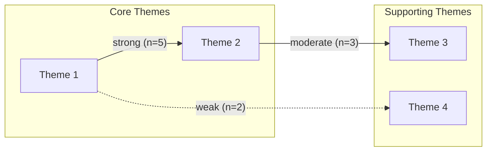

# Synthesis Matrix Template

<!--
Usage: Use this matrix to synthesize findings across multiple papers.
Maps themes/concepts (rows) against papers (columns) to identify patterns.
Save to: RESEARCH/[topic]/synthesis_matrix.md
-->

# Synthesis Matrix

## Review: [Your Review Title]

## Date: [Date]

---

## Theme × Paper Matrix

Use this matrix to map how each paper addresses key themes. Mark with:
- **✓** = Theme addressed with supporting evidence
- **✗** = Theme contradicted or refuted
- **○** = Theme mentioned but not substantiated
- **—** = Theme not addressed

| Theme / Concept | Paper 1 | Paper 2 | Paper 3 | Paper 4 | Paper 5 | Pattern Notes |
|-----------------|---------|---------|---------|---------|---------|---------------|
| Theme 1: [Name] | | | | | | |
| Theme 2: [Name] | | | | | | |
| Theme 3: [Name] | | | | | | |
| Theme 4: [Name] | | | | | | |
| Theme 5: [Name] | | | | | | |

---

## Detailed Theme Analysis

### Theme 1: [Theme Name]

**Definition:** [Clear definition of this theme]

| Paper | Key Evidence | Quote/Page | Support Level |
|-------|--------------|------------|---------------|
| Author (Year) | | p. | Strong/Moderate/Weak |
| Author (Year) | | p. | Strong/Moderate/Weak |

**Synthesis:** [Narrative synthesis of findings across papers for this theme]

**Consensus:** [ ] Strong consensus | [ ] Moderate consensus | [ ] Mixed findings | [ ] Contradictory

---

### Theme 2: [Theme Name]

**Definition:** [Clear definition of this theme]

| Paper | Key Evidence | Quote/Page | Support Level |
|-------|--------------|------------|---------------|
| Author (Year) | | p. | Strong/Moderate/Weak |
| Author (Year) | | p. | Strong/Moderate/Weak |

**Synthesis:** [Narrative synthesis]

**Consensus:** [ ] Strong consensus | [ ] Moderate consensus | [ ] Mixed findings | [ ] Contradictory

---

## Relationship Matrix

Map relationships between key constructs across studies.

### Construct Relationship: [Construct A] → [Construct B]

| Paper | Direction | Strength | Mechanism | Conditions |
|-------|-----------|----------|-----------|------------|
| Author (Year) | +/- | Strong/Mod/Weak | | |
| Author (Year) | +/- | Strong/Mod/Weak | | |

**Overall Pattern:** [Describe the overall relationship pattern]

---

## Contradiction Analysis

Document conflicting findings and potential explanations.

| Contradiction | Papers in Support | Papers Against | Possible Explanation |
|---------------|-------------------|----------------|---------------------|
| [Finding 1] | Author (Year) | Author (Year) | |
| [Finding 2] | Author (Year) | Author (Year) | |

---

## Gap Identification from Synthesis

Based on the matrix analysis, identify:

### Under-researched Themes
| Theme | # Papers | Gap Type |
|-------|----------|----------|
| | /N | Theoretical / Empirical / Methodological |

### Unexplored Relationships
| Relationship | Explored By | Not Explored |
|--------------|-------------|--------------|
| A → B | n = | Potential gap |

### Conflicting Areas Needing Resolution
| Topic | Nature of Conflict | Suggested Resolution |
|-------|-------------------|---------------------|
| | | |

---

## Visual Synthesis

### Theme Frequency Heatmap (Conceptual)

```
Papers →     P1  P2  P3  P4  P5  P6  P7  P8
Theme 1      ██  ██  ░░  ██  ░░  ██  ██  ░░  (5/8)
Theme 2      ██  ░░  ██  ██  ██  ░░  ██  ██  (6/8)
Theme 3      ░░  ██  ██  ░░  ██  ██  ░░  ██  (5/8)
Theme 4      ██  ██  ██  ██  ░░  ░░  ░░  ░░  (4/8)

██ = Addressed    ░░ = Not addressed
```

### Thematic Network (Mermaid)



---

## Summary Statistics

| Metric | Value |
|--------|-------|
| Total Papers in Matrix | |
| Total Themes Identified | |
| Themes with Strong Consensus | |
| Themes with Contradictions | |
| Key Gaps Identified | |

---

*Matrix created: [Date]*
*Last updated: [Date]*
